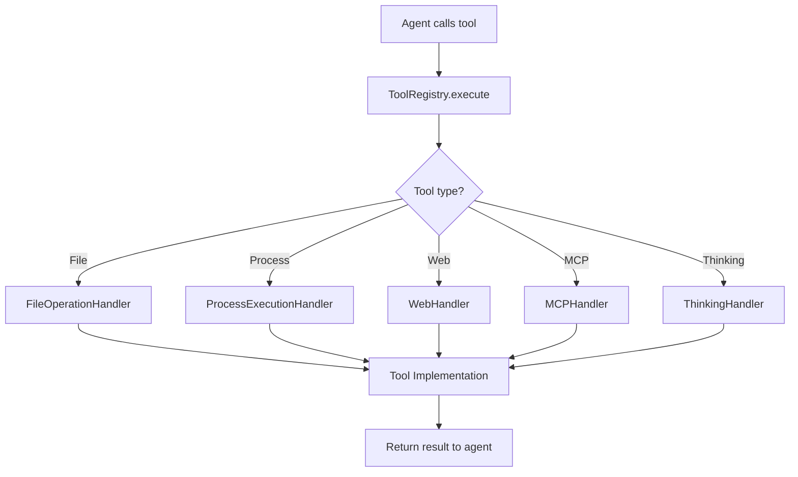
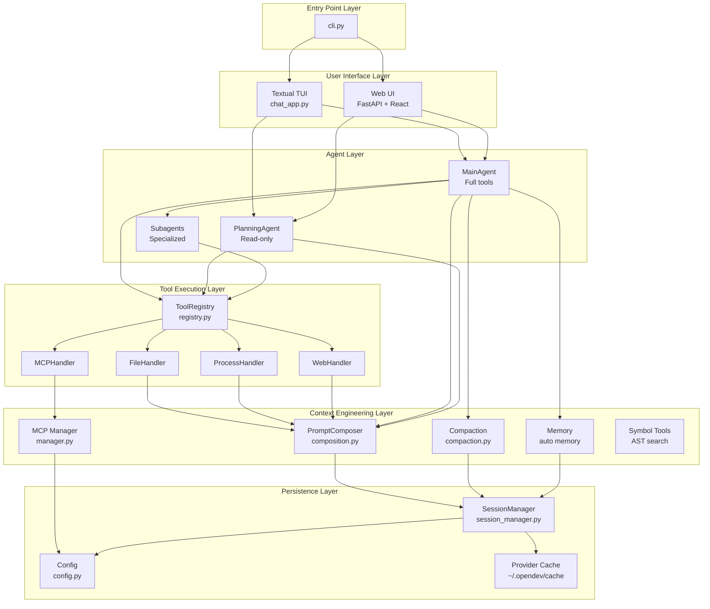
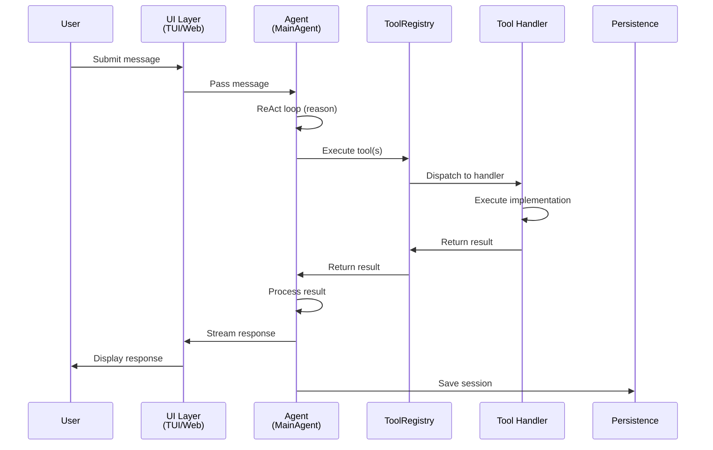
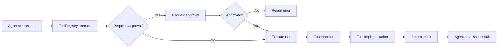

# Architecture Overview

**File**: `01_architecture_overview.md`
**Purpose**: High-level system architecture and component relationships

---

## Table of Contents

- [System Overview](#system-overview)
- [Layered Architecture](#layered-architecture)
- [Component Diagram](#component-diagram)
- [Technology Stack](#technology-stack)
- [Data Flow](#data-flow)
- [Component Responsibilities](#component-responsibilities)

---

## System Overview

SWE-CLI is a sophisticated AI-powered software engineering assistant built on a **layered architecture** with clear separation of concerns. The system consists of six primary layers, each with distinct responsibilities:

```
┌─────────────────────────────────────────────┐
│         Entry Point Layer (CLI)             │
│    swecli/cli.py, swecli/ui_textual/runner  │
└─────────────────────────────────────────────┘
                     ↓
┌─────────────────────────────────────────────┐
│          User Interface Layer               │
│  TUI (Textual) + Web UI (FastAPI + React)   │
└─────────────────────────────────────────────┘
                     ↓
┌─────────────────────────────────────────────┐
│            Agent Layer (ReAct)              │
│    MainAgent, PlanningAgent, Subagents    │
└─────────────────────────────────────────────┘
                     ↓
┌─────────────────────────────────────────────┐
│         Tool Execution Layer                │
│   ToolRegistry, Handlers, Implementations   │
└─────────────────────────────────────────────┘
                     ↓
┌─────────────────────────────────────────────┐
│      Context Engineering Layer              │
│  Prompts, Memory, MCP, Compaction, Symbols  │
└─────────────────────────────────────────────┘
                     ↓
┌─────────────────────────────────────────────┐
│        Persistence Layer                    │
│    Session Storage, Config, Cache           │
└─────────────────────────────────────────────┘
```

---

## Layered Architecture

### Layer 1: Entry Point

**Location**: `swecli/cli.py`

**Responsibilities**:
- Command-line argument parsing
- Environment setup and validation
- UI mode selection (TUI vs Web UI)
- Initial configuration loading

**Key Files**:
- `swecli/cli.py` - Main entry point, CLI argument parsing
- `swecli/ui_textual/runner.py` - TUI runner initialization
- `swecli/web/server.py` - Web UI server initialization

**Flow**:
```python
# swecli/cli.py
def main():
    args = parse_args()
    if args.web:
        run_web_ui()
    else:
        run_tui()
```

---

### Layer 2: User Interface

**Location**: `swecli/ui_textual/`, `swecli/web/`

**Responsibilities**:
- User interaction (input/output)
- Message streaming and display
- Approval flow management
- Ask-user prompt handling
- Real-time updates

**Two UI Implementations**:

#### Textual TUI
- **Framework**: Textual (Python TUI framework)
- **Pattern**: Blocking, event-driven
- **Approval**: Modal dialog, blocks agent execution
- **Files**: `chat_app.py`, `ui_callback.py`, `controllers/`

#### Web UI
- **Frontend**: React + Vite + TypeScript + Zustand
- **Backend**: FastAPI + WebSockets
- **Pattern**: Non-blocking, polling-based
- **Approval**: WebSocket broadcast → frontend poll → resolve
- **Files**:
  - Backend: `server.py`, `websocket.py`, `state.py`, `managers/`
  - Frontend: `web-ui/src/` (builds to `swecli/web/static/`)

**Key Pattern**:
```python
# TUI: Blocking approval
result = ui_callback.request_approval(operation)  # Blocks until user responds

# Web: Async approval
await web_approval_manager.broadcast_approval_required(operation)
# Agent polls state._pending_approvals until resolved
```

---

### Layer 3: Agent Layer

**Location**: `swecli/core/agents/`

**Responsibilities**:
- Reasoning and decision-making (ReAct loop)
- Tool selection and execution
- Context management
- Subagent delegation
- Graceful completion and interrupt handling

**Components**:

#### MainAgent (Main Agent)
- **File**: `swecli/core/agents/main_agent.py`
- **Mode**: Normal mode
- **Tools**: Full tool access (read, write, execute, web, etc.)
- **Loop**: ReAct (Reason → Act → Observe, max 10 turns)

#### PlanningAgent (Read-Only Agent)
- **File**: `swecli/core/agents/planning_agent.py`
- **Mode**: Plan mode
- **Tools**: Read-only (Glob, Grep, Read, WebFetch, WebSearch)
- **Purpose**: Exploration and planning without code modification

#### Subagents
- **Location**: `swecli/core/agents/subagents/agents/`
- **Types**:
  - `code_explorer.py` - Codebase exploration
  - `planner.py` - Implementation planning
  - `ask_user.py` - User interaction
  - `web_clone.py` - Web page cloning
  - `web_generator.py` - Web page generation
- **Pattern**: Specialized agents for specific tasks, invoked via Task tool

**ReAct Loop Overview**:
```
1. Reasoning: Agent analyzes current state
2. Action: Agent selects tools to execute
3. Execution: Tools run, return results
4. Observation: Agent processes results
5. Repeat until task complete (max 10 turns)
```

---

### Layer 4: Tool Execution

**Location**: `swecli/core/context_engineering/tools/`

**Responsibilities**:
- Tool registration and discovery
- Tool execution dispatching
- Approval integration
- Error handling and validation
- MCP tool integration

**Architecture**:



**Key Files**:
- `registry.py` - Central tool registry, dispatching
- `handlers/` - Category-specific handlers
  - `file_handler.py` - Read, Write, Edit, Glob
  - `process_handlers.py` - Bash, Task, TaskOutput
  - `web_handler.py` - WebFetch, WebSearch, WebScreenshot
  - `mcp_handler.py` - MCP tool execution
- `implementations/` - Tool implementations
  - `bash_tool.py`, `file_tools.py`, `web_fetch_tool.py`, etc.

**Tool Categories**:
- **File Operations**: Read, Write, Edit, Glob, Grep
- **Process Execution**: Bash, Task (subagents), TaskOutput
- **Web Tools**: WebFetch, WebSearch, WebScreenshot
- **MCP Tools**: Dynamically loaded from MCP servers
- **Thinking Tools**: ThinkingMode (internal reasoning)
- **User Interaction**: AskUserQuestion
- **Batch Tools**: Batch (parallel tool execution)
- **Notebook Tools**: NotebookEdit (Jupyter notebooks)

---

### Layer 5: Context Engineering

**Location**: `swecli/core/context_engineering/`

**Responsibilities**:
- Prompt composition and templating
- Context compaction (auto-compression)
- Memory systems (auto memory)
- MCP integration
- Symbol-based code search (AST parsing)

**Components**:

#### Prompt System
- **Location**: `swecli/core/agents/prompts/`
- **Pattern**: Modular composition with priority-based section ordering
- **Files**:
  - `composition.py` - PromptComposer class
  - `templates/system/main/*.md` - Individual prompt sections
  - `renderer.py` - Template rendering with variable substitution
  - `loader.py` - Template loading and caching

#### Context Compaction
- **Location**: `swecli/core/context_engineering/compaction.py`
- **Pattern**: Automatic compression when approaching token limits
- **Strategy**: Preserve recent messages, compress older ones

#### Memory System
- **Location**: `swecli/core/context_engineering/memory/`
- **Pattern**: Auto-memory files in `~/.claude/projects/{project}/memory/`
- **Files**: `MEMORY.md` + topic-specific files

#### MCP Integration
- **Location**: `swecli/core/context_engineering/mcp/`
- **Files**:
  - `manager.py` - MCP server management
  - `client.py` - MCP client implementation
  - `discovery.py` - Tool discovery and caching
- **Pattern**: Token-efficient discovery with caching

#### Symbol Tools
- **Location**: `swecli/core/context_engineering/symbol_tools/`
- **Purpose**: AST-based code search (find classes, functions, variables)
- **Files**: `symbol_search.py`, `ast_parser.py`

---

### Layer 6: Persistence

**Location**: `swecli/core/context_engineering/history/`, `swecli/core/runtime/`

**Responsibilities**:
- Session storage and retrieval
- Configuration management
- Provider cache
- MCP server configuration

**Storage Locations**:

```
~/.opendev/
├── sessions/                    # Session files (.jsonl)
├── sessions-index.json          # Fast session lookup (with self-healing)
├── projects/                    # Project-scoped sessions
│   └── {encoded-path}/
│       └── sessions/
├── settings.json                # User-level config
├── cache/
│   └── providers/*.json         # Provider configs (24h TTL)
└── mcp/
    └── servers.json             # MCP server configurations

.opendev/
└── settings.json                # Project-level config (highest priority)
```

**Key Files**:
- `session_manager.py` - Session CRUD operations
- `config.py` - Hierarchical configuration loading
- `models/session.py` - Session data models

**Configuration Priority**:
```
1. .opendev/settings.json (project-level)
2. ~/.opendev/settings.json (user-level)
3. Environment variables
4. Defaults
```

---

## Component Diagram



---

## Technology Stack

### By Layer

| Layer | Technologies | Purpose |
|-------|-------------|---------|
| **Entry Point** | Python 3.10+, Click/argparse | CLI parsing, initialization |
| **UI (TUI)** | Textual, asyncio | Terminal user interface |
| **UI (Web)** | FastAPI, WebSockets, React 18, Vite, TypeScript, Zustand, TailwindCSS | Modern web interface |
| **Agent** | Python asyncio, HTTP clients, models.dev API | LLM integration, reasoning |
| **Tools** | subprocess, AST, requests, BeautifulSoup | Tool execution |
| **Context Engineering** | Jinja2, JSON, AST parsers | Prompt composition, code analysis |
| **Persistence** | JSON, filesystem, SQLite (future) | Data storage |

### Frontend Stack (Web UI)

```
web-ui/
├── React 18           # UI framework
├── Vite               # Build tool
├── TypeScript         # Type safety
├── Zustand            # State management
├── TailwindCSS        # Styling
├── Radix UI           # Accessible components
├── Lucide React       # Icons
└── WebSocket API      # Real-time communication
```

### Backend Stack

```
Python 3.10+
├── FastAPI            # Web framework
├── WebSockets         # Real-time communication
├── asyncio            # Async I/O
├── Textual            # TUI framework
├── Pydantic           # Data validation
├── httpx              # HTTP client
└── BeautifulSoup4     # HTML parsing
```

---

## Data Flow

### User Message Flow



### Tool Execution Flow



### Session Persistence Flow

```mermaid
graph TD
    A[Agent processes message] --> B[Add message to session]
    B --> C[ValidatedMessageList enforces invariants]
    C --> D{Valid?}
    D -->|No| E[Raise ValidationError]
    D -->|Yes| F[Append to session.messages]
    F --> G[SessionManager.save_session]
    G --> H[Write to ~/.opendev/sessions/{id}.jsonl]
    H --> I[Update sessions-index.json]
```

---

## Component Responsibilities

### Entry Point Layer

| Component | Responsibility | Key Operations |
|-----------|---------------|----------------|
| `cli.py` | CLI argument parsing, UI mode selection | Parse args, route to TUI/Web |
| `runner.py` | TUI initialization | Setup Textual app, run event loop |
| `server.py` | Web UI initialization | Setup FastAPI, WebSocket routes |

### User Interface Layer

| Component | Responsibility | Key Operations |
|-----------|---------------|----------------|
| **TUI** | | |
| `chat_app.py` | Main Textual app, widget composition | Render chat, handle input, modal dialogs |
| `ui_callback.py` | Agent → UI communication | Stream messages, approvals, ask-user |
| **Web** | | |
| `server.py` | FastAPI routes, API endpoints | Session CRUD, config endpoints |
| `websocket.py` | WebSocket communication | Broadcast events, handle connections |
| `state.py` | Shared state management | Pending approvals, ask-user prompts |
| `managers/` | Web-specific managers | Approval, ask-user, streaming |

### Agent Layer

| Component | Responsibility | Key Operations |
|-----------|---------------|----------------|
| `main_agent.py` | Main ReAct agent | Reason, select tools, execute, loop |
| `planning_agent.py` | Read-only exploration agent | Plan mode execution |
| Subagents | Specialized task execution | Code exploration, planning, web generation |

### Tool Execution Layer

| Component | Responsibility | Key Operations |
|-----------|---------------|----------------|
| `registry.py` | Tool registration, dispatching | Execute tools, route to handlers |
| `file_handler.py` | File operations | Read, Write, Edit, Glob, Grep |
| `process_handlers.py` | Process execution | Bash, Task, TaskOutput |
| `web_handler.py` | Web operations | WebFetch, WebSearch, WebScreenshot |
| `mcp_handler.py` | MCP tool execution | Dynamic tool loading, execution |

### Context Engineering Layer

| Component | Responsibility | Key Operations |
|-----------|---------------|----------------|
| `composition.py` | Modular prompt assembly | Register sections, compose prompts |
| `compaction.py` | Context compression | Auto-compact when near token limit |
| `memory/` | Auto-memory system | Store/retrieve learnings |
| `mcp/manager.py` | MCP server management | Enable/disable servers, tool discovery |
| `symbol_tools/` | AST-based code search | Find classes, functions, symbols |

### Persistence Layer

| Component | Responsibility | Key Operations |
|-----------|---------------|----------------|
| `session_manager.py` | Session CRUD | Create, load, save, list sessions |
| `config.py` | Hierarchical config loading | Load project/user/default configs |
| `models/session.py` | Data models | ChatSession, ChatMessage, etc. |

---

## Key Architectural Decisions

### 1. Dual-Agent System

**Decision**: Separate MainAgent (full tools) and PlanningAgent (read-only)

**Rationale**:
- Plan mode prevents accidental code changes during exploration
- Clear separation of concerns (planning vs execution)
- Users can safely explore without side effects

**Implementation**: Mode toggle via `mode_manager.py`, shared tool registry with filtered tools

---

### 2. Modular Prompt Composition

**Decision**: System prompts assembled from individual markdown sections

**Rationale**:
- Easy to add/modify prompt sections without touching agent code
- Priority-based ordering for consistent composition
- Conditional sections based on context (e.g., git status only in repos)

**Implementation**: `PromptComposer` in `composition.py`, templates in `templates/system/main/*.md`

---

### 3. Dual UI Support (TUI + Web)

**Decision**: Support both Textual TUI and Web UI

**Rationale**:
- TUI for terminal users, low latency, blocking approval
- Web UI for rich interactions, multi-device access, async patterns

**Implementation**:
- TUI: Blocking, event-driven, modal dialogs
- Web: Non-blocking, polling, WebSocket broadcasts

---

### 4. MCP Integration

**Decision**: Support MCP (Model Context Protocol) for dynamic tool loading

**Rationale**:
- Extensibility without code changes
- Standard protocol for LLM tools
- Community ecosystem of MCP servers

**Implementation**: `mcp/manager.py` for server management, token-efficient discovery with caching

---

### 5. ValidatedMessageList

**Decision**: Enforce tool_use ↔ tool_result pairing at write time

**Rationale**:
- Prevent message list corruption
- Early error detection
- LLM-compatible message sequences

**Implementation**: `ValidatedMessageList` in `models/session.py`, validates on append

---

### 6. Session Indexing with Self-Healing

**Decision**: Maintain `sessions-index.json` with automatic repair

**Rationale**:
- Fast session lookup without scanning all files
- Self-healing prevents index corruption
- Topic detection for meaningful session titles

**Implementation**: `session_manager.py` rebuilds index if corrupted, `TopicDetector` for titles

---

## Next Steps

- **For agent details**: See [Agent System](./02_agent_system.md)
- **For tool execution**: See [Tool System](./03_tool_system.md)
- **For execution flows**: See [Execution Flows](./05_execution_flows.md)
- **For UI details**: See [UI Architectures](./06_ui_architectures.md)

---

**[← Back to Index](./00_INDEX.md)** | **[Next: Agent System →](./02_agent_system.md)**
