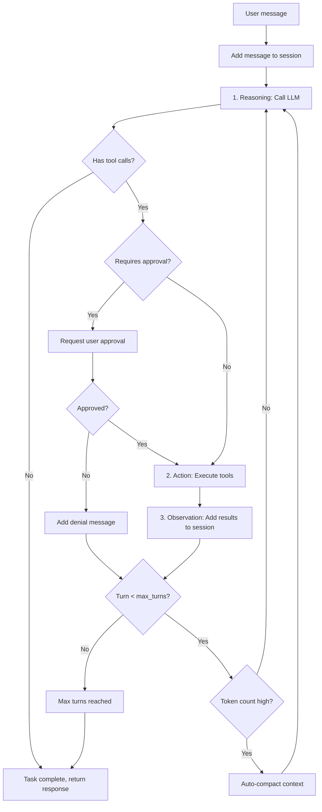
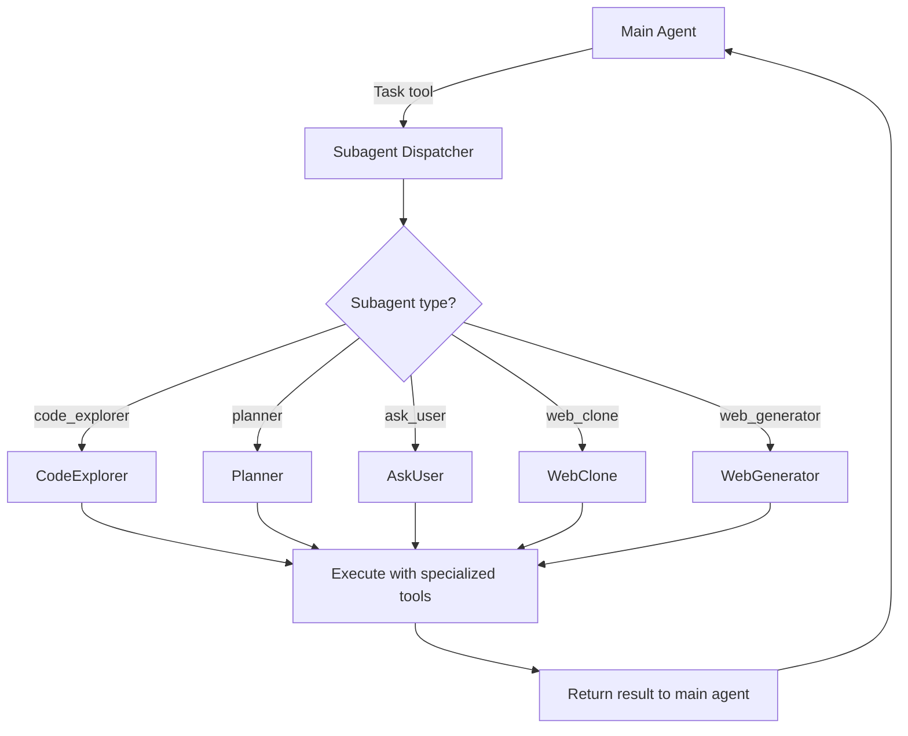
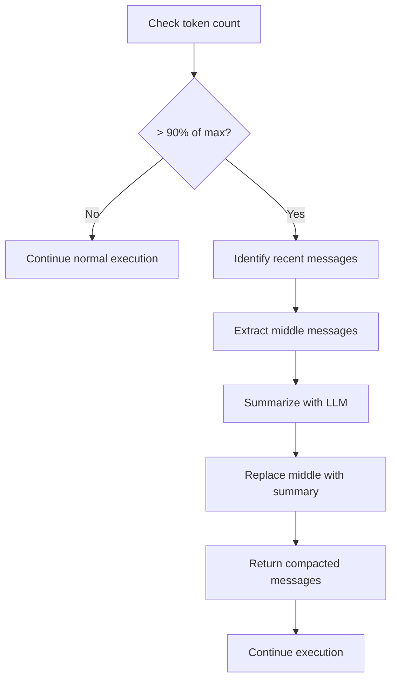
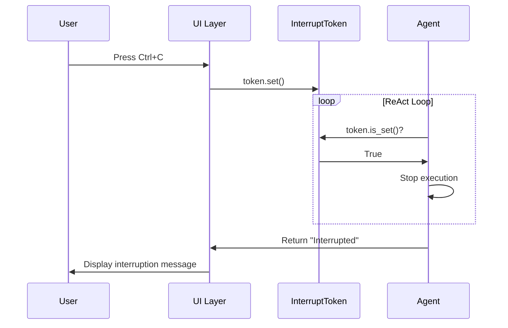
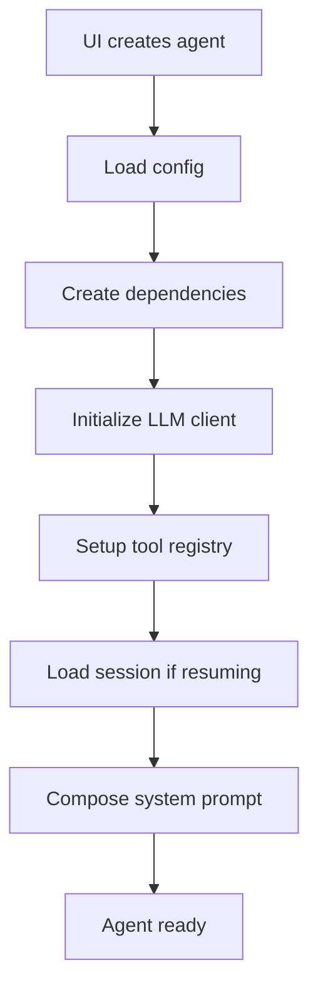
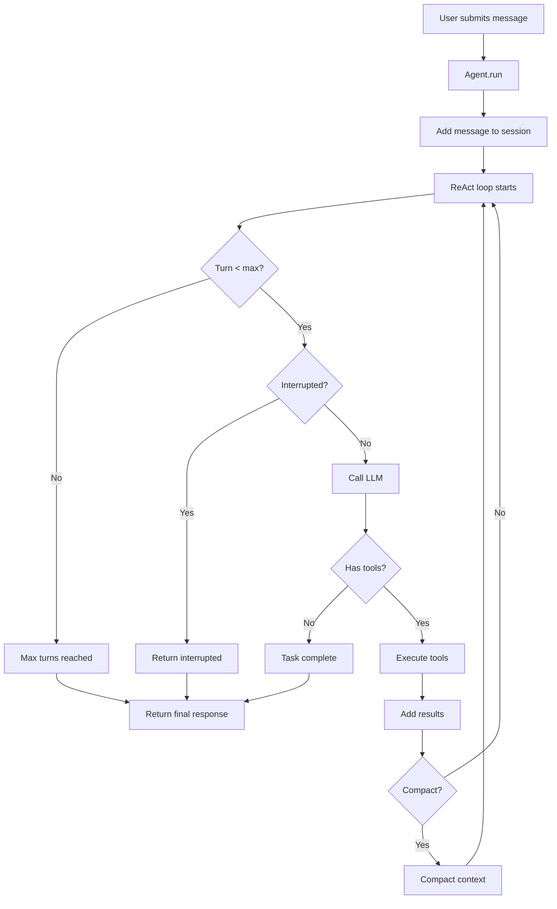

# Agent System

**File**: `02_agent_system.md`
**Purpose**: Deep dive into the agent architecture

---

## Table of Contents

- [Overview](#overview)
- [MainAgent (Main Agent)](#swecliagent-main-agent)
- [PlanningAgent (Read-Only)](#planningagent-read-only)
- [ReAct Loop](#react-loop)
- [Subagent System](#subagent-system)
- [LLM Integration](#llm-integration)
- [Context Compaction](#context-compaction)
- [Interrupt System](#interrupt-system)
- [Dependency Injection](#dependency-injection)

---

## Overview

The SWE-CLI agent system is built on a **dual-agent architecture** with a sophisticated **ReAct (Reasoning and Acting) loop**. The system supports:

- **MainAgent**: Full tool access for code modification and execution
- **PlanningAgent**: Read-only tools for safe exploration and planning
- **Subagents**: Specialized agents for specific tasks (exploration, planning, web generation)
- **Auto-compaction**: Automatic context compression when approaching token limits
- **Interrupt handling**: Graceful cancellation with InterruptToken
- **Dependency injection**: AgentDependencies for core services

**Key Locations**:
- `swecli/core/agents/main_agent.py` - Main agent implementation
- `swecli/core/agents/planning_agent.py` - Planning agent (read-only)
- `swecli/core/agents/subagents/agents/` - Subagent implementations
- `swecli/models/agent_deps.py` - Dependency injection container

---

## MainAgent (Main Agent)

**File**: `swecli/core/agents/main_agent.py`

**Purpose**: Primary agent for code modification, tool execution, and task completion

### Capabilities

- **Full tool access**: Read, Write, Edit, Bash, WebFetch, etc.
- **ReAct loop**: Iterative reasoning and acting (max 10 turns)
- **Context management**: Auto-compaction, message validation
- **Approval integration**: Respect user approval levels (Manual/Semi-Auto/Auto)
- **Subagent delegation**: Spawn specialized subagents via Task tool
- **Interrupt handling**: Graceful cancellation with InterruptToken

### Core Loop

```python
# swecli/core/agents/main_agent.py
async def run(self, user_message: str, interrupt_token: InterruptToken = None):
    """
    Execute ReAct loop:
    1. Add user message to session
    2. Loop: Reason → Act → Observe (max 10 turns)
    3. Return final response
    """
    self.session.add_message({"role": "user", "content": user_message})

    for turn in range(self.max_turns):
        if interrupt_token and interrupt_token.is_set():
            return "Interrupted by user"

        # 1. Reason: Get LLM response (may include tool calls)
        response = await self.llm_client.create_message(
            messages=self.session.messages,
            tools=self.tool_registry.get_tool_schemas(),
            system=self.prompt_composer.compose()
        )

        # 2. Act: Execute tools if requested
        if response.tool_calls:
            results = await self.tool_registry.execute_tools(
                response.tool_calls,
                interrupt_token=interrupt_token
            )
            self.session.add_message({"role": "assistant", "content": response.content, "tool_calls": response.tool_calls})
            for result in results:
                self.session.add_message({"role": "tool_result", "content": result})
        else:
            # No tools, task complete
            self.session.add_message({"role": "assistant", "content": response.content})
            break

        # 3. Auto-compaction if needed
        if self.session.token_count > self.max_tokens * 0.9:
            await self.compact_context()

    return response.content
```

### Key Features

#### 1. Graceful Completion

The agent stops when:
- LLM returns no tool calls (task complete)
- Max turns reached (10 iterations)
- Interrupt token set (user cancellation)

```python
# Agent reasoning determines completion - no hard-coded branching
if not response.tool_calls:
    # LLM decided task is complete
    break
```

#### 2. Auto-Compaction

Automatic context compression when approaching token limits:

```python
if self.session.token_count > self.max_tokens * 0.9:
    compressed = await self.compactor.compact(self.session.messages)
    self.session.messages = compressed
```

#### 3. Message Validation

All messages validated via `ValidatedMessageList`:

```python
# swecli/models/session.py
class ValidatedMessageList(list):
    def append(self, message):
        # Enforce tool_use → tool_result pairing
        if message["role"] == "tool_result":
            if not self._last_was_tool_use():
                raise ValidationError("tool_result without preceding tool_use")
        super().append(message)
```

---

## PlanningAgent (Read-Only)

**File**: `swecli/core/agents/planning_agent.py`

**Purpose**: Safe exploration and planning without code modification

### Capabilities

- **Read-only tools**: Glob, Grep, Read, WebFetch, WebSearch
- **No modification**: Cannot Write, Edit, or execute Bash commands
- **Plan mode**: Activated via `/mode plan` or Shift+Tab
- **Safe exploration**: Users can explore codebase without side effects

### Tool Restrictions

```python
# swecli/core/agents/planning_agent.py
ALLOWED_TOOLS = [
    "Glob",      # File search
    "Grep",      # Content search
    "Read",      # File reading
    "WebFetch",  # Web content fetching
    "WebSearch", # Web search
    "Task",      # Subagent delegation (read-only subagents only)
]

def get_tools(self):
    """Return only read-only tools"""
    all_tools = self.tool_registry.get_tool_schemas()
    return [t for t in all_tools if t["name"] in ALLOWED_TOOLS]
```

### Mode Switching

```python
# swecli/core/runtime/mode_manager.py
class ModeManager:
    def switch_mode(self, mode: str):
        """Switch between normal and plan mode"""
        if mode == "plan":
            return PlanningAgent(...)
        else:
            return MainAgent(...)
```

---

## ReAct Loop

**ReAct** = **Rea**soning + **Act**ing

The agent alternates between reasoning about the next action and executing tools until the task is complete.

### ReAct Flow Diagram



### Detailed Example

```python
# Turn 1: User asks to fix a bug
User: "Fix the bug in calculate_total()"

# Agent reasoning
Agent: "I need to read the file first to understand the bug"
Tool: Read(file="app.py")
Result: [file content showing bug]

# Turn 2: Agent analyzes
Agent: "I found the bug on line 45, the variable is misspelled"
Tool: Edit(file="app.py", old_string="totla", new_string="total")
Result: "File edited successfully"

# Turn 3: Agent verifies
Agent: "Let me verify the fix by reading the file again"
Tool: Read(file="app.py", offset=40, limit=10)
Result: [fixed content]

# Turn 4: Completion
Agent: "The bug has been fixed. The variable 'totla' was corrected to 'total' on line 45."
[No tool calls] → Task complete
```

### Max Turns Limit

Default: **10 turns**

**Rationale**:
- Prevents infinite loops
- Forces focused problem-solving
- Encourages efficient tool use

**Override**: Configurable in agent initialization

```python
agent = MainAgent(max_turns=15)  # Increase for complex tasks
```

---

## Subagent System

**Location**: `swecli/core/agents/subagents/agents/`

**Purpose**: Specialized agents for specific tasks, invoked via Task tool

### Available Subagents

| Subagent | Purpose | Tools | File |
|----------|---------|-------|------|
| **code_explorer** | Codebase exploration, pattern finding | Glob, Grep, Read | `code_explorer.py` |
| **planner** | Implementation planning | Glob, Grep, Read | `planner.py` |
| **ask_user** | Multi-step user interaction | AskUserQuestion | `ask_user.py` |
| **web_clone** | Clone web pages to local files | WebFetch, Write | `web_clone.py` |
| **web_generator** | Generate web pages from specs | Write, Read | `web_generator.py` |

### Invocation Pattern

```python
# Main agent delegates to subagent
Tool: Task(
    subagent_type="code_explorer",
    prompt="Find all error handling patterns in the codebase",
    description="Explore error handling"
)

# Subagent runs independently
# Returns: Comprehensive report on error handling patterns
```

### Subagent Architecture



### Example: Code Explorer Subagent

```python
# swecli/core/agents/subagents/agents/code_explorer.py
class CodeExplorer:
    """Specialized agent for codebase exploration"""

    ALLOWED_TOOLS = ["Glob", "Grep", "Read"]

    async def run(self, prompt: str):
        """
        Explore codebase based on prompt:
        1. Use Glob to find files
        2. Use Grep to search content
        3. Use Read to examine files
        4. Synthesize findings
        """
        # Agent decides exploration strategy
        # No hard-coded search patterns
        response = await self.llm_client.create_message(
            messages=[{"role": "user", "content": prompt}],
            tools=self.get_tools(),
            system=self.get_system_prompt()
        )
        return response.content
```

---

## LLM Integration

**Location**: `swecli/core/llm/`

**Purpose**: HTTP client abstraction for multiple LLM providers

### Provider Support

- **OpenAI** (GPT-4, GPT-4 Turbo)
- **Anthropic** (Claude 3.5 Sonnet, Claude 3 Opus)
- **models.dev** (Centralized provider API)
- **Vision models** (GPT-4V, Claude 3 Vision)

### HTTP Client Pattern

```python
# swecli/core/llm/http_client.py
class LLMHTTPClient:
    """Base HTTP client for LLM API calls"""

    async def create_message(
        self,
        messages: list,
        tools: list = None,
        system: str = None,
        model: str = None
    ):
        """
        Send request to LLM API
        Returns: Response with content and tool_calls
        """
        # Lazy initialization - create client on first use
        if not self._client:
            self._client = self._create_client()

        response = await self._client.post(
            "/v1/messages",
            json={
                "model": model or self.default_model,
                "messages": messages,
                "tools": tools,
                "system": system,
                "max_tokens": 4096
            }
        )
        return self._parse_response(response)
```

### Provider Routing

```python
# swecli/core/runtime/config.py
class RuntimeConfig:
    def get_llm_client(self):
        """Route to appropriate LLM client based on config"""
        if self.provider == "openai":
            return OpenAIClient(api_key=self.api_key)
        elif self.provider == "anthropic":
            return AnthropicClient(api_key=self.api_key)
        else:
            return ModelsDevClient(api_key=self.api_key)
```

### VLM Support (Vision)

```python
# Vision-capable models can process images
response = await llm_client.create_message(
    messages=[
        {
            "role": "user",
            "content": [
                {"type": "text", "text": "What's in this image?"},
                {"type": "image", "source": {"url": "data:image/png;base64,..."}}
            ]
        }
    ],
    model="gpt-4-vision-preview"
)
```

---

## Context Compaction

**File**: `swecli/core/context_engineering/compaction.py`

**Purpose**: Automatic context compression when approaching token limits

### Strategy

1. **Preserve recent messages** (last 5-10 messages)
2. **Compress older messages** (summarize with LLM)
3. **Maintain tool_use ↔ tool_result pairing**

### Implementation

```python
# swecli/core/context_engineering/compaction.py
class ContextCompactor:
    async def compact(self, messages: list) -> list:
        """
        Compact message history when approaching token limit

        Strategy:
        1. Keep system message
        2. Keep last N messages (recent context)
        3. Summarize middle messages in batches
        """
        if len(messages) < self.min_messages:
            return messages  # Too few to compact

        system_msg = messages[0] if messages[0]["role"] == "system" else None
        recent = messages[-self.keep_recent:]
        middle = messages[1:-self.keep_recent] if system_msg else messages[:-self.keep_recent]

        # Summarize middle messages
        summary = await self._summarize(middle)

        result = []
        if system_msg:
            result.append(system_msg)
        result.append({
            "role": "assistant",
            "content": f"[Context compacted: {len(middle)} messages summarized]\n{summary}"
        })
        result.extend(recent)

        return result
```

### Trigger Conditions

```python
# Auto-compact when 90% of max tokens
if session.token_count > max_tokens * 0.9:
    await compact_context()
```

### Compaction Flow



---

## Interrupt System

**File**: `swecli/core/interrupt/token.py`

**Purpose**: Centralized, thread-safe cancellation mechanism

### InterruptToken Pattern

```python
# swecli/core/interrupt/token.py
class InterruptToken:
    """Thread-safe cancellation token"""

    def __init__(self):
        self._event = threading.Event()

    def set(self):
        """Signal interrupt"""
        self._event.set()

    def is_set(self) -> bool:
        """Check if interrupted"""
        return self._event.is_set()

    def reset(self):
        """Clear interrupt"""
        self._event.clear()
```

### Usage in Agent

```python
# Agent checks interrupt token at each turn
async def run(self, user_message: str, interrupt_token: InterruptToken = None):
    for turn in range(self.max_turns):
        if interrupt_token and interrupt_token.is_set():
            self.session.add_message({
                "role": "assistant",
                "content": "Task interrupted by user."
            })
            return "Interrupted"

        # Continue execution
        ...
```

### Interrupt Flow



---

## Dependency Injection

**File**: `swecli/models/agent_deps.py`

**Purpose**: Inject core services into agents for testability and decoupling

### AgentDependencies Container

```python
# swecli/models/agent_deps.py
@dataclass
class AgentDependencies:
    """Container for agent dependencies"""

    mode_manager: ModeManager
    approval_manager: ApprovalManager
    undo_manager: UndoManager
    session_manager: SessionManager
    ui_callback: UICallback
    tool_registry: ToolRegistry
    prompt_composer: PromptComposer
    llm_client: LLMHTTPClient
    config: RuntimeConfig
```

### Injection Pattern

```python
# Agent initialization with dependencies
deps = AgentDependencies(
    mode_manager=mode_manager,
    approval_manager=approval_manager,
    session_manager=session_manager,
    ui_callback=ui_callback,
    tool_registry=tool_registry,
    prompt_composer=prompt_composer,
    llm_client=llm_client,
    config=config
)

agent = MainAgent(deps)
```

### Benefits

1. **Testability**: Easy to mock dependencies in tests
2. **Decoupling**: Agents don't create their own dependencies
3. **Flexibility**: Swap implementations (e.g., different storage backends)
4. **Clarity**: Explicit dependencies visible in constructor

---

## Agent Lifecycle

### Initialization



### Execution



### Cleanup

```python
# Agent cleanup (called by UI on exit)
async def cleanup(self):
    """Save session and close resources"""
    await self.session_manager.save_session(self.session)
    await self.llm_client.close()
```

---

## Best Practices

### 1. Never Hard-Code Control Flow

**BAD**:
```python
if user_message.startswith("fix"):
    run_fix_workflow()
elif user_message.startswith("add"):
    run_add_workflow()
```

**GOOD**:
```python
# Let the LLM decide the next action
response = await llm_client.create_message(messages, tools)
if response.tool_calls:
    execute_tools(response.tool_calls)
```

### 2. Trust the ReAct Loop

The agent will:
- Decide when to stop (no tool calls)
- Recover from errors (tool failures)
- Adapt to new information (tool results)

Don't add complex branching logic - the LLM handles this.

### 3. Use Subagents for Specialized Tasks

Delegate complex, multi-step tasks to subagents:
```python
# Good: Delegate codebase exploration to specialized agent
Tool: Task(subagent_type="code_explorer", prompt="Find all API endpoints")

# Bad: Main agent tries to explore everything
Tool: Glob("**/*.py")
Tool: Grep("@app.route", ...)
# (many more tool calls, cluttering main agent context)
```

### 4. Respect Token Limits

- Enable auto-compaction
- Use subagents to isolate context
- Summarize large tool outputs before adding to session

---

## Next Steps

- **For tool details**: See [Tool System](./03_tool_system.md)
- **For prompt composition**: See [Prompt Composition](./04_prompt_composition.md)
- **For execution flows**: See [Execution Flows](./05_execution_flows.md)

---

**[← Back to Index](./00_INDEX.md)** | **[Next: Tool System →](./03_tool_system.md)**
