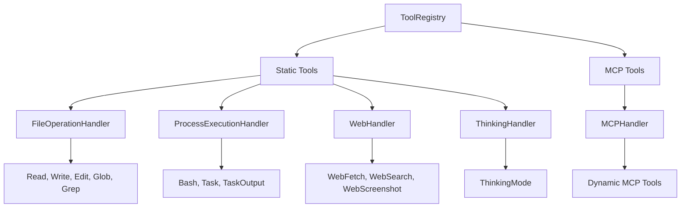
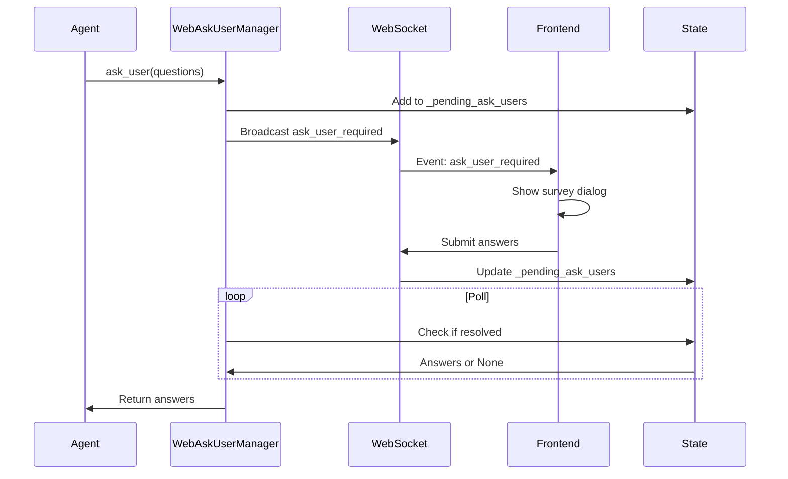
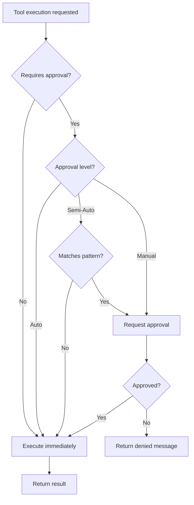

# Tool System

**File**: `03_tool_system.md`
**Purpose**: Tool registry, handlers, and execution

---

## Table of Contents

- [Overview](#overview)
- [ToolRegistry Architecture](#toolregistry-architecture)
- [Tool Handler Pattern](#tool-handler-pattern)
- [Tool Categories](#tool-categories)
- [Tool Execution Context](#tool-execution-context)
- [Approval Integration](#approval-integration)
- [MCP Integration](#mcp-integration)
- [Adding New Tools](#adding-new-tools)

---

## Overview

The SWE-CLI tool system provides a **modular, extensible architecture** for tool execution. Tools are organized by category, with specialized handlers for each category. The system supports:

- **Static tools**: Built-in tools (Read, Write, Bash, etc.)
- **MCP tools**: Dynamically loaded from MCP servers
- **Approval integration**: Tools can require user approval
- **Batch execution**: Parallel tool execution via Batch tool
- **Error handling**: Graceful error recovery and reporting

**Key Locations**:
- `swecli/core/context_engineering/tools/registry.py` - Central registry
- `swecli/core/context_engineering/tools/handlers/` - Category handlers
- `swecli/core/context_engineering/tools/implementations/` - Tool implementations

---

## ToolRegistry Architecture

**File**: `swecli/core/context_engineering/tools/registry.py`

**Purpose**: Central registry for tool discovery, schema generation, and execution dispatching

### Core Responsibilities

1. **Tool registration**: Register static and MCP tools
2. **Schema generation**: Generate JSON schemas for LLM consumption
3. **Tool dispatching**: Route tool calls to appropriate handlers
4. **Error handling**: Catch and format tool execution errors

### Registry Structure



### Implementation

```python
# swecli/core/context_engineering/tools/registry.py
class ToolRegistry:
    """Central registry for all tools"""

    def __init__(self):
        self.handlers = {
            "file": FileOperationHandler(),
            "process": ProcessExecutionHandler(),
            "web": WebHandler(),
            "mcp": MCPHandler(),
            "thinking": ThinkingHandler(),
            "user": UserInteractionHandler(),
            "batch": BatchHandler(),
            "notebook": NotebookHandler(),
        }
        self.static_tools = self._discover_static_tools()
        self.mcp_tools = []

    def _discover_static_tools(self) -> dict:
        """Discover all static tools from implementations/"""
        tools = {}
        for handler in self.handlers.values():
            tools.update(handler.get_tools())
        return tools

    def register_mcp_tools(self, mcp_tools: list):
        """Register tools from MCP servers"""
        self.mcp_tools = mcp_tools

    def get_tool_schemas(self, mode: str = "normal") -> list:
        """
        Generate JSON schemas for LLM consumption

        Args:
            mode: "normal" (all tools) or "plan" (read-only tools)
        """
        schemas = []

        # Static tools
        for tool_name, tool in self.static_tools.items():
            if mode == "plan" and tool_name not in PLAN_MODE_TOOLS:
                continue
            schemas.append(tool.get_schema())

        # MCP tools
        if mode == "normal":
            for mcp_tool in self.mcp_tools:
                schemas.append(mcp_tool.get_schema())

        return schemas

    async def execute_tool(
        self,
        tool_name: str,
        parameters: dict,
        interrupt_token: InterruptToken = None
    ) -> str:
        """
        Execute a tool by name

        Flow:
        1. Find appropriate handler
        2. Check approval if needed
        3. Execute tool
        4. Return result or error
        """
        try:
            # Find handler
            handler = self._get_handler_for_tool(tool_name)

            # Check approval
            if self._requires_approval(tool_name, parameters):
                approved = await self.approval_manager.request_approval(
                    tool_name, parameters
                )
                if not approved:
                    return f"Tool '{tool_name}' execution denied by user"

            # Execute
            result = await handler.execute(
                tool_name, parameters, interrupt_token
            )
            return result

        except Exception as e:
            return f"Error executing {tool_name}: {str(e)}"

    def _get_handler_for_tool(self, tool_name: str):
        """Route tool to appropriate handler"""
        if tool_name in self.static_tools:
            return self.handlers[self.static_tools[tool_name].category]
        elif tool_name in [t.name for t in self.mcp_tools]:
            return self.handlers["mcp"]
        else:
            raise ValueError(f"Unknown tool: {tool_name}")
```

---

## Tool Handler Pattern

**Pattern**: Separate handler classes for each tool category

**Rationale**:
- **Separation of concerns**: File operations separate from process execution
- **Testability**: Mock handlers independently
- **Extensibility**: Add new categories without modifying existing code

### Handler Interface

```python
# Base handler interface
class ToolHandler:
    """Base class for tool handlers"""

    @abstractmethod
    def get_tools(self) -> dict:
        """Return tools this handler provides"""
        pass

    @abstractmethod
    async def execute(
        self,
        tool_name: str,
        parameters: dict,
        interrupt_token: InterruptToken = None
    ) -> str:
        """Execute a tool"""
        pass
```

### Handler Categories

| Handler | Category | Tools | File |
|---------|----------|-------|------|
| **FileOperationHandler** | `file` | Read, Write, Edit, Glob, Grep | `file_handler.py` |
| **ProcessExecutionHandler** | `process` | Bash, Task, TaskOutput, TaskStop | `process_handlers.py` |
| **WebHandler** | `web` | WebFetch, WebSearch, WebScreenshot | `web_handler.py` |
| **MCPHandler** | `mcp` | Dynamic MCP tools | `mcp_handler.py` |
| **ThinkingHandler** | `thinking` | ThinkingMode | `thinking_handler.py` |
| **UserInteractionHandler** | `user` | AskUserQuestion | `user_handler.py` |
| **BatchHandler** | `batch` | Batch | `batch_handler.py` |
| **NotebookHandler** | `notebook` | NotebookEdit | `notebook_handler.py` |

---

## Tool Categories

### File Operations

**Handler**: `FileOperationHandler` (`file_handler.py`)

**Tools**:

#### Read
```python
{
    "name": "Read",
    "description": "Read file contents",
    "parameters": {
        "file_path": {"type": "string", "required": True},
        "offset": {"type": "number", "required": False},
        "limit": {"type": "number", "required": False}
    }
}
```

**Implementation**:
```python
# swecli/core/context_engineering/tools/implementations/file_tools.py
class ReadTool:
    async def execute(self, file_path: str, offset: int = 0, limit: int = 2000):
        """Read file with optional offset and limit"""
        with open(file_path) as f:
            lines = f.readlines()
            if offset:
                lines = lines[offset:]
            if limit:
                lines = lines[:limit]
            return "".join(f"{i+1}: {line}" for i, line in enumerate(lines, offset))
```

#### Write
```python
{
    "name": "Write",
    "description": "Write file (overwrite)",
    "parameters": {
        "file_path": {"type": "string", "required": True},
        "content": {"type": "string", "required": True}
    }
}
```

**Approval**: Required if file exists (to prevent accidental overwrite)

#### Edit
```python
{
    "name": "Edit",
    "description": "Edit file with exact string replacement",
    "parameters": {
        "file_path": {"type": "string", "required": True},
        "old_string": {"type": "string", "required": True},
        "new_string": {"type": "string", "required": True},
        "replace_all": {"type": "boolean", "required": False}
    }
}
```

**Validation**: Ensures `old_string` is unique (unless `replace_all=True`)

#### Glob
```python
{
    "name": "Glob",
    "description": "Find files matching pattern",
    "parameters": {
        "pattern": {"type": "string", "required": True},
        "path": {"type": "string", "required": False}
    }
}
```

**Example**: `Glob(pattern="**/*.py")` → Find all Python files

#### Grep
```python
{
    "name": "Grep",
    "description": "Search file contents with regex",
    "parameters": {
        "pattern": {"type": "string", "required": True},
        "path": {"type": "string", "required": False},
        "glob": {"type": "string", "required": False},
        "output_mode": {"type": "string", "enum": ["content", "files_with_matches", "count"]},
        "context": {"type": "number", "required": False}
    }
}
```

**Example**: `Grep(pattern="class.*Agent", glob="**/*.py")` → Find class definitions

---

### Process Execution

**Handler**: `ProcessExecutionHandler` (`process_handlers.py`)

**Tools**:

#### Bash
```python
{
    "name": "Bash",
    "description": "Execute bash command",
    "parameters": {
        "command": {"type": "string", "required": True},
        "timeout": {"type": "number", "required": False},
        "run_in_background": {"type": "boolean", "required": False}
    }
}
```

**Security**:
- Approval required for destructive commands (rm, git reset, etc.)
- Command sandboxing (configurable)
- Timeout limits (default 2 minutes, max 10 minutes)

**Implementation**:
```python
# swecli/core/context_engineering/tools/implementations/bash_tool.py
class BashTool:
    async def execute(
        self,
        command: str,
        timeout: int = 120000,
        run_in_background: bool = False
    ):
        """Execute bash command with timeout"""
        if run_in_background:
            return await self._execute_background(command)

        try:
            result = subprocess.run(
                command,
                shell=True,
                capture_output=True,
                text=True,
                timeout=timeout / 1000
            )
            return result.stdout or result.stderr
        except subprocess.TimeoutExpired:
            return f"Command timed out after {timeout}ms"
```

#### Task (Subagent Execution)
```python
{
    "name": "Task",
    "description": "Launch specialized subagent",
    "parameters": {
        "subagent_type": {"type": "string", "required": True},
        "prompt": {"type": "string", "required": True},
        "description": {"type": "string", "required": True},
        "run_in_background": {"type": "boolean", "required": False}
    }
}
```

**Subagent Types**:
- `code_explorer` - Codebase exploration
- `planner` - Implementation planning
- `ask_user` - Multi-step user interaction
- `web_clone` - Clone web pages
- `web_generator` - Generate web pages

#### TaskOutput
```python
{
    "name": "TaskOutput",
    "description": "Get output from background task",
    "parameters": {
        "task_id": {"type": "string", "required": True},
        "block": {"type": "boolean", "default": True}
    }
}
```

---

### Web Tools

**Handler**: `WebHandler` (`web_handler.py`)

**Tools**:

#### WebFetch
```python
{
    "name": "WebFetch",
    "description": "Fetch web page content",
    "parameters": {
        "url": {"type": "string", "required": True},
        "prompt": {"type": "string", "required": True}
    }
}
```

**Implementation**:
```python
# swecli/core/context_engineering/tools/implementations/web_fetch_tool.py
class WebFetchTool:
    async def execute(self, url: str, prompt: str):
        """
        Fetch URL, convert HTML to markdown, process with LLM

        Flow:
        1. Fetch URL
        2. Convert HTML to markdown (readable format)
        3. Process with small LLM (extract info based on prompt)
        4. Return extracted info
        """
        html = await self._fetch_url(url)
        markdown = self._html_to_markdown(html)

        # Use small model to extract info
        result = await self.llm_client.create_message(
            messages=[
                {"role": "user", "content": f"{prompt}\n\nContent:\n{markdown}"}
            ],
            model="gpt-3.5-turbo"
        )
        return result.content
```

#### WebSearch
```python
{
    "name": "WebSearch",
    "description": "Search the web",
    "parameters": {
        "query": {"type": "string", "required": True},
        "allowed_domains": {"type": "array", "required": False},
        "blocked_domains": {"type": "array", "required": False}
    }
}
```

**Cache**: 15-minute cache for repeated searches

#### WebScreenshot
```python
{
    "name": "WebScreenshot",
    "description": "Capture screenshot of web page",
    "parameters": {
        "url": {"type": "string", "required": True},
        "full_page": {"type": "boolean", "default": False}
    }
}
```

**Requirements**: Playwright installed

---

### MCP Tools

**Handler**: `MCPHandler` (`mcp_handler.py`)

**Purpose**: Execute tools provided by MCP servers

**Dynamic Discovery**:
```python
# swecli/core/context_engineering/mcp/discovery.py
class MCPToolDiscovery:
    async def discover_tools(self, server_name: str) -> list:
        """
        Discover tools from MCP server

        Flow:
        1. Connect to MCP server (stdio)
        2. Send tools/list request
        3. Parse tool schemas
        4. Cache for 24h (token-efficient)
        """
        if cached := self._get_cached_tools(server_name):
            return cached

        client = await self.mcp_manager.get_client(server_name)
        tools = await client.list_tools()

        self._cache_tools(server_name, tools)
        return tools
```

**Execution**:
```python
# swecli/core/context_engineering/tools/handlers/mcp_handler.py
class MCPHandler:
    async def execute(self, tool_name: str, parameters: dict):
        """Execute MCP tool"""
        server_name = self._get_server_for_tool(tool_name)
        client = await self.mcp_manager.get_client(server_name)

        result = await client.call_tool(
            name=tool_name,
            arguments=parameters
        )
        return result.content
```

---

### Thinking Tools

**Handler**: `ThinkingHandler` (`thinking_handler.py`)

**Tool**: ThinkingMode

**Purpose**: Internal reasoning without tool execution

```python
{
    "name": "ThinkingMode",
    "description": "Think through a problem without executing tools",
    "parameters": {
        "thought": {"type": "string", "required": True}
    }
}
```

**Use Case**: Agent needs to reason before deciding next action

```python
# Agent uses ThinkingMode to plan
Tool: ThinkingMode(thought="I need to understand the current architecture before making changes. Let me first read the main files.")
# No external execution, just recorded in session
```

---

### User Interaction Tools

**Handler**: `UserInteractionHandler` (`user_handler.py`)

**Tool**: AskUserQuestion

```python
{
    "name": "AskUserQuestion",
    "description": "Ask user questions during execution",
    "parameters": {
        "questions": {
            "type": "array",
            "items": {
                "question": {"type": "string"},
                "header": {"type": "string"},
                "options": {"type": "array"},
                "multiSelect": {"type": "boolean"}
            }
        }
    }
}
```

**Implementation**:
```python
# swecli/core/context_engineering/tools/implementations/ask_user.py
class AskUserTool:
    async def execute(self, questions: list):
        """
        Ask user questions (1-4 questions)

        TUI: Modal dialog, blocking
        Web: WebSocket broadcast → survey dialog → poll
        """
        if self.ui_type == "tui":
            return await self.ui_callback.ask_user(questions)
        else:
            return await self.web_ask_user_manager.ask_user(questions)
```

**Flow (Web UI)**:


---

### Batch Tools

**Handler**: `BatchHandler` (`batch_handler.py`)

**Tool**: Batch

**Purpose**: Execute multiple tools in parallel

```python
{
    "name": "Batch",
    "description": "Execute multiple tools in parallel",
    "parameters": {
        "tool_calls": {
            "type": "array",
            "items": {
                "tool_name": {"type": "string"},
                "parameters": {"type": "object"}
            }
        }
    }
}
```

**Implementation**:
```python
# swecli/core/context_engineering/tools/implementations/batch_tool.py
class BatchTool:
    async def execute(self, tool_calls: list):
        """Execute tools in parallel using asyncio.gather"""
        tasks = [
            self.tool_registry.execute_tool(tc["tool_name"], tc["parameters"])
            for tc in tool_calls
        ]
        results = await asyncio.gather(*tasks, return_exceptions=True)

        # Format results
        return "\n\n".join(
            f"Tool: {tc['tool_name']}\nResult: {result}"
            for tc, result in zip(tool_calls, results)
        )
```

**Use Case**: Read multiple files in parallel

```python
Tool: Batch(tool_calls=[
    {"tool_name": "Read", "parameters": {"file_path": "app.py"}},
    {"tool_name": "Read", "parameters": {"file_path": "config.py"}},
    {"tool_name": "Read", "parameters": {"file_path": "models.py"}}
])
```

---

## Tool Execution Context

**Pattern**: Pass context through execution pipeline

```python
# swecli/models/tool_context.py
@dataclass
class ToolExecutionContext:
    """Context passed to tool handlers"""

    session: ChatSession
    config: RuntimeConfig
    ui_callback: UICallback
    approval_manager: ApprovalManager
    interrupt_token: InterruptToken
    working_dir: str
```

**Usage**:
```python
# Handler receives context
class FileOperationHandler:
    async def execute(
        self,
        tool_name: str,
        parameters: dict,
        context: ToolExecutionContext
    ):
        # Access session, config, etc.
        working_dir = context.working_dir
        interrupt_token = context.interrupt_token
        ...
```

---

## Approval Integration

**Pattern**: Tools declare if they require approval

```python
# Tool schema with approval flag
{
    "name": "Bash",
    "requires_approval": True,
    "approval_patterns": [
        r"rm\s+-rf",
        r"git\s+reset\s+--hard",
        r"git\s+push\s+--force"
    ]
}
```

**Approval Flow**:



**Implementation**:
```python
# swecli/core/runtime/approval/manager.py
class ApprovalManager:
    def requires_approval(
        self,
        tool_name: str,
        parameters: dict
    ) -> bool:
        """Check if tool requires approval"""
        if self.level == ApprovalLevel.AUTO:
            return False
        if self.level == ApprovalLevel.MANUAL:
            return True

        # Semi-Auto: check patterns
        if tool_name == "Bash":
            command = parameters.get("command", "")
            for pattern in DANGEROUS_PATTERNS:
                if re.search(pattern, command):
                    return True

        return False

    async def request_approval(
        self,
        tool_name: str,
        parameters: dict
    ) -> bool:
        """Request user approval (UI-dependent)"""
        if self.ui_type == "tui":
            return await self.ui_callback.request_approval(tool_name, parameters)
        else:
            return await self.web_approval_manager.request_approval(tool_name, parameters)
```

---

## MCP Integration

**Location**: `swecli/core/context_engineering/mcp/`

**Purpose**: Integrate with MCP (Model Context Protocol) servers for dynamic tool loading

### MCP Server Management

```python
# swecli/core/context_engineering/mcp/manager.py
class MCPManager:
    """Manage MCP servers and tool discovery"""

    def __init__(self, config_path: str = "~/.opendev/mcp/servers.json"):
        self.config_path = Path(config_path).expanduser()
        self.servers = self._load_servers()
        self.clients = {}

    def add_server(self, name: str, command: str, args: list = None):
        """Add MCP server configuration"""
        self.servers[name] = {
            "command": command,
            "args": args or [],
            "enabled": True
        }
        self._save_servers()

    def enable_server(self, name: str):
        """Enable MCP server"""
        if name in self.servers:
            self.servers[name]["enabled"] = True
            self._save_servers()

    def disable_server(self, name: str):
        """Disable MCP server"""
        if name in self.servers:
            self.servers[name]["enabled"] = False
            self._save_servers()

    async def get_client(self, name: str) -> MCPClient:
        """Get or create MCP client for server"""
        if name not in self.clients:
            server = self.servers[name]
            client = MCPClient(
                command=server["command"],
                args=server["args"]
            )
            await client.connect()
            self.clients[name] = client
        return self.clients[name]

    async def discover_all_tools(self) -> list:
        """Discover tools from all enabled servers"""
        tools = []
        for name, server in self.servers.items():
            if server["enabled"]:
                client = await self.get_client(name)
                server_tools = await client.list_tools()
                tools.extend(server_tools)
        return tools
```

### MCP Client

```python
# swecli/core/context_engineering/mcp/client.py
class MCPClient:
    """MCP protocol client (stdio-based)"""

    def __init__(self, command: str, args: list = None):
        self.command = command
        self.args = args or []
        self.process = None

    async def connect(self):
        """Start MCP server process"""
        self.process = await asyncio.create_subprocess_exec(
            self.command,
            *self.args,
            stdin=asyncio.subprocess.PIPE,
            stdout=asyncio.subprocess.PIPE,
            stderr=asyncio.subprocess.PIPE
        )

    async def list_tools(self) -> list:
        """Request tool list from server"""
        request = {"jsonrpc": "2.0", "method": "tools/list", "id": 1}
        await self._send(request)
        response = await self._receive()
        return response["result"]["tools"]

    async def call_tool(self, name: str, arguments: dict):
        """Execute tool on server"""
        request = {
            "jsonrpc": "2.0",
            "method": "tools/call",
            "params": {"name": name, "arguments": arguments},
            "id": 2
        }
        await self._send(request)
        response = await self._receive()
        return response["result"]
```

### CLI Commands

```bash
# Add MCP server
opendev mcp add myserver uvx mcp-server-sqlite

# List servers
opendev mcp list

# Enable/disable
opendev mcp enable myserver
opendev mcp disable myserver

# Remove server
opendev mcp remove myserver
```

---

## Adding New Tools

### Step 1: Create Tool Implementation

```python
# swecli/core/context_engineering/tools/implementations/my_tool.py
class MyTool:
    """My custom tool"""

    def get_schema(self):
        """Return tool schema for LLM"""
        return {
            "name": "MyTool",
            "description": "Does something useful",
            "parameters": {
                "type": "object",
                "properties": {
                    "param1": {
                        "type": "string",
                        "description": "First parameter"
                    }
                },
                "required": ["param1"]
            }
        }

    async def execute(self, param1: str, context: ToolExecutionContext):
        """Execute the tool"""
        # Implementation here
        result = do_something(param1)
        return result
```

### Step 2: Add to Handler

```python
# swecli/core/context_engineering/tools/handlers/my_handler.py
class MyHandler(ToolHandler):
    """Handler for custom tools"""

    def __init__(self):
        self.tools = {
            "MyTool": MyTool()
        }

    def get_tools(self):
        return self.tools

    async def execute(self, tool_name: str, parameters: dict, context: ToolExecutionContext):
        tool = self.tools[tool_name]
        return await tool.execute(**parameters, context=context)
```

### Step 3: Register Handler

```python
# swecli/core/context_engineering/tools/registry.py
class ToolRegistry:
    def __init__(self):
        self.handlers = {
            # ... existing handlers
            "my_category": MyHandler(),
        }
```

### Step 4: Test

```python
# tests/test_my_tool.py
async def test_my_tool():
    tool = MyTool()
    context = create_test_context()
    result = await tool.execute(param1="test", context=context)
    assert result == "expected"
```

---

## Best Practices

### 1. Single Responsibility

Each tool should do one thing well:
```python
# Good: Focused tool
class ReadTool:
    async def execute(self, file_path: str):
        return read_file(file_path)

# Bad: Multi-purpose tool
class FileOperationTool:
    async def execute(self, operation: str, file_path: str, content: str = None):
        if operation == "read":
            return read_file(file_path)
        elif operation == "write":
            return write_file(file_path, content)
        # ...
```

### 2. Clear Error Messages

```python
# Good: Specific error
try:
    with open(file_path) as f:
        return f.read()
except FileNotFoundError:
    return f"Error: File '{file_path}' not found"
except PermissionError:
    return f"Error: Permission denied reading '{file_path}'"

# Bad: Generic error
try:
    with open(file_path) as f:
        return f.read()
except Exception as e:
    return f"Error: {e}"
```

### 3. Respect Interrupt Tokens

```python
async def execute(self, large_operation: str, context: ToolExecutionContext):
    interrupt_token = context.interrupt_token

    for item in large_list:
        if interrupt_token and interrupt_token.is_set():
            return "Operation interrupted by user"

        process(item)

    return "Complete"
```

---

## Next Steps

- **For prompt composition**: See [Prompt Composition](./04_prompt_composition.md)
- **For execution flows**: See [Execution Flows](./05_execution_flows.md)
- **For extension guide**: See [Extension Points](./09_extension_points.md)

---

**[← Back to Index](./00_INDEX.md)** | **[Next: Prompt Composition →](./04_prompt_composition.md)**
