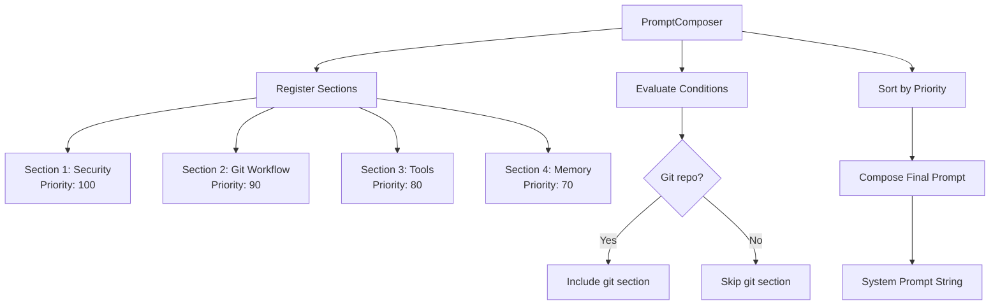
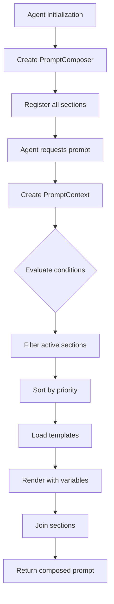

# Prompt Composition

**File**: `04_prompt_composition.md`
**Purpose**: Modular prompt system architecture

---

## Table of Contents

- [Overview](#overview)
- [PromptComposer Architecture](#promptcomposer-architecture)
- [Template Section System](#template-section-system)
- [Section Registration](#section-registration)
- [Priority and Ordering](#priority-and-ordering)
- [Conditional Sections](#conditional-sections)
- [Variable Substitution](#variable-substitution)
- [Template Rendering](#template-rendering)
- [Adding New Sections](#adding-new-sections)

---

## Overview

SWE-CLI uses a **modular prompt composition system** that assembles system prompts from individual markdown sections. This approach provides:

- **Modularity**: Each prompt section is a separate file
- **Priority-based ordering**: Sections ordered by priority for consistent composition
- **Conditional inclusion**: Sections can be included based on context (e.g., git status)
- **Variable substitution**: Dynamic values injected into templates
- **Easy maintenance**: Add/modify sections without touching agent code

**Key Locations**:
- `swecli/core/agents/prompts/composition.py` - PromptComposer class
- `swecli/core/agents/prompts/templates/system/main/*.md` - Prompt sections
- `swecli/core/agents/prompts/renderer.py` - Template rendering
- `swecli/core/agents/prompts/loader.py` - Template loading

---

## PromptComposer Architecture

**File**: `swecli/core/agents/prompts/composition.py`

**Purpose**: Compose system prompts from modular sections with priority-based ordering

### Core Responsibilities

1. **Section registration**: Register prompt sections with metadata
2. **Priority ordering**: Order sections by priority
3. **Conditional evaluation**: Decide which sections to include
4. **Composition**: Assemble final prompt from active sections
5. **Variable injection**: Substitute dynamic values into templates

### Structure



### Implementation

```python
# swecli/core/agents/prompts/composition.py
class PromptComposer:
    """Compose system prompts from modular sections"""

    def __init__(self, config: RuntimeConfig):
        self.config = config
        self.sections = []
        self.variables = {}
        self.loader = TemplateLoader()
        self.renderer = TemplateRenderer()

        # Register all sections
        self._register_sections()

    def _register_sections(self):
        """Register all prompt sections from templates/system/main/"""
        # Core sections (always included)
        self.register_section(
            name="security-policy",
            template="security-policy.md",
            priority=100,
            condition=None
        )
        self.register_section(
            name="git-workflow",
            template="git-workflow.md",
            priority=90,
            condition=lambda ctx: ctx.is_git_repo
        )
        self.register_section(
            name="tool-usage",
            template="tool-usage.md",
            priority=80,
            condition=None
        )
        self.register_section(
            name="auto-memory",
            template="auto-memory.md",
            priority=70,
            condition=lambda ctx: ctx.has_memory
        )
        # ... more sections

    def register_section(
        self,
        name: str,
        template: str,
        priority: int,
        condition: Callable = None
    ):
        """
        Register a prompt section

        Args:
            name: Section identifier
            template: Template file name
            priority: Higher priority = earlier in prompt
            condition: Optional condition function (ctx -> bool)
        """
        self.sections.append({
            "name": name,
            "template": template,
            "priority": priority,
            "condition": condition
        })

    def compose(self, context: PromptContext = None) -> str:
        """
        Compose final system prompt

        Flow:
        1. Evaluate conditions for each section
        2. Filter to active sections
        3. Sort by priority (descending)
        4. Load and render templates
        5. Join into final prompt
        """
        context = context or self._create_default_context()

        # Filter active sections
        active_sections = [
            section for section in self.sections
            if not section["condition"] or section["condition"](context)
        ]

        # Sort by priority (high to low)
        active_sections.sort(key=lambda s: s["priority"], reverse=True)

        # Render each section
        rendered_sections = []
        for section in active_sections:
            template_content = self.loader.load(section["template"])
            rendered = self.renderer.render(template_content, context.variables)
            rendered_sections.append(rendered)

        # Join with section separators
        return "\n\n---\n\n".join(rendered_sections)

    def _create_default_context(self) -> PromptContext:
        """Create context with current runtime info"""
        return PromptContext(
            is_git_repo=self._check_git_repo(),
            has_memory=self._check_memory(),
            working_dir=os.getcwd(),
            git_branch=self._get_git_branch(),
            model=self.config.model,
            variables=self._get_variables()
        )
```

---

## Template Section System

**Location**: `swecli/core/agents/prompts/templates/system/main/`

**Pattern**: Each section is a separate markdown file

### Available Sections

| Section | File | Priority | Conditional | Purpose |
|---------|------|----------|-------------|---------|
| **Security Policy** | `security-policy.md` | 100 | No | Security guidelines, OWASP awareness |
| **Git Workflow** | `git-workflow.md` | 90 | Git repo only | Git safety, commit messages, PR creation |
| **Tool Usage** | `tool-usage.md` | 80 | No | How to use tools effectively |
| **Auto Memory** | `auto-memory.md` | 70 | Has memory | Memory system instructions |
| **Doing Tasks** | `doing-tasks.md` | 60 | No | Task execution guidelines |
| **Code Style** | `code-style.md` | 50 | No | Coding conventions |
| **System Info** | `system-info.md` | 40 | No | Environment, platform, model info |
| **Mode Instructions** | `mode-instructions.md` | 30 | Mode-specific | Normal vs Plan mode instructions |

### Section Structure

```markdown
# Section Title

Brief description of section purpose.

## Subsection 1

Content with **markdown formatting**.

## Subsection 2

- Bullet points
- More bullets

## Examples

```code
example code block
```

## Important Notes

**CRITICAL**: Important instructions in bold.
```

---

## Section Registration

### Static Registration

```python
# Register at initialization
class PromptComposer:
    def _register_sections(self):
        self.register_section(
            name="security-policy",
            template="security-policy.md",
            priority=100,
            condition=None  # Always included
        )
```

### Dynamic Registration

```python
# Register sections at runtime
composer = PromptComposer(config)
composer.register_section(
    name="custom-instructions",
    template="custom-instructions.md",
    priority=85,
    condition=lambda ctx: ctx.has_custom_instructions
)
```

### Section Metadata

```python
@dataclass
class Section:
    name: str                    # Unique identifier
    template: str                # Template file name
    priority: int                # Higher = earlier in prompt
    condition: Callable = None   # Optional condition (ctx -> bool)
```

---

## Priority and Ordering

**Priority Range**: 1-100 (higher priority appears earlier in prompt)

**Rationale**:
- Critical instructions (security) come first
- Context-specific instructions (git, mode) in middle
- General guidelines (code style) at end

### Priority Tiers

| Tier | Priority Range | Purpose | Examples |
|------|----------------|---------|----------|
| **Critical** | 100-90 | Security, safety, critical constraints | Security policy, git safety |
| **High** | 89-70 | Core functionality, context-specific | Tool usage, memory, CLAUDE.md |
| **Medium** | 69-50 | Task execution, conventions | Doing tasks, code style |
| **Low** | 49-1 | System info, optional features | Environment info, mode hints |

### Ordering Example

```
Priority 100: Security Policy
Priority 90:  Git Workflow
Priority 80:  Tool Usage
Priority 70:  Auto Memory
Priority 60:  Doing Tasks
Priority 50:  Code Style
Priority 40:  System Info
Priority 30:  Mode Instructions
```

### Composedprompt Example

```
# Security Policy (Priority 100)
Never execute destructive commands without approval...

---

# Git Workflow (Priority 90)
When creating commits, follow these steps...

---

# Tool Usage (Priority 80)
Use the following tools to accomplish tasks...

---

... (more sections)
```

---

## Conditional Sections

**Pattern**: Sections can be conditionally included based on runtime context

### Condition Functions

```python
# Condition: Include only if in git repo
def git_repo_condition(ctx: PromptContext) -> bool:
    return ctx.is_git_repo

# Condition: Include only if memory directory exists
def memory_condition(ctx: PromptContext) -> bool:
    return ctx.has_memory

# Condition: Include only in plan mode
def plan_mode_condition(ctx: PromptContext) -> bool:
    return ctx.mode == "plan"
```

### Context Object

```python
@dataclass
class PromptContext:
    """Context for conditional section evaluation"""

    # Environment
    is_git_repo: bool
    working_dir: str
    git_branch: str = None

    # Features
    has_memory: bool
    has_mcp: bool

    # Mode
    mode: str  # "normal" or "plan"

    # Model
    model: str

    # Variables for template rendering
    variables: dict
```

### Registration with Conditions

```python
# Git workflow only for git repos
self.register_section(
    name="git-workflow",
    template="git-workflow.md",
    priority=90,
    condition=lambda ctx: ctx.is_git_repo
)

# Memory section only if memory directory exists
self.register_section(
    name="auto-memory",
    template="auto-memory.md",
    priority=70,
    condition=lambda ctx: ctx.has_memory
)
```

---

## Variable Substitution

**Pattern**: Templates can include variables that are substituted at render time

### Variable Syntax

```markdown
# System Info

- Working Directory: {{working_dir}}
- Git Branch: {{git_branch}}
- Model: {{model}}
- Platform: {{platform}}
```

### Variable Sources

```python
def _get_variables(self) -> dict:
    """Collect variables for template rendering"""
    return {
        # Environment
        "working_dir": os.getcwd(),
        "git_branch": self._get_git_branch(),
        "platform": platform.system(),

        # Config
        "model": self.config.model,
        "provider": self.config.provider,

        # Memory
        "memory_dir": self._get_memory_dir(),

        # MCP
        "mcp_servers": self._get_enabled_mcp_servers(),
    }
```

### Rendering

```python
# Template with variables
template = "Working in: {{working_dir}}, Branch: {{git_branch}}"

# Render with variable substitution
variables = {"working_dir": "/Users/dev/project", "git_branch": "main"}
rendered = renderer.render(template, variables)
# Result: "Working in: /Users/dev/project, Branch: main"
```

---

## Template Rendering

**File**: `swecli/core/agents/prompts/renderer.py`

**Purpose**: Render templates with variable substitution

### Implementation

```python
# swecli/core/agents/prompts/renderer.py
class TemplateRenderer:
    """Render templates with variable substitution"""

    def render(self, template: str, variables: dict) -> str:
        """
        Render template with variables

        Supports:
        - {{variable}} - Simple substitution
        - {{variable|default}} - Default value if missing
        - Conditional blocks (future)
        """
        result = template

        # Simple substitution
        for key, value in variables.items():
            pattern = r"\{\{" + key + r"\}\}"
            result = re.sub(pattern, str(value), result)

        # Default values
        default_pattern = r"\{\{(\w+)\|([^}]+)\}\}"
        def replace_with_default(match):
            var_name = match.group(1)
            default = match.group(2)
            return str(variables.get(var_name, default))

        result = re.sub(default_pattern, replace_with_default, result)

        return result
```

### Template Loader

```python
# swecli/core/agents/prompts/loader.py
class TemplateLoader:
    """Load template files from disk"""

    def __init__(self, template_dir: str = None):
        self.template_dir = template_dir or self._default_template_dir()
        self.cache = {}

    def load(self, template_name: str) -> str:
        """Load template from disk (with caching)"""
        if template_name in self.cache:
            return self.cache[template_name]

        template_path = Path(self.template_dir) / template_name
        if not template_path.exists():
            raise FileNotFoundError(f"Template not found: {template_name}")

        content = template_path.read_text()
        self.cache[template_name] = content
        return content

    def _default_template_dir(self) -> str:
        """Get default template directory"""
        return Path(__file__).parent / "templates" / "system" / "main"
```

---

## Adding New Sections

### Step 1: Create Template File

```markdown
# swecli/core/agents/prompts/templates/system/main/my-section.md

# My Custom Section

This section provides instructions for my custom feature.

## Key Points

- Point 1
- Point 2
- Point 3

## Example

```example
example code
```

**IMPORTANT**: Critical instruction here.
```

### Step 2: Register Section

```python
# swecli/core/agents/prompts/composition.py
class PromptComposer:
    def _register_sections(self):
        # ... existing sections

        self.register_section(
            name="my-section",
            template="my-section.md",
            priority=75,  # Between tool-usage (80) and auto-memory (70)
            condition=lambda ctx: ctx.has_custom_feature
        )
```

### Step 3: Update Context (if conditional)

```python
# swecli/models/prompt_context.py
@dataclass
class PromptContext:
    # ... existing fields

    has_custom_feature: bool = False
```

### Step 4: Test

```python
# tests/test_prompt_composition.py
def test_my_section():
    composer = PromptComposer(config)
    context = PromptContext(has_custom_feature=True)
    prompt = composer.compose(context)

    assert "My Custom Section" in prompt
```

---

## Section Examples

### Security Policy Section

```markdown
# Security Policy

**CRITICAL**: Assist with authorized security testing, defensive security, CTF challenges, and educational contexts. Refuse requests for:

- Destructive techniques
- DoS attacks
- Mass targeting
- Supply chain compromise
- Detection evasion for malicious purposes

## Dual-Use Security Tools

C2 frameworks, credential testing, and exploit development require clear authorization context:

- Pentesting engagements
- CTF competitions
- Security research
- Defensive use cases
```

### Git Workflow Section

```markdown
# Git Workflow

## Committing Changes

Only create commits when requested by the user.

**Git Safety Protocol**:
- NEVER update git config
- NEVER run destructive commands (push --force, reset --hard) unless explicitly requested
- NEVER skip hooks (--no-verify)
- CRITICAL: Always create NEW commits rather than amending

## Steps

1. Run git status to see changes
2. Run git diff to review changes
3. Draft commit message
4. Stage relevant files
5. Create commit with co-authored-by
```

### Tool Usage Section

```markdown
# Tool Usage

**CRITICAL - Use Dedicated Tools**:

- To read files use **Read** instead of cat
- To edit files use **Edit** instead of sed
- To create files use **Write** instead of echo
- To search files use **Glob** instead of find
- To search content use **Grep** instead of grep

Reserve **Bash** exclusively for system commands that require shell execution.

## Parallel Tool Calls

When calling multiple independent tools, make all calls in a single message for optimal performance.
```

---

## Best Practices

### 1. Keep Sections Focused

Each section should cover one topic:
```markdown
# Good: Focused section
# Git Workflow
Instructions for git operations

# Bad: Mixed topics
# Development Guidelines
Instructions for git, testing, deployment, documentation...
```

### 2. Use Clear Headings

```markdown
# Good: Clear structure
# Security Policy
## Approved Use Cases
## Prohibited Actions

# Bad: No structure
Security Policy

Here are some rules...
```

### 3. Highlight Critical Instructions

```markdown
**CRITICAL**: This is a must-follow instruction

**IMPORTANT**: This is important but not critical
```

### 4. Provide Examples

```markdown
## Example: Good Commit Message

```
feat: add user authentication

Implements JWT-based authentication with refresh tokens.

Co-Authored-By: Claude Opus 4.6 <noreply@anthropic.com>
```
```

### 5. Avoid Tables in Prompts

**BAD**: Tables waste tokens and are poorly parsed by LLMs
```markdown
| Tool | Use Case |
|------|----------|
| Read | Reading files |
| Write | Writing files |
```

**GOOD**: Use lists or prose
```markdown
Tool Usage:
- **Read**: Use to read file contents
- **Write**: Use to write files
```

---

## Composition Flow Diagram



---

## Next Steps

- **For execution flows**: See [Execution Flows](./05_execution_flows.md)
- **For UI integration**: See [UI Architectures](./06_ui_architectures.md)
- **For extension guide**: See [Extension Points](./09_extension_points.md)

---

**[← Back to Index](./00_INDEX.md)** | **[Next: Execution Flows →](./05_execution_flows.md)**
