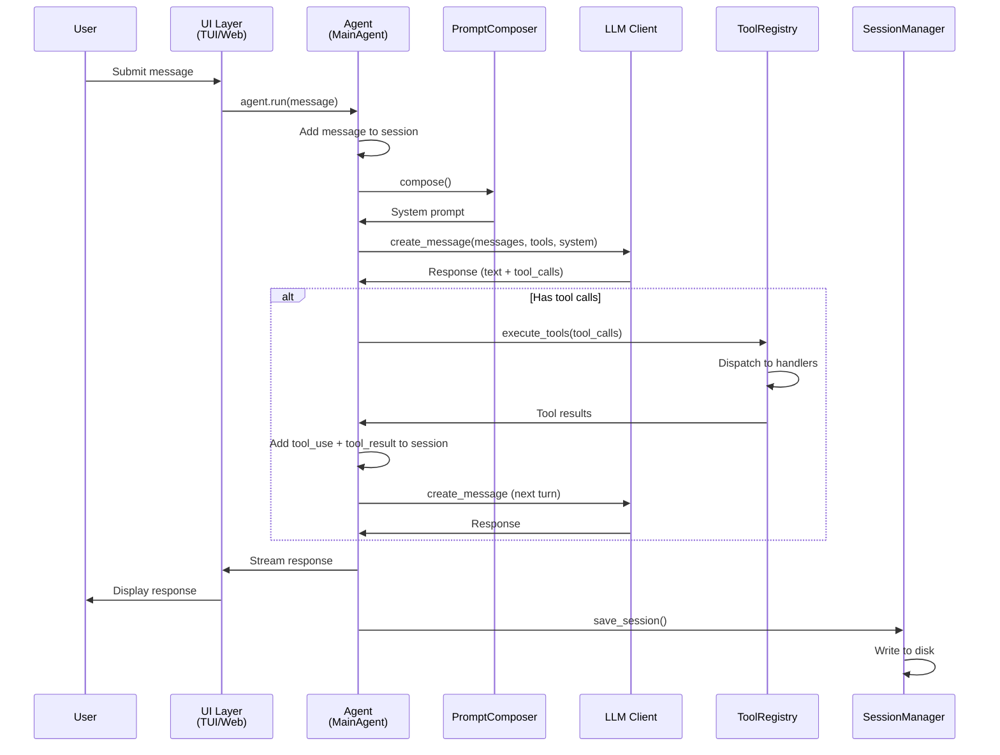
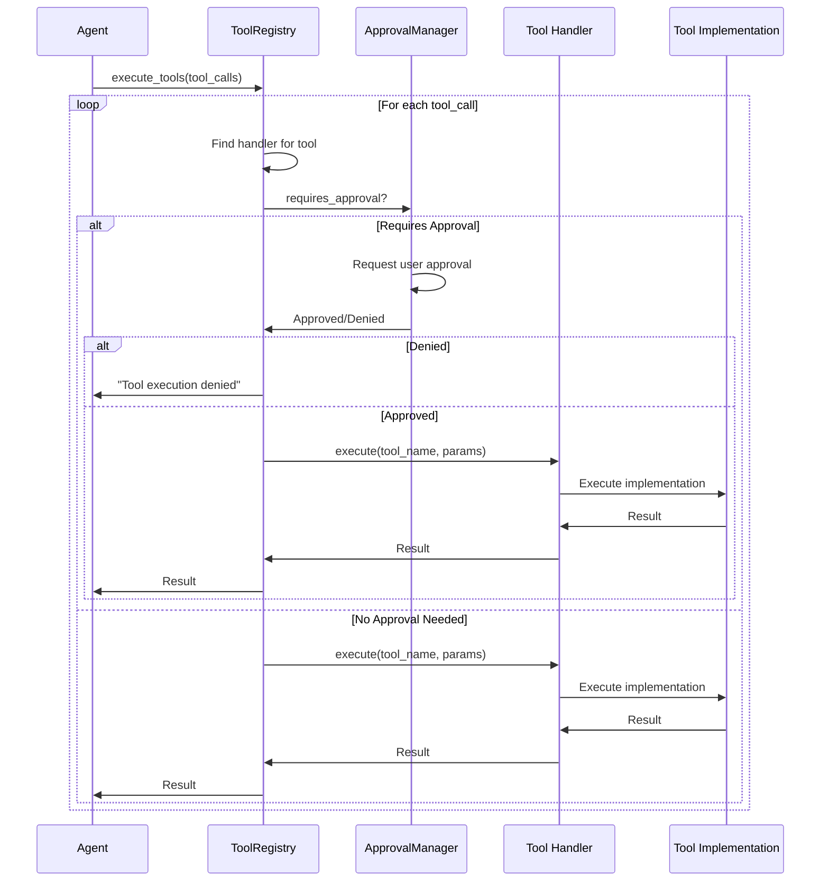
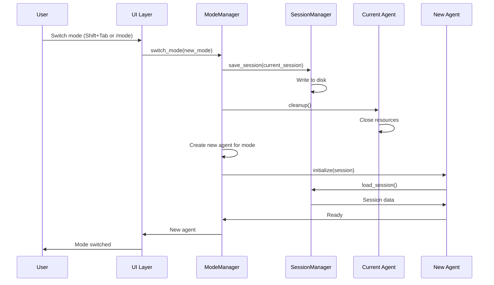
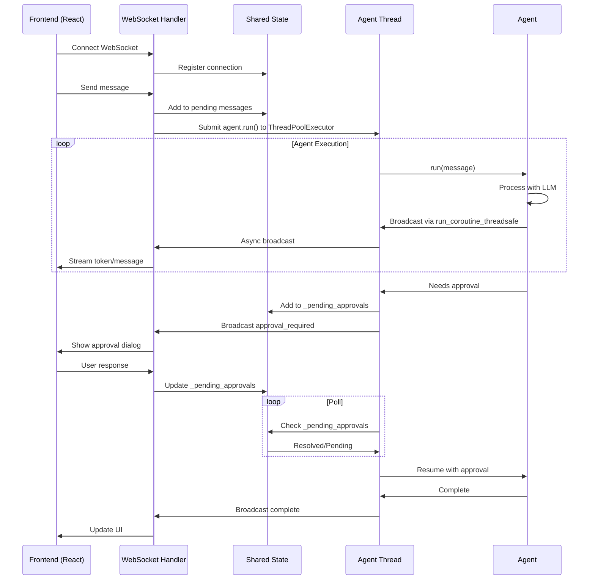
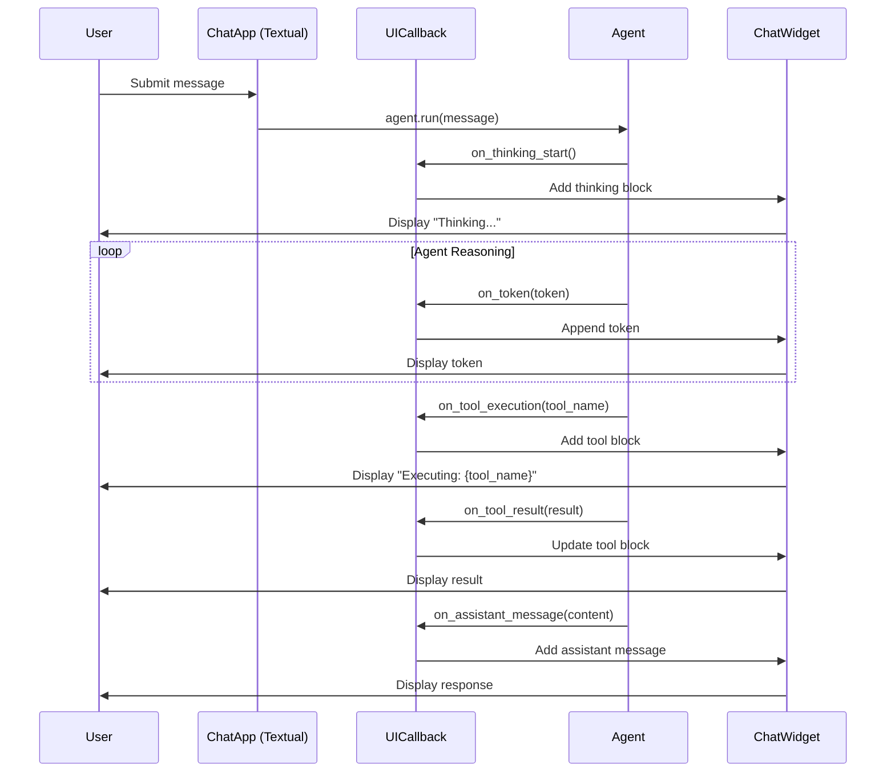
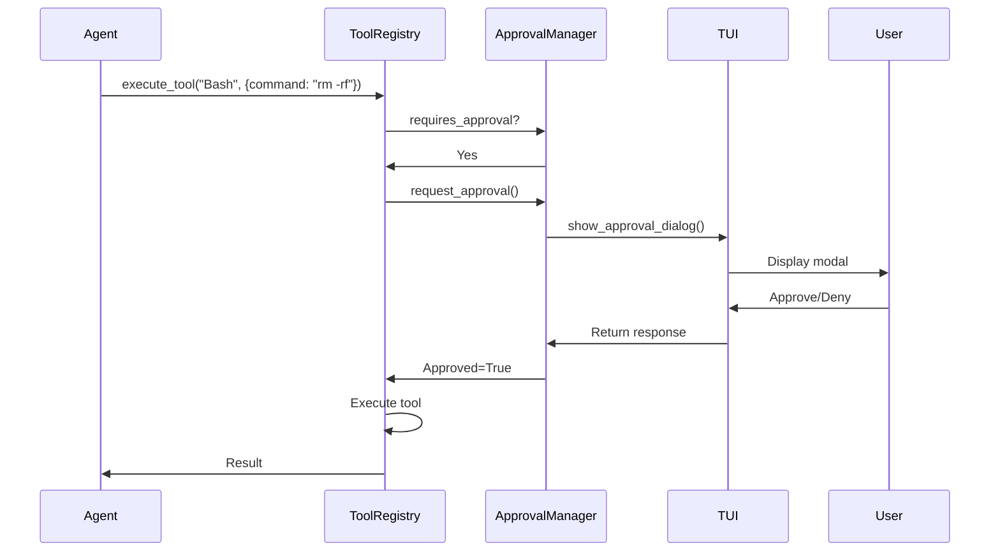
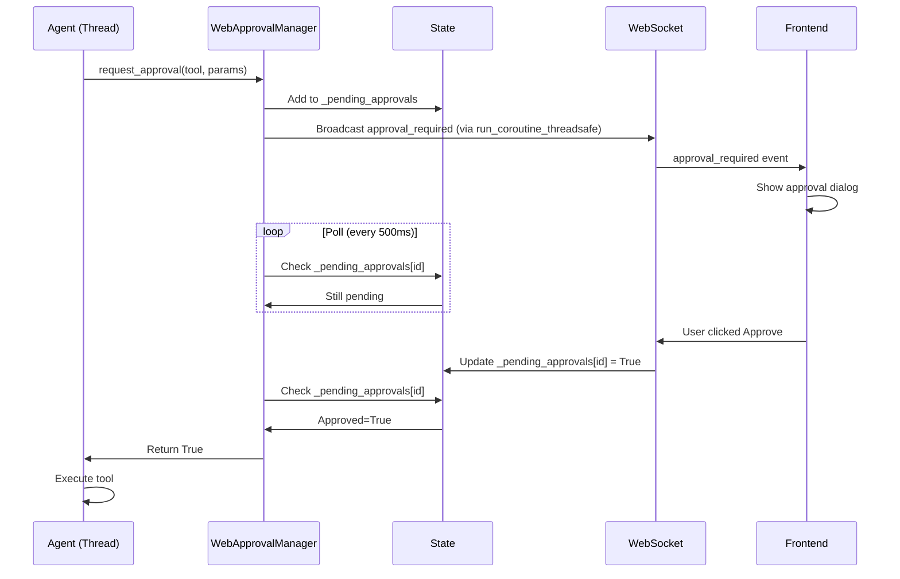
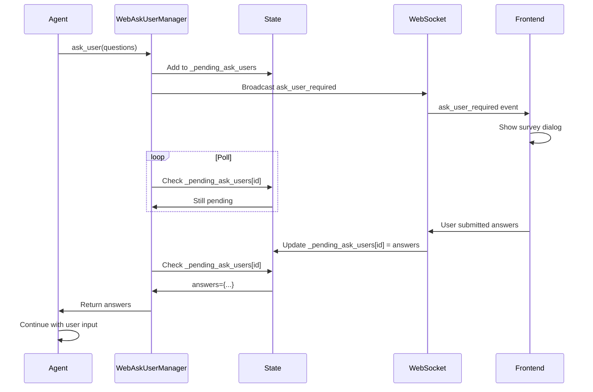

# Execution Flows

**File**: `05_execution_flows.md`
**Purpose**: Key execution flows through the system

---

## Table of Contents

- [Overview](#overview)
- [Flow 1: User Message to Response](#flow-1-user-message-to-response)
- [Flow 2: Tool Execution](#flow-2-tool-execution)
- [Flow 3: Session Persistence](#flow-3-session-persistence)
- [Flow 4: Mode Switching](#flow-4-mode-switching)
- [Flow 5: Web UI WebSocket Flow](#flow-5-web-ui-websocket-flow)
- [Flow 6: TUI Real-Time Display](#flow-6-tui-real-time-display)
- [Flow 7: Approval Flow](#flow-7-approval-flow)
- [Flow 8: Ask-User Flow](#flow-8-ask-user-flow)

---

## Overview

This document traces the key execution flows through the SWE-CLI system, from user input to final output. Understanding these flows is essential for:

- **Debugging**: Trace where issues occur in the pipeline
- **Extension**: Know where to hook in new functionality
- **Optimization**: Identify bottlenecks and optimization opportunities

Each flow is presented as:
1. **Sequence diagram**: Visual representation of component interactions
2. **Step-by-step description**: Detailed explanation of each step
3. **Code references**: Specific file paths and functions

---

## Flow 1: User Message to Response

**Purpose**: End-to-end flow from user input to agent response

### Sequence Diagram



### Step-by-Step

#### 1. User Submits Message

```python
# TUI: User types in input field, presses Enter
# Web: User types in chat input, clicks Send

# UI captures input
user_message = input_field.value
```

#### 2. UI Calls Agent

```python
# swecli/ui_textual/chat_app.py (TUI)
async def on_submit(self, message: str):
    response = await self.agent.run(message)

# swecli/web/websocket.py (Web)
async def handle_message(self, data: dict):
    response = await self.agent.run(data["message"])
```

#### 3. Agent Adds Message to Session

```python
# swecli/core/agents/main_agent.py
async def run(self, user_message: str):
    # Add user message
    self.session.add_message({
        "role": "user",
        "content": user_message
    })
```

#### 4. Agent Composes System Prompt

```python
# Get system prompt from composer
system_prompt = self.prompt_composer.compose(
    context=PromptContext(
        is_git_repo=self.is_git_repo(),
        has_memory=self.has_memory(),
        mode=self.mode
    )
)
```

#### 5. Agent Calls LLM

```python
# Call LLM with messages, tools, and system prompt
response = await self.llm_client.create_message(
    messages=self.session.messages,
    tools=self.tool_registry.get_tool_schemas(),
    system=system_prompt,
    max_tokens=4096
)
```

#### 6. Process Response

```python
if response.tool_calls:
    # Agent wants to execute tools
    results = await self.tool_registry.execute_tools(
        response.tool_calls,
        interrupt_token=self.interrupt_token
    )

    # Add assistant message with tool_calls
    self.session.add_message({
        "role": "assistant",
        "content": response.content,
        "tool_calls": response.tool_calls
    })

    # Add tool results
    for result in results:
        self.session.add_message({
            "role": "tool_result",
            "content": result
        })

    # Continue ReAct loop (next turn)
else:
    # No tools, task complete
    self.session.add_message({
        "role": "assistant",
        "content": response.content
    })
    return response.content
```

#### 7. Stream Response to UI

```python
# TUI: Update chat display
await ui_callback.on_assistant_message(response.content)

# Web: Broadcast via WebSocket
await websocket.send_json({
    "type": "assistant_message",
    "content": response.content
})
```

#### 8. Save Session

```python
# Auto-save after each turn
await self.session_manager.save_session(self.session)
```

---

## Flow 2: Tool Execution

**Purpose**: Tool dispatching and execution flow

### Sequence Diagram



### Step-by-Step

#### 1. Agent Requests Tool Execution

```python
# Agent received tool_calls from LLM
tool_calls = [
    {"name": "Read", "parameters": {"file_path": "app.py"}},
    {"name": "Bash", "parameters": {"command": "git status"}}
]

results = await self.tool_registry.execute_tools(tool_calls)
```

#### 2. Registry Dispatches to Handler

```python
# swecli/core/context_engineering/tools/registry.py
async def execute_tools(self, tool_calls: list):
    results = []
    for tool_call in tool_calls:
        # Find handler
        handler = self._get_handler_for_tool(tool_call["name"])

        # Execute
        result = await self.execute_tool(
            tool_call["name"],
            tool_call["parameters"],
            handler
        )
        results.append(result)
    return results
```

#### 3. Check Approval

```python
async def execute_tool(self, tool_name: str, parameters: dict, handler):
    # Check if approval required
    if await self.approval_manager.requires_approval(tool_name, parameters):
        approved = await self.approval_manager.request_approval(
            tool_name, parameters
        )
        if not approved:
            return f"Tool '{tool_name}' execution denied by user"

    # Execute tool
    return await handler.execute(tool_name, parameters)
```

#### 4. Handler Executes Tool

```python
# swecli/core/context_engineering/tools/handlers/file_handler.py
class FileOperationHandler:
    async def execute(self, tool_name: str, parameters: dict):
        if tool_name == "Read":
            tool = self.tools["Read"]
            return await tool.execute(**parameters)
        elif tool_name == "Write":
            tool = self.tools["Write"]
            return await tool.execute(**parameters)
        # ... other tools
```

#### 5. Tool Implementation Executes

```python
# swecli/core/context_engineering/tools/implementations/file_tools.py
class ReadTool:
    async def execute(self, file_path: str, offset: int = 0, limit: int = 2000):
        with open(file_path) as f:
            lines = f.readlines()[offset:offset+limit]
            return "".join(f"{i+1}: {line}" for i, line in enumerate(lines, offset))
```

#### 6. Result Returned to Agent

```python
# Result propagates back:
# Tool Implementation → Handler → Registry → Agent

# Agent receives result
result = "1: import os\n2: import sys\n..."
```

---

## Flow 3: Session Persistence

**Purpose**: Session save and restore flow

### Save Flow

```mermaid
graph TD
    A[Agent adds message] --> B[ValidatedMessageList.append]
    B --> C{Valid message pair?}
    C -->|No| D[Raise ValidationError]
    C -->|Yes| E[Append to session.messages]
    E --> F[SessionManager.save_session]
    F --> G[Serialize to JSON]
    G --> H[Write to ~/.opendev/sessions/{id}.jsonl]
    H --> I[Update sessions-index.json]
    I --> J{Index corrupted?}
    J -->|Yes| K[Rebuild index]
    J -->|No| L[Done]
    K --> L
```

### Load Flow

```mermaid
graph TD
    A[User requests session resume] --> B[SessionManager.load_session]
    B --> C{Session in index?}
    C -->|No| D[Scan sessions/ directory]
    D --> E[Rebuild index]
    E --> F[Find session]
    C -->|Yes| F
    F --> G[Read {id}.jsonl file]
    G --> H[Parse JSONL]
    H --> I[Deserialize messages]
    I --> J[Create ChatSession object]
    J --> K[Validate message pairs]
    K --> L{Valid?}
    L -->|No| M[Raise ValidationError]
    L -->|Yes| N[Return session]
```

### Implementation

#### Save

```python
# swecli/core/context_engineering/history/session_manager.py
class SessionManager:
    async def save_session(self, session: ChatSession):
        """Save session to disk"""
        # Serialize to JSONL
        session_path = self.sessions_dir / f"{session.id}.jsonl"
        with open(session_path, "w") as f:
            for message in session.messages:
                f.write(json.dumps(message) + "\n")

        # Update index
        await self._update_index(session)

    async def _update_index(self, session: ChatSession):
        """Update sessions-index.json"""
        try:
            with open(self.index_path) as f:
                index = json.load(f)
        except (FileNotFoundError, json.JSONDecodeError):
            # Rebuild if corrupted
            index = await self._rebuild_index()

        # Add/update session entry
        index[session.id] = {
            "title": session.title,
            "created_at": session.created_at,
            "updated_at": session.updated_at,
            "message_count": len(session.messages)
        }

        with open(self.index_path, "w") as f:
            json.dump(index, f, indent=2)
```

#### Load

```python
async def load_session(self, session_id: str) -> ChatSession:
    """Load session from disk"""
    session_path = self.sessions_dir / f"{session_id}.jsonl"

    if not session_path.exists():
        raise FileNotFoundError(f"Session {session_id} not found")

    messages = []
    with open(session_path) as f:
        for line in f:
            message = json.loads(line.strip())
            messages.append(message)

    # Create session
    session = ChatSession(
        id=session_id,
        messages=ValidatedMessageList(messages),
        created_at=messages[0].get("timestamp") if messages else None
    )

    return session
```

---

## Flow 4: Mode Switching

**Purpose**: Normal ↔ Plan mode transition

### Mode Switch Flow



### Implementation

```python
# swecli/core/runtime/mode_manager.py
class ModeManager:
    def __init__(self, config: RuntimeConfig):
        self.config = config
        self.current_mode = "normal"
        self.current_agent = None

    async def switch_mode(self, new_mode: str) -> Agent:
        """Switch between normal and plan mode"""
        # Save current session
        if self.current_agent:
            await self.session_manager.save_session(
                self.current_agent.session
            )
            await self.current_agent.cleanup()

        # Create new agent
        if new_mode == "plan":
            agent = PlanningAgent(
                config=self.config,
                session=self.current_agent.session if self.current_agent else None
            )
        else:
            agent = MainAgent(
                config=self.config,
                session=self.current_agent.session if self.current_agent else None
            )

        self.current_mode = new_mode
        self.current_agent = agent
        return agent
```

---

## Flow 5: Web UI WebSocket Flow

**Purpose**: Web UI real-time communication with agent (threaded + async)

### Architecture

The Web UI uses a **hybrid threading model**:
- **Main thread**: FastAPI server (async)
- **Agent thread**: Agent execution (ThreadPoolExecutor)
- **Communication**: `asyncio.run_coroutine_threadsafe` for WebSocket broadcasts

### Sequence Diagram



### Implementation

#### WebSocket Handler

```python
# swecli/web/websocket.py
class WebSocketHandler:
    def __init__(self):
        self.connections = set()
        self.agent_executor = ThreadPoolExecutor(max_workers=1)

    async def handle_connection(self, websocket: WebSocket):
        """Handle WebSocket connection"""
        await websocket.accept()
        self.connections.add(websocket)

        try:
            async for data in websocket.receive_json():
                if data["type"] == "user_message":
                    await self.handle_message(data, websocket)
        finally:
            self.connections.remove(websocket)

    async def handle_message(self, data: dict, websocket: WebSocket):
        """Handle user message - run agent in thread"""
        # Run agent in background thread
        loop = asyncio.get_event_loop()
        future = loop.run_in_executor(
            self.agent_executor,
            self._run_agent_sync,
            data["message"]
        )

        # Wait for completion
        await future

    def _run_agent_sync(self, message: str):
        """Run agent synchronously in thread"""
        # This runs in thread pool
        asyncio.run(self.agent.run(message))
```

#### Agent Broadcasts

```python
# Agent needs to broadcast to WebSocket from thread
# swecli/web/managers/stream_manager.py
class WebStreamManager:
    def __init__(self, websocket_manager):
        self.websocket_manager = websocket_manager

    def broadcast_from_thread(self, event: dict):
        """Broadcast from agent thread to async WebSocket"""
        loop = self.websocket_manager.loop
        asyncio.run_coroutine_threadsafe(
            self.websocket_manager.broadcast(event),
            loop
        )

# Agent calls this during execution
stream_manager.broadcast_from_thread({
    "type": "token",
    "content": "Hello"
})
```

---

## Flow 6: TUI Real-Time Display

**Purpose**: Textual TUI real-time message streaming and display

### Sequence Diagram



### Implementation

#### UICallback

```python
# swecli/ui_textual/ui_callback.py
class TUICallback:
    """Callback interface for agent → UI communication"""

    def __init__(self, chat_widget):
        self.chat_widget = chat_widget

    async def on_thinking_start(self):
        """Agent started thinking"""
        self.chat_widget.add_thinking_block()

    async def on_token(self, token: str):
        """Agent generated token"""
        self.chat_widget.append_token(token)

    async def on_tool_execution(self, tool_name: str, parameters: dict):
        """Agent executing tool"""
        self.chat_widget.add_tool_block(tool_name, parameters)

    async def on_tool_result(self, tool_name: str, result: str):
        """Tool execution completed"""
        self.chat_widget.update_tool_result(tool_name, result)

    async def on_assistant_message(self, content: str):
        """Agent completed response"""
        self.chat_widget.add_assistant_message(content)
```

#### Agent Integration

```python
# swecli/core/agents/main_agent.py
async def run(self, message: str):
    # Signal thinking start
    await self.ui_callback.on_thinking_start()

    # Call LLM
    response = await self.llm_client.create_message(...)

    # Stream tokens
    for token in response.content:
        await self.ui_callback.on_token(token)

    # Execute tools
    if response.tool_calls:
        for tool_call in response.tool_calls:
            await self.ui_callback.on_tool_execution(
                tool_call["name"],
                tool_call["parameters"]
            )

            result = await self.tool_registry.execute_tool(...)

            await self.ui_callback.on_tool_result(
                tool_call["name"],
                result
            )

    # Final message
    await self.ui_callback.on_assistant_message(response.content)
```

---

## Flow 7: Approval Flow

**Purpose**: User approval for risky operations (TUI vs Web)

### TUI Approval (Blocking)



### Web Approval (Polling)



---

## Flow 8: Ask-User Flow

**Purpose**: Multi-step user interaction (survey dialog)

### Web Ask-User Flow



### Implementation

```python
# swecli/web/managers/ask_user_manager.py
class WebAskUserManager:
    async def ask_user(self, questions: list) -> dict:
        """Ask user questions (called from agent thread)"""
        # Generate unique ID
        ask_id = str(uuid.uuid4())

        # Add to pending
        state._pending_ask_users[ask_id] = None

        # Broadcast via WebSocket (from thread)
        loop = self.websocket_manager.loop
        asyncio.run_coroutine_threadsafe(
            self.websocket_manager.broadcast({
                "type": "ask_user_required",
                "id": ask_id,
                "questions": questions
            }),
            loop
        )

        # Poll for response
        while True:
            if state._pending_ask_users.get(ask_id) is not None:
                answers = state._pending_ask_users.pop(ask_id)
                return answers
            await asyncio.sleep(0.5)
```

---

## Summary

| Flow | Pattern | Key Components |
|------|---------|----------------|
| **User Message** | Async pipeline | UI → Agent → LLM → Tools → UI |
| **Tool Execution** | Dispatch pattern | Registry → Handler → Implementation |
| **Session Persistence** | Auto-save with validation | ValidatedMessageList → JSONL → Index |
| **Mode Switching** | Agent swap | Save → Cleanup → Create → Load |
| **Web WebSocket** | Thread + async hybrid | ThreadPoolExecutor + run_coroutine_threadsafe |
| **TUI Real-Time** | Callback pattern | Agent → UICallback → Widgets |
| **Approval** | TUI blocking, Web polling | Modal (TUI) vs State polling (Web) |
| **Ask-User** | Survey dialog | Broadcast → Poll → Resolve |

---

## Next Steps

- **For UI details**: See [UI Architectures](./06_ui_architectures.md)
- **For data models**: See [Data Structures](./07_data_structures.md)
- **For design patterns**: See [Design Patterns](./08_design_patterns.md)

---

**[← Back to Index](./00_INDEX.md)** | **[Next: UI Architectures →](./06_ui_architectures.md)**
