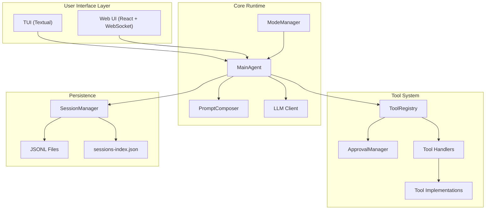

# SWE-CLI Execution Flows - Architecture Overview

**File**: `05_execution_flows_2.md`
**Purpose**: Visual architecture diagrams summarizing key execution flows

---

## High-Level System Architecture



---

## Flow Summary

| # | Flow | Pattern | Pipeline |
|---|------|---------|----------|
| 1 | **User Message → Response** | Async pipeline | `UI → Agent → PromptComposer → LLM → ToolRegistry → UI` |
| 2 | **Tool Execution** | Dispatch pattern | `Registry → ApprovalManager → Handler → Implementation` |
| 3 | **Session Persistence** | Auto-save + validation | `ValidatedMessageList → JSONL → Index` |
| 4 | **Mode Switching** | Agent swap | `Save → Cleanup → Create new Agent → Load` |
| 5 | **Web WebSocket** | Thread + async hybrid | `ThreadPoolExecutor + run_coroutine_threadsafe` |
| 6 | **TUI Real-Time** | Callback pattern | `Agent → UICallback → ChatWidget` |
| 7 | **Approval** | Blocking (TUI) / Polling (Web) | `Modal dialog (TUI)` · `State polling (Web)` |
| 8 | **Ask-User** | Survey dialog | `Broadcast → Poll → Resolve` |

---

## Flow 1 - User Message to Response

```
User ──submit──▶ UI Layer ──agent.run()──▶ MainAgent
                                              │
                            ┌─────────────────┤
                            ▼                 ▼
                     PromptComposer      Session.add_message()
                            │
                            ▼
                     System Prompt
                            │
                            ▼
                    LLM Client.create_message(messages, tools, system)
                            │
                            ▼
                   ┌── Response ──┐
                   │              │
            has tool_calls?    no tool_calls
                   │              │
                   ▼              ▼
           ToolRegistry       Return content
         execute_tools()          │
                   │              │
                   ▼              │
         Add tool_use +           │
         tool_result to           │
           session                │
                   │              │
                   ▼              │
          LLM (next turn)         │
            ◄─────────────────────┘
                   │
                   ▼
          Stream to UI ──▶ User
                   │
                   ▼
          SessionManager.save_session()
```

---

## Flow 2 - Tool Execution (Dispatch Pattern)

```
Agent
  │
  ▼
ToolRegistry.execute_tools(tool_calls)
  │
  ├──▶ for each tool_call:
  │        │
  │        ▼
  │    _get_handler_for_tool(name)
  │        │
  │        ▼
  │    ApprovalManager.requires_approval?
  │        │
  │    ┌───┴───┐
  │    │       │
  │   YES      NO
  │    │       │
  │    ▼       │
  │  request_  │
  │  approval()│
  │    │       │
  │  ┌─┴─┐    │
  │  │   │    │
  │ DENY APPROVE
  │  │   │    │
  │  ▼   └──┬─┘
  │ "denied" │
  │          ▼
  │   Handler.execute(name, params)
  │          │
  │          ▼
  │   Tool Implementation.execute(**params)
  │          │
  │          ▼
  │       Result
  │
  ▼
Return results[]
```

### Tool Layer Hierarchy

```
ToolRegistry
    ├── FileOperationHandler
    │       ├── ReadTool
    │       ├── WriteTool
    │       └── ...
    ├── BashHandler
    │       └── BashTool
    └── ...other handlers
```

---

## Flow 3 - Session Persistence

```
                    ┌──── SAVE ────┐                    ┌──── LOAD ────┐
                    │              │                    │              │
    Agent adds msg  │              │  User requests     │              │
         │          │              │   resume            │              │
         ▼          │              │      │              │              │
  ValidatedMessageList             │      ▼              │              │
    .append()       │              │  SessionManager     │              │
         │          │              │  .load_session()    │              │
    valid pair?     │              │      │              │              │
    ┌────┴────┐     │              │   in index?         │              │
    │         │     │              │   ┌──┴──┐           │              │
   YES        NO    │              │  YES    NO          │              │
    │     raise err │              │   │   scan dir      │              │
    ▼               │              │   │   rebuild idx   │              │
  session.messages  │              │   │     │           │              │
    │               │              │   ▼     ▼           │              │
  SessionManager    │              │  Read {id}.jsonl    │              │
  .save_session()   │              │      │              │              │
    │               │              │  Parse JSONL        │              │
  Serialize JSON    │              │      │              │              │
    │               │              │  Deserialize msgs   │              │
  Write .jsonl      │              │      │              │              │
    │               │              │  Create ChatSession │              │
  Update index      │              │      │              │              │
    │               │              │  Validate pairs     │              │
  corrupted?        │              │   ┌──┴──┐           │              │
  ┌──┴──┐           │              │  YES    NO          │              │
 YES    NO          │              │   │   raise err     │              │
  │     │           │              │   ▼                 │              │
rebuild  │          │              │  Return session     │              │
  │     │           │              │                     │              │
  └──┬──┘           │              └─────────────────────┘              │
     ▼              │                                                  │
    Done            │                                                  │
                    └──────────────────────────────────────────────────┘
```

**Storage layout:**

```
~/.opendev/sessions/
    ├── sessions-index.json       ← {id: {title, created_at, updated_at, message_count}}
    ├── {session-id-1}.jsonl      ← one JSON object per line per message
    ├── {session-id-2}.jsonl
    └── ...
```

---

## Flow 4 - Mode Switching (Normal ↔ Plan)

```
User (Shift+Tab or /mode)
    │
    ▼
UI Layer ──▶ ModeManager.switch_mode(new_mode)
                 │
                 ├──▶ SessionManager.save_session(current)
                 │
                 ├──▶ current_agent.cleanup()
                 │
                 ├──▶ Create new agent:
                 │       new_mode == "plan"  →  PlanningAgent
                 │       new_mode == "normal" →  MainAgent
                 │
                 ├──▶ new_agent.initialize(session)
                 │
                 └──▶ Return new agent to UI
```

---

## Flow 5 & 6 - UI Communication Models

### Web UI - Hybrid Threading Model

```
┌─────────────────────────────────────────────────────────┐
│                    Main Thread (async)                    │
│                                                          │
│   FastAPI Server ◄──── WebSocket ────► React Frontend    │
│        │                    ▲                             │
│        │                    │ run_coroutine_threadsafe    │
│        ▼                    │                             │
│   ThreadPoolExecutor ───────┘                            │
│        │                                                 │
│   ┌────▼──────────────────────┐                          │
│   │    Agent Thread            │                          │
│   │    ┌──────────┐           │                          │
│   │    │  Agent    │──stream──▶│──broadcast──▶ WebSocket  │
│   │    └──────────┘           │                          │
│   └───────────────────────────┘                          │
│                                                          │
│   Shared State: _pending_approvals, _pending_ask_users   │
└─────────────────────────────────────────────────────────┘
```

### TUI - Callback Pattern

```
Agent ────callback────▶ TUICallback ────update────▶ ChatWidget ──▶ User
              │
              ├── on_thinking_start()  → add thinking block
              ├── on_token(token)      → append token (streaming)
              ├── on_tool_execution()  → add tool block
              ├── on_tool_result()     → update tool block
              └── on_assistant_message() → add final message
```

---

## Flow 7 & 8 - Interactive Flows

### Approval Flow

```
                     TUI (Blocking)                     Web (Polling)
                ┌────────────────────┐           ┌─────────────────────────┐
                │                    │           │                         │
  Agent ──▶ ApprovalManager          │  Agent ──▶│ WebApprovalManager      │
                │                    │           │     │                   │
          requires_approval?         │           │  add to _pending        │
              YES                    │           │     │                   │
                │                    │           │  broadcast via WS       │
          show_approval_dialog()     │           │     │                   │
                │                    │           │  ┌──▼──┐                │
           ┌────▼────┐               │           │  │Poll │◄──────┐       │
           │  Modal  │               │           │  │500ms│       │       │
           │ Dialog  │               │           │  └──┬──┘       │       │
           └────┬────┘               │           │     │    still pending  │
           User clicks               │           │     │          │       │
           Approve / Deny            │           │  resolved? ────┘       │
                │                    │           │     │                   │
           return bool               │           │   return bool          │
                │                    │           │                         │
                └────────────────────┘           └─────────────────────────┘
```

### Ask-User Flow (Web Only - Survey Dialog)

```
Agent ──▶ WebAskUserManager.ask_user(questions)
              │
              ├── Generate unique ask_id
              ├── Add to _pending_ask_users[ask_id] = None
              ├── Broadcast {type: "ask_user_required", questions} via WebSocket
              │
              │   Frontend shows survey dialog
              │
              ├── Poll _pending_ask_users[ask_id] every 500ms
              │       └── User submits answers via WebSocket
              │       └── State updated: _pending_ask_users[ask_id] = answers
              │
              └── Return answers to Agent
```

---

## Component Interaction Map

```
┌─────────────────────────────────────────────────────────────────┐
│                         USER                                     │
│                    ┌─────┴─────┐                                 │
│                    ▼           ▼                                  │
│              ┌─────────┐ ┌─────────┐                             │
│              │   TUI   │ │ Web UI  │    ◄── UI Layer             │
│              │(Textual)│ │(React)  │                             │
│              └────┬────┘ └────┬────┘                             │
│                   │           │                                   │
│              UICallback   WebSocket                              │
│                   │           │                                   │
│                   └─────┬─────┘                                  │
│                         ▼                                        │
│                   ┌───────────┐                                   │
│                   │ModeManager│    ◄── Runtime                   │
│                   └─────┬─────┘                                  │
│                         ▼                                        │
│                   ┌───────────┐                                   │
│                   │MainAgent│    ◄── Core Agent                 │
│                   └─┬───┬───┬─┘                                  │
│                     │   │   │                                    │
│          ┌──────────┘   │   └──────────┐                         │
│          ▼              ▼              ▼                          │
│   ┌────────────┐ ┌───────────┐ ┌──────────────┐                  │
│   │PromptCompo-│ │ LLM Client│ │ ToolRegistry │  ◄── Services   │
│   │    ser     │ │           │ │              │                  │
│   └────────────┘ └───────────┘ └───┬──────┬───┘                  │
│                                    │      │                      │
│                          ┌─────────┘      └────────┐             │
│                          ▼                         ▼             │
│                   ┌──────────────┐          ┌────────────┐       │
│                   │ApprovalManager│          │ Tool       │       │
│                   └──────────────┘          │ Handlers   │       │
│                                             └─────┬──────┘       │
│                                                   ▼              │
│                                             ┌────────────┐       │
│                                             │ Tool Impls │       │
│                                             │(Read,Write,│       │
│                                             │ Bash, ...) │       │
│                                             └────────────┘       │
│                                                                  │
│                   ┌──────────────┐                                │
│                   │SessionManager│    ◄── Persistence            │
│                   └───┬──────┬───┘                                │
│                       │      │                                   │
│                       ▼      ▼                                   │
│                   .jsonl   index.json                             │
└─────────────────────────────────────────────────────────────────┘
```
