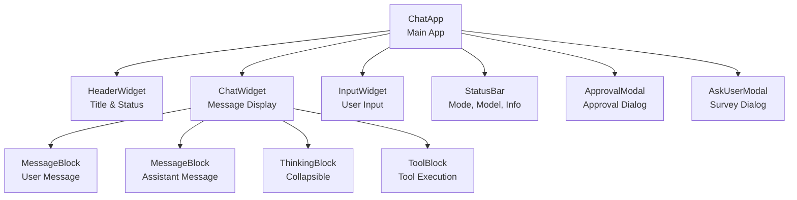
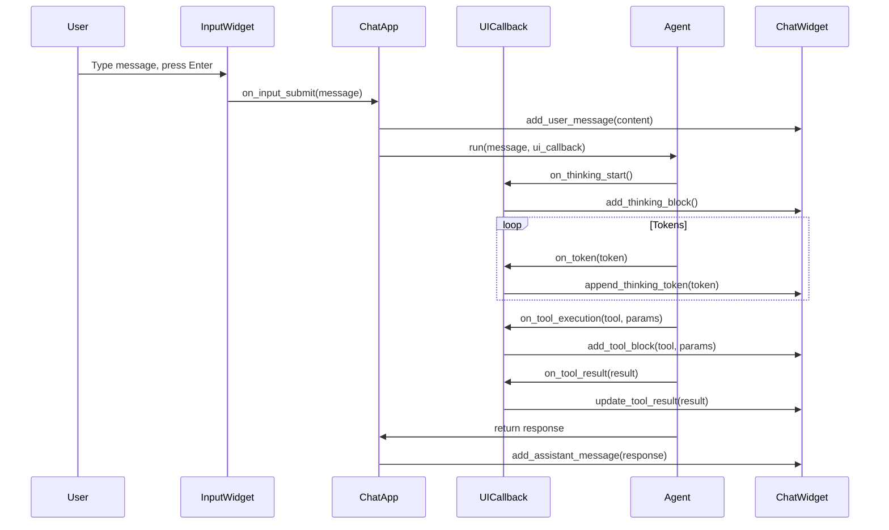
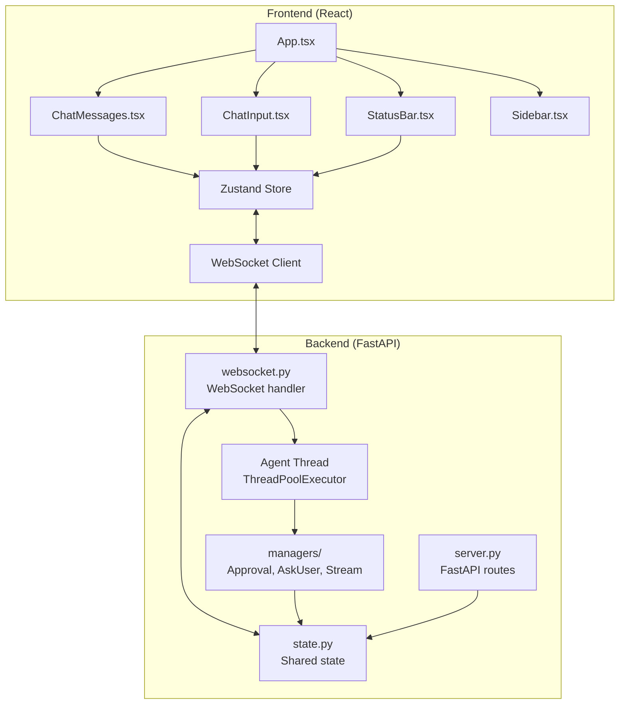

# UI Architectures

**File**: `06_ui_architectures.md`
**Purpose**: Textual TUI and Web UI architectures

---

## Table of Contents

- [Overview](#overview)
- [Textual TUI Architecture](#textual-tui-architecture)
- [Web UI Architecture](#web-ui-architecture)
- [Approval Flow Differences](#approval-flow-differences)
- [Ask-User Flow Differences](#ask-user-flow-differences)
- [Message Streaming](#message-streaming)
- [State Synchronization](#state-synchronization)
- [Design Trade-offs](#design-trade-offs)

---

## Overview

SWE-CLI supports two UI implementations with fundamentally different interaction patterns:

1. **Textual TUI**: Terminal-based, blocking, modal dialogs
2. **Web UI**: Browser-based, non-blocking, polling

Both UIs share the same agent core but differ in:
- **Threading model**: TUI is async, Web uses ThreadPoolExecutor for agent
- **Approval pattern**: TUI blocks, Web polls state
- **Communication**: TUI uses callbacks, Web uses WebSocket broadcasts
- **State management**: TUI uses Textual state, Web uses Zustand + shared state

**Key Locations**:
- **TUI**: `swecli/ui_textual/`
- **Web Backend**: `swecli/web/`
- **Web Frontend**: `web-ui/src/`

---

## Textual TUI Architecture

**Framework**: Textual (Python TUI framework)
**Pattern**: Event-driven, async, blocking interactions

### Component Hierarchy



### Key Components

#### ChatApp (Main Application)

```python
# swecli/ui_textual/chat_app.py
class ChatApp(App):
    """Main Textual application"""

    CSS_PATH = "styles.tcss"
    BINDINGS = [
        ("ctrl+c", "quit", "Quit"),
        ("shift+tab", "toggle_mode", "Toggle Mode"),
        ("ctrl+k", "clear_chat", "Clear Chat"),
    ]

    def __init__(self, agent):
        super().__init__()
        self.agent = agent
        self.ui_callback = TUICallback(self)

    def compose(self) -> ComposeResult:
        """Compose UI widgets"""
        yield HeaderWidget()
        yield ChatWidget()
        yield InputWidget()
        yield StatusBar()

    async def on_mount(self):
        """Initialize on mount"""
        self.query_one(InputWidget).focus()

    async def on_input_submit(self, message: Message):
        """Handle user message submission"""
        # Add user message to chat
        chat_widget = self.query_one(ChatWidget)
        chat_widget.add_user_message(message.value)

        # Run agent
        response = await self.agent.run(
            message.value,
            ui_callback=self.ui_callback
        )

        # Response streamed via ui_callback
```

#### ChatWidget (Message Display)

```python
# swecli/ui_textual/widgets/chat_widget.py
class ChatWidget(VerticalScroll):
    """Scrollable chat message display"""

    def add_user_message(self, content: str):
        """Add user message block"""
        block = MessageBlock(role="user", content=content)
        self.mount(block)
        self.scroll_end()

    def add_assistant_message(self, content: str):
        """Add assistant message block"""
        block = MessageBlock(role="assistant", content=content)
        self.mount(block)
        self.scroll_end()

    def add_thinking_block(self):
        """Add collapsible thinking block"""
        block = ThinkingBlock()
        self.mount(block)
        self._current_thinking = block

    def append_thinking_token(self, token: str):
        """Append token to current thinking block"""
        if self._current_thinking:
            self._current_thinking.append(token)

    def add_tool_block(self, tool_name: str, parameters: dict):
        """Add tool execution block"""
        block = ToolBlock(tool_name, parameters)
        self.mount(block)
        self._current_tool = block

    def update_tool_result(self, result: str):
        """Update current tool block with result"""
        if self._current_tool:
            self._current_tool.set_result(result)
```

#### UICallback (Agent → UI Communication)

```python
# swecli/ui_textual/ui_callback.py
class TUICallback:
    """Callback interface for agent events"""

    def __init__(self, app: ChatApp):
        self.app = app

    async def on_thinking_start(self):
        """Called when agent starts thinking"""
        chat_widget = self.app.query_one(ChatWidget)
        chat_widget.add_thinking_block()

    async def on_token(self, token: str):
        """Called when agent generates token"""
        chat_widget = self.app.query_one(ChatWidget)
        chat_widget.append_thinking_token(token)

    async def on_tool_execution(self, tool_name: str, parameters: dict):
        """Called when agent executes tool"""
        chat_widget = self.app.query_one(ChatWidget)
        chat_widget.add_tool_block(tool_name, parameters)

    async def on_tool_result(self, tool_name: str, result: str):
        """Called when tool returns result"""
        chat_widget = self.app.query_one(ChatWidget)
        chat_widget.update_tool_result(result)

    async def request_approval(self, operation: str) -> bool:
        """Request user approval (blocking modal)"""
        modal = ApprovalModal(operation)
        await self.app.push_screen(modal)
        # Blocks until user responds
        return await modal.wait_for_response()

    async def ask_user(self, questions: list) -> dict:
        """Ask user questions (blocking modal)"""
        modal = AskUserModal(questions)
        await self.app.push_screen(modal)
        # Blocks until user responds
        return await modal.wait_for_response()
```

### Event Flow



---

## Web UI Architecture

**Frontend**: React 18 + Vite + TypeScript + Zustand
**Backend**: FastAPI + WebSockets
**Pattern**: Non-blocking, polling-based

### Architecture Diagram



### Backend Components

#### FastAPI Server

```python
# swecli/web/server.py
from fastapi import FastAPI, WebSocket
from fastapi.staticfiles import StaticFiles

app = FastAPI()

# Serve static frontend files
app.mount("/", StaticFiles(directory="swecli/web/static", html=True), name="static")

# API endpoints
@app.get("/api/config")
async def get_config():
    """Get current configuration"""
    return {
        "mode": state.mode,
        "autonomy_level": state.autonomy_level,
        "working_dir": state.working_dir,
        "git_branch": state.git_branch,
        "model": state.model
    }

@app.post("/api/config/mode")
async def set_mode(data: dict):
    """Set normal/plan mode"""
    state.mode = data["mode"]
    await websocket_manager.broadcast({
        "type": "mode_changed",
        "mode": data["mode"]
    })
    return {"status": "ok"}

@app.get("/api/sessions")
async def list_sessions():
    """List all sessions"""
    return await session_manager.list_sessions()

# WebSocket endpoint
@app.websocket("/ws")
async def websocket_endpoint(websocket: WebSocket):
    """WebSocket connection for real-time communication"""
    await websocket_manager.handle_connection(websocket)
```

#### WebSocket Handler

```python
# swecli/web/websocket.py
class WebSocketManager:
    def __init__(self):
        self.connections = set()
        self.agent_executor = ThreadPoolExecutor(max_workers=1)
        self.loop = asyncio.get_event_loop()

    async def handle_connection(self, websocket: WebSocket):
        """Handle WebSocket connection"""
        await websocket.accept()
        self.connections.add(websocket)

        try:
            async for data in websocket.receive_json():
                await self.handle_message(data, websocket)
        finally:
            self.connections.remove(websocket)

    async def handle_message(self, data: dict, websocket: WebSocket):
        """Handle incoming WebSocket message"""
        if data["type"] == "user_message":
            # Run agent in background thread
            loop = asyncio.get_event_loop()
            loop.run_in_executor(
                self.agent_executor,
                self._run_agent_sync,
                data["message"]
            )

    def _run_agent_sync(self, message: str):
        """Run agent synchronously in thread"""
        asyncio.run(self.agent.run(message))

    async def broadcast(self, event: dict):
        """Broadcast event to all connected clients"""
        for connection in self.connections:
            try:
                await connection.send_json(event)
            except Exception:
                # Connection closed, will be removed
                pass
```

#### Shared State

```python
# swecli/web/state.py
class WebState:
    """Shared state for Web UI"""

    def __init__(self):
        # Config
        self.mode = "normal"
        self.autonomy_level = "semi-auto"
        self.working_dir = os.getcwd()
        self.git_branch = None
        self.model = "gpt-4"

        # Pending approvals (id -> result)
        self._pending_approvals = {}

        # Pending ask-user (id -> answers)
        self._pending_ask_users = {}

        # Current session
        self.current_session_id = None

# Global state instance
state = WebState()
```

### Frontend Components

#### Zustand Store

```typescript
// web-ui/src/stores/chat.ts
import create from 'zustand'

interface ChatState {
  messages: Message[]
  thinking: string
  mode: string
  autonomyLevel: string

  // Actions
  addMessage: (message: Message) => void
  appendThinking: (token: string) => void
  clearThinking: () => void
  setMode: (mode: string) => void
}

export const useChatStore = create<ChatState>((set) => ({
  messages: [],
  thinking: '',
  mode: 'normal',
  autonomyLevel: 'semi-auto',

  addMessage: (message) => set((state) => ({
    messages: [...state.messages, message]
  })),

  appendThinking: (token) => set((state) => ({
    thinking: state.thinking + token
  })),

  clearThinking: () => set({ thinking: '' }),

  setMode: (mode) => set({ mode })
}))
```

#### WebSocket Client

```typescript
// web-ui/src/lib/websocket.ts
import { useChatStore } from '../stores/chat'

class WebSocketClient {
  private ws: WebSocket | null = null

  connect() {
    this.ws = new WebSocket('ws://localhost:8000/ws')

    this.ws.onmessage = (event) => {
      const data = JSON.parse(event.data)
      this.handleMessage(data)
    }
  }

  handleMessage(data: any) {
    const store = useChatStore.getState()

    switch (data.type) {
      case 'token':
        store.appendThinking(data.content)
        break

      case 'assistant_message':
        store.clearThinking()
        store.addMessage({
          role: 'assistant',
          content: data.content
        })
        break

      case 'approval_required':
        // Show approval dialog
        showApprovalDialog(data)
        break

      case 'ask_user_required':
        // Show ask-user dialog
        showAskUserDialog(data)
        break

      case 'mode_changed':
        store.setMode(data.mode)
        break
    }
  }

  send(message: any) {
    if (this.ws?.readyState === WebSocket.OPEN) {
      this.ws.send(JSON.stringify(message))
    }
  }
}

export const ws = new WebSocketClient()

// Connect at module level
ws.connect()
```

#### Chat Component

```typescript
// web-ui/src/components/ChatMessages.tsx
import { useChatStore } from '../stores/chat'

export function ChatMessages() {
  const messages = useChatStore((state) => state.messages)
  const thinking = useChatStore((state) => state.thinking)

  return (
    <div className="flex flex-col gap-4 p-4">
      {messages.map((message, i) => (
        <MessageBlock key={i} message={message} />
      ))}

      {thinking && (
        <ThinkingBlock content={thinking} />
      )}
    </div>
  )
}
```

---

## Approval Flow Differences

### TUI Approval (Blocking)

```python
# swecli/ui_textual/ui_callback.py
async def request_approval(self, operation: str) -> bool:
    """Blocking modal approval"""
    modal = ApprovalModal(operation)

    # Push modal screen (blocks)
    await self.app.push_screen(modal)

    # Wait for user response (blocks agent)
    result = await modal.wait_for_response()

    return result

# Agent execution is blocked until user responds
```

### Web Approval (Polling)

```python
# swecli/web/managers/approval_manager.py
class WebApprovalManager:
    async def request_approval(self, operation: str) -> bool:
        """Non-blocking polling approval"""
        # Generate unique ID
        approval_id = str(uuid.uuid4())

        # Add to pending approvals
        state._pending_approvals[approval_id] = None

        # Broadcast to frontend (from thread)
        loop = websocket_manager.loop
        asyncio.run_coroutine_threadsafe(
            websocket_manager.broadcast({
                "type": "approval_required",
                "id": approval_id,
                "operation": operation
            }),
            loop
        )

        # Poll for response
        while True:
            if state._pending_approvals.get(approval_id) is not None:
                result = state._pending_approvals.pop(approval_id)
                return result
            await asyncio.sleep(0.5)

# Frontend updates state when user responds
```

**Comparison**:

| Aspect | TUI | Web |
|--------|-----|-----|
| **Pattern** | Blocking modal | Polling state |
| **Thread** | Same thread | Agent in thread, WS in async |
| **Response** | Immediate | Polled every 500ms |
| **State** | Modal widget state | Shared state dictionary |
| **UX** | Blocks everything | Non-blocking UI |

---

## Ask-User Flow Differences

### TUI Ask-User (Blocking)

```python
# swecli/ui_textual/ui_callback.py
async def ask_user(self, questions: list) -> dict:
    """Blocking modal survey"""
    modal = AskUserModal(questions)

    # Push modal (blocks)
    await self.app.push_screen(modal)

    # Wait for answers (blocks agent)
    answers = await modal.wait_for_response()

    return answers
```

### Web Ask-User (Polling)

```python
# swecli/web/managers/ask_user_manager.py
class WebAskUserManager:
    async def ask_user(self, questions: list) -> dict:
        """Non-blocking polling survey"""
        # Generate unique ID
        ask_id = str(uuid.uuid4())

        # Add to pending
        state._pending_ask_users[ask_id] = None

        # Broadcast to frontend
        loop = websocket_manager.loop
        asyncio.run_coroutine_threadsafe(
            websocket_manager.broadcast({
                "type": "ask_user_required",
                "id": ask_id,
                "questions": questions
            }),
            loop
        )

        # Poll for answers
        while True:
            if state._pending_ask_users.get(ask_id) is not None:
                answers = state._pending_ask_users.pop(ask_id)
                return answers
            await asyncio.sleep(0.5)
```

---

## Message Streaming

### TUI Streaming

```python
# Agent streams tokens via callback
async def on_token(self, token: str):
    chat_widget = self.app.query_one(ChatWidget)
    chat_widget.append_thinking_token(token)
    # Textual auto-updates display
```

### Web Streaming

```python
# Agent broadcasts tokens via WebSocket
def broadcast_token(token: str):
    asyncio.run_coroutine_threadsafe(
        websocket_manager.broadcast({
            "type": "token",
            "content": token
        }),
        loop
    )

# Frontend receives and updates state
ws.onmessage = (event) => {
  const data = JSON.parse(event.data)
  if (data.type === 'token') {
    useChatStore.getState().appendThinking(data.content)
  }
}
```

---

## State Synchronization

### TUI State

- **Widget state**: Textual widgets manage their own state
- **No global state**: Each widget is independent
- **Event-driven**: Widgets communicate via events

### Web State

- **Zustand store**: Centralized frontend state
- **Shared backend state**: `WebState` for pending operations
- **WebSocket sync**: Broadcasts keep frontend in sync

```typescript
// Frontend state sync
useEffect(() => {
  const unsubscribe = ws.on('mode_changed', (mode) => {
    useChatStore.getState().setMode(mode)
  })

  return unsubscribe
}, [])
```

---

## Design Trade-offs

### TUI

**Advantages**:
- ✅ Simple threading model (all async)
- ✅ Blocking interactions (intuitive for approval)
- ✅ Low latency (no network)
- ✅ Terminal-native (developers love terminals)

**Disadvantages**:
- ❌ Limited to terminal
- ❌ No rich media (images, videos)
- ❌ Single device only
- ❌ Harder to show complex UI (tables, graphs)

### Web UI

**Advantages**:
- ✅ Rich UI (React components, TailwindCSS)
- ✅ Multi-device (desktop, mobile)
- ✅ Rich media support (images, videos)
- ✅ Better for complex interactions (multi-step forms)

**Disadvantages**:
- ❌ Complex threading (ThreadPoolExecutor + async)
- ❌ Polling overhead (approval, ask-user)
- ❌ Network latency
- ❌ Browser required

---

## Choosing the Right UI

**Use TUI when**:
- Working in terminal environment
- Low latency critical
- Simple approval dialogs sufficient
- Want lightweight, fast startup

**Use Web UI when**:
- Need rich UI components
- Multi-device access required
- Complex forms and interactions
- Want to embed in browser-based workflow

---

## Next Steps

- **For data models**: See [Data Structures](./07_data_structures.md)
- **For design patterns**: See [Design Patterns](./08_design_patterns.md)
- **For extension guide**: See [Extension Points](./09_extension_points.md)

---

**[← Back to Index](./00_INDEX.md)** | **[Next: Data Structures →](./07_data_structures.md)**
