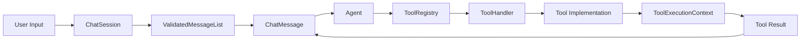

# Data Structures

**File**: `07_data_structures.md`
**Purpose**: Core data models and relationships

---

## Table of Contents

- [Overview](#overview)
- [Session Models](#session-models)
- [Message Models](#message-models)
- [ValidatedMessageList](#validatedmessagelist)
- [Agent Dependencies](#agent-dependencies)
- [Tool Execution Context](#tool-execution-context)
- [Configuration Models](#configuration-models)
- [MCP Models](#mcp-models)
- [Entity Relationships](#entity-relationships)

---

## Overview

SWE-CLI uses Pydantic models for data validation and type safety. The core data structures include:

- **ChatSession**: Conversation session with messages
- **ChatMessage**: Individual message (user, assistant, tool_use, tool_result)
- **ValidatedMessageList**: Message list with pairing invariants
- **AgentDependencies**: Dependency injection container
- **ToolExecutionContext**: Context for tool execution
- **RuntimeConfig**: System configuration
- **MCPServer/MCPTool**: MCP integration models

**Key Location**: `swecli/models/`

---

## Session Models

### ChatSession

**File**: `swecli/models/session.py`

**Purpose**: Represents a conversation session

```python
from pydantic import BaseModel, Field
from datetime import datetime
from typing import Optional

class ChatSession(BaseModel):
    """Conversation session"""

    id: str = Field(default_factory=lambda: str(uuid.uuid4())[:8])
    title: Optional[str] = None
    created_at: datetime = Field(default_factory=datetime.utcnow)
    updated_at: datetime = Field(default_factory=datetime.utcnow)
    messages: ValidatedMessageList = Field(default_factory=ValidatedMessageList)
    metadata: dict = Field(default_factory=dict)

    # Computed properties
    @property
    def token_count(self) -> int:
        """Estimate token count of all messages"""
        return sum(len(m.get("content", "")) // 4 for m in self.messages)

    @property
    def message_count(self) -> int:
        """Total message count"""
        return len(self.messages)

    def add_message(self, message: dict):
        """Add message to session (validates automatically)"""
        self.messages.append(message)
        self.updated_at = datetime.utcnow()

    def to_dict(self) -> dict:
        """Serialize to dictionary"""
        return {
            "id": self.id,
            "title": self.title,
            "created_at": self.created_at.isoformat(),
            "updated_at": self.updated_at.isoformat(),
            "messages": list(self.messages),
            "metadata": self.metadata
        }

    @classmethod
    def from_dict(cls, data: dict) -> "ChatSession":
        """Deserialize from dictionary"""
        return cls(
            id=data["id"],
            title=data.get("title"),
            created_at=datetime.fromisoformat(data["created_at"]),
            updated_at=datetime.fromisoformat(data["updated_at"]),
            messages=ValidatedMessageList(data.get("messages", [])),
            metadata=data.get("metadata", {})
        )
```

### Session Index Entry

**File**: `swecli/models/session.py`

**Purpose**: Lightweight session metadata for index

```python
class SessionIndexEntry(BaseModel):
    """Session index entry (for fast lookup)"""

    id: str
    title: str
    created_at: datetime
    updated_at: datetime
    message_count: int
    project_path: Optional[str] = None

    def to_dict(self) -> dict:
        return {
            "id": self.id,
            "title": self.title,
            "created_at": self.created_at.isoformat(),
            "updated_at": self.updated_at.isoformat(),
            "message_count": self.message_count,
            "project_path": self.project_path
        }
```

---

## Message Models

### ChatMessage Types

**File**: `swecli/models/message.py`

**Message Roles**:
- `user`: User input
- `assistant`: Agent response
- `tool_use`: Agent requesting tool execution
- `tool_result`: Tool execution result

### Message Structures

#### User Message

```python
{
    "role": "user",
    "content": "Fix the bug in app.py",
    "timestamp": "2024-02-24T10:30:00Z"
}
```

#### Assistant Message (No Tools)

```python
{
    "role": "assistant",
    "content": "I'll help you fix the bug. Let me read the file first.",
    "timestamp": "2024-02-24T10:30:05Z"
}
```

#### Assistant Message (With Tool Calls)

```python
{
    "role": "assistant",
    "content": "I'll read the file to find the bug.",
    "tool_calls": [
        {
            "id": "call_123",
            "type": "function",
            "function": {
                "name": "Read",
                "arguments": "{\"file_path\": \"app.py\"}"
            }
        }
    ],
    "timestamp": "2024-02-24T10:30:10Z"
}
```

#### Tool Result Message

```python
{
    "role": "tool_result",
    "tool_call_id": "call_123",
    "content": "1: import os\n2: import sys\n...",
    "timestamp": "2024-02-24T10:30:12Z"
}
```

### Message Schema

```python
class ChatMessage(BaseModel):
    """Chat message model"""

    role: Literal["user", "assistant", "tool_result"]
    content: str
    timestamp: datetime = Field(default_factory=datetime.utcnow)

    # Tool-specific fields
    tool_calls: Optional[list] = None
    tool_call_id: Optional[str] = None

    class Config:
        json_schema_extra = {
            "example": {
                "role": "user",
                "content": "Hello!",
                "timestamp": "2024-02-24T10:30:00Z"
            }
        }
```

---

## ValidatedMessageList

**File**: `swecli/models/session.py`

**Purpose**: Enforce tool_use ↔ tool_result pairing invariants

### Invariants

1. **Tool_use → Tool_result pairing**: Every tool_use must be followed by matching tool_result(s)
2. **No orphan tool_results**: Tool_result must follow tool_use
3. **Matching IDs**: Tool_result.tool_call_id must match tool_use.id

### Implementation

```python
class ValidatedMessageList(list):
    """
    Message list that enforces tool_use ↔ tool_result pairing

    Invariants:
    - tool_use messages must be followed by tool_result(s)
    - tool_result messages must have a preceding tool_use
    - tool_call_id must match
    """

    def append(self, message: dict):
        """Append message with validation"""
        # Validate message structure
        self._validate_message_structure(message)

        # Validate pairing invariants
        if message["role"] == "tool_result":
            self._validate_tool_result(message)
        elif message["role"] == "assistant" and message.get("tool_calls"):
            self._validate_tool_use(message)

        # Append if valid
        super().append(message)

    def _validate_message_structure(self, message: dict):
        """Validate message has required fields"""
        if "role" not in message:
            raise ValidationError("Message must have 'role' field")
        if "content" not in message:
            raise ValidationError("Message must have 'content' field")
        if message["role"] not in ["user", "assistant", "tool_result"]:
            raise ValidationError(f"Invalid role: {message['role']}")

    def _validate_tool_result(self, message: dict):
        """Validate tool_result follows tool_use"""
        if not self:
            raise ValidationError("tool_result without preceding messages")

        # Find last assistant message with tool_calls
        last_tool_use = None
        for msg in reversed(self):
            if msg["role"] == "assistant" and msg.get("tool_calls"):
                last_tool_use = msg
                break

        if not last_tool_use:
            raise ValidationError("tool_result without preceding tool_use")

        # Validate tool_call_id matches
        tool_call_id = message.get("tool_call_id")
        if tool_call_id:
            tool_call_ids = [tc["id"] for tc in last_tool_use["tool_calls"]]
            if tool_call_id not in tool_call_ids:
                raise ValidationError(
                    f"tool_call_id {tool_call_id} does not match any tool_use"
                )

    def _validate_tool_use(self, message: dict):
        """Validate tool_use structure"""
        tool_calls = message.get("tool_calls", [])
        for tool_call in tool_calls:
            if "id" not in tool_call:
                raise ValidationError("tool_call must have 'id'")
            if "function" not in tool_call:
                raise ValidationError("tool_call must have 'function'")
            if "name" not in tool_call["function"]:
                raise ValidationError("tool_call.function must have 'name'")

    def extend(self, messages: list):
        """Extend list with validation"""
        for message in messages:
            self.append(message)
```

### Validation Example

```python
# Valid sequence
messages = ValidatedMessageList()
messages.append({"role": "user", "content": "Hello"})
messages.append({
    "role": "assistant",
    "content": "Let me read the file",
    "tool_calls": [{"id": "call_1", "function": {"name": "Read"}}]
})
messages.append({
    "role": "tool_result",
    "tool_call_id": "call_1",
    "content": "File contents..."
})
# ✅ Valid

# Invalid sequence
messages = ValidatedMessageList()
messages.append({"role": "user", "content": "Hello"})
messages.append({
    "role": "tool_result",  # ❌ No preceding tool_use
    "content": "Result"
})
# Raises ValidationError
```

---

## Agent Dependencies

**File**: `swecli/models/agent_deps.py`

**Purpose**: Dependency injection container for agent services

### Structure

```python
from dataclasses import dataclass
from typing import Optional

@dataclass
class AgentDependencies:
    """Container for agent dependencies (dependency injection)"""

    # Core services
    mode_manager: "ModeManager"
    approval_manager: "ApprovalManager"
    undo_manager: "UndoManager"
    session_manager: "SessionManager"

    # Communication
    ui_callback: "UICallback"

    # Tool system
    tool_registry: "ToolRegistry"

    # Prompt system
    prompt_composer: "PromptComposer"

    # LLM integration
    llm_client: "LLMHTTPClient"

    # Configuration
    config: "RuntimeConfig"

    # Optional
    interrupt_token: Optional["InterruptToken"] = None
```

### Usage

```python
# Create dependencies
deps = AgentDependencies(
    mode_manager=mode_manager,
    approval_manager=approval_manager,
    undo_manager=undo_manager,
    session_manager=session_manager,
    ui_callback=ui_callback,
    tool_registry=tool_registry,
    prompt_composer=prompt_composer,
    llm_client=llm_client,
    config=config,
    interrupt_token=interrupt_token
)

# Inject into agent
agent = MainAgent(deps)

# Agent accesses dependencies
async def run(self, message: str):
    # Access session manager
    await self.deps.session_manager.save_session(self.session)

    # Access approval manager
    approved = await self.deps.approval_manager.request_approval(...)

    # Access UI callback
    await self.deps.ui_callback.on_thinking_start()
```

---

## Tool Execution Context

**File**: `swecli/models/tool_context.py`

**Purpose**: Context passed to tool handlers during execution

### Structure

```python
@dataclass
class ToolExecutionContext:
    """Context for tool execution"""

    # Session
    session: ChatSession

    # Configuration
    config: RuntimeConfig

    # Services
    ui_callback: "UICallback"
    approval_manager: "ApprovalManager"

    # Cancellation
    interrupt_token: Optional["InterruptToken"] = None

    # Environment
    working_dir: str = "."

    # Tool-specific
    tool_name: str = ""
    parameters: dict = Field(default_factory=dict)
```

### Usage

```python
# Tool handler receives context
class FileOperationHandler:
    async def execute(
        self,
        tool_name: str,
        parameters: dict,
        context: ToolExecutionContext
    ) -> str:
        # Access working directory
        file_path = os.path.join(context.working_dir, parameters["file_path"])

        # Check interrupt
        if context.interrupt_token and context.interrupt_token.is_set():
            return "Operation interrupted"

        # Execute tool
        result = await self._execute_file_operation(file_path)

        return result
```

---

## Configuration Models

### RuntimeConfig

**File**: `swecli/core/runtime/config.py`

**Purpose**: System-wide configuration

```python
from pydantic import BaseModel, Field
from typing import Optional, Literal

class RuntimeConfig(BaseModel):
    """Runtime configuration"""

    # LLM settings
    provider: str = "openai"
    model: str = "gpt-4"
    api_key: str
    api_base: Optional[str] = None

    # Approval settings
    approval_level: Literal["auto", "semi-auto", "manual"] = "semi-auto"

    # Mode
    mode: Literal["normal", "plan"] = "normal"

    # Paths
    working_dir: str = "."
    sessions_dir: str = "~/.opendev/sessions"
    config_path: str = "~/.opendev/settings.json"

    # Limits
    max_tokens: int = 128000
    max_turns: int = 10

    # MCP
    mcp_servers: dict = Field(default_factory=dict)

    # Features
    enable_auto_memory: bool = True
    enable_context_compaction: bool = True

    @classmethod
    def load(cls, config_path: str = None) -> "RuntimeConfig":
        """Load configuration from file"""
        # Priority: config_path > ~/.opendev/settings.json > defaults
        ...

    def save(self, config_path: str = None):
        """Save configuration to file"""
        ...
```

### ApprovalLevel

```python
from enum import Enum

class ApprovalLevel(str, Enum):
    """Approval level for risky operations"""

    AUTO = "auto"         # No approval required
    SEMI_AUTO = "semi-auto"  # Approval for dangerous operations only
    MANUAL = "manual"     # Approval for all operations
```

---

## MCP Models

### MCPServer

**File**: `swecli/models/mcp.py`

**Purpose**: MCP server configuration

```python
class MCPServer(BaseModel):
    """MCP server configuration"""

    name: str
    command: str
    args: list[str] = Field(default_factory=list)
    env: dict[str, str] = Field(default_factory=dict)
    enabled: bool = True

    def to_dict(self) -> dict:
        return {
            "command": self.command,
            "args": self.args,
            "env": self.env,
            "enabled": self.enabled
        }
```

### MCPTool

**File**: `swecli/models/mcp.py`

**Purpose**: MCP tool schema

```python
class MCPTool(BaseModel):
    """MCP tool schema"""

    name: str
    description: str
    parameters: dict  # JSON schema
    server_name: str  # Which server provides this tool

    def get_schema(self) -> dict:
        """Get JSON schema for LLM"""
        return {
            "name": self.name,
            "description": self.description,
            "parameters": self.parameters
        }
```

---

## Entity Relationships

### ER Diagram

```mermaid
erDiagram
    ChatSession ||--o{ ChatMessage : contains
    ChatSession {
        string id PK
        string title
        datetime created_at
        datetime updated_at
        dict metadata
    }

    ChatMessage {
        string role
        string content
        datetime timestamp
        list tool_calls
        string tool_call_id
    }

    ChatSession ||--|| ValidatedMessageList : uses
    ValidatedMessageList {
        list messages
    }

    Agent ||--|| AgentDependencies : has
    AgentDependencies {
        ModeManager mode_manager
        ApprovalManager approval_manager
        SessionManager session_manager
        ToolRegistry tool_registry
        PromptComposer prompt_composer
        LLMHTTPClient llm_client
        RuntimeConfig config
    }

    Agent ||--|| ChatSession : manages
    Agent ||--|| RuntimeConfig : uses

    ToolRegistry ||--o{ ToolHandler : contains
    ToolHandler ||--o{ Tool : manages

    Tool ||--|| ToolExecutionContext : receives
    ToolExecutionContext {
        ChatSession session
        RuntimeConfig config
        UICallback ui_callback
        InterruptToken interrupt_token
    }

    RuntimeConfig ||--o{ MCPServer : configures
    MCPServer ||--o{ MCPTool : provides
```



### Data Flow



---

## Model Hierarchy

```
BaseModel (Pydantic)
├── ChatSession
│   ├── messages: ValidatedMessageList
│   └── metadata: dict
├── ChatMessage
│   ├── role: str
│   ├── content: str
│   ├── tool_calls: Optional[list]
│   └── tool_call_id: Optional[str]
├── SessionIndexEntry
│   ├── id: str
│   ├── title: str
│   └── message_count: int
├── RuntimeConfig
│   ├── provider: str
│   ├── model: str
│   ├── approval_level: ApprovalLevel
│   └── mcp_servers: dict
├── MCPServer
│   ├── name: str
│   ├── command: str
│   └── enabled: bool
└── MCPTool
    ├── name: str
    ├── description: str
    └── parameters: dict

dataclass (Python)
├── AgentDependencies
│   ├── mode_manager: ModeManager
│   ├── approval_manager: ApprovalManager
│   ├── session_manager: SessionManager
│   ├── tool_registry: ToolRegistry
│   └── config: RuntimeConfig
└── ToolExecutionContext
    ├── session: ChatSession
    ├── config: RuntimeConfig
    └── interrupt_token: InterruptToken

list (Python)
└── ValidatedMessageList
    └── Custom validation logic
```

---

## Best Practices

### 1. Use Pydantic for Validation

```python
# Good: Pydantic model with validation
class ChatSession(BaseModel):
    id: str
    messages: ValidatedMessageList

# Bad: Plain dict (no validation)
session = {"id": "123", "messages": []}
```

### 2. Enforce Invariants at Write Time

```python
# Good: Validate on append
class ValidatedMessageList(list):
    def append(self, message):
        self._validate(message)
        super().append(message)

# Bad: Validate on read
messages = []
messages.append(message)  # No validation
if not is_valid(messages):  # Too late
    raise ValidationError()
```

### 3. Use Type Hints

```python
# Good: Type hints for clarity
def add_message(self, message: ChatMessage) -> None:
    self.messages.append(message)

# Bad: No type hints
def add_message(self, message):
    self.messages.append(message)
```

---

## Next Steps

- **For design patterns**: See [Design Patterns](./08_design_patterns.md)
- **For extension guide**: See [Extension Points](./09_extension_points.md)

---

**[← Back to Index](./00_INDEX.md)** | **[Next: Design Patterns →](./08_design_patterns.md)**
