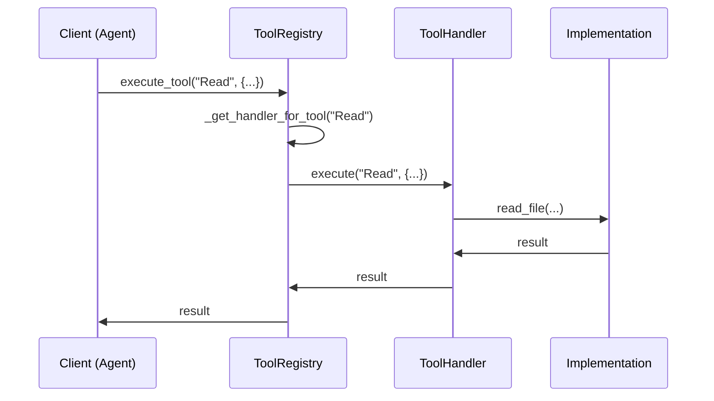
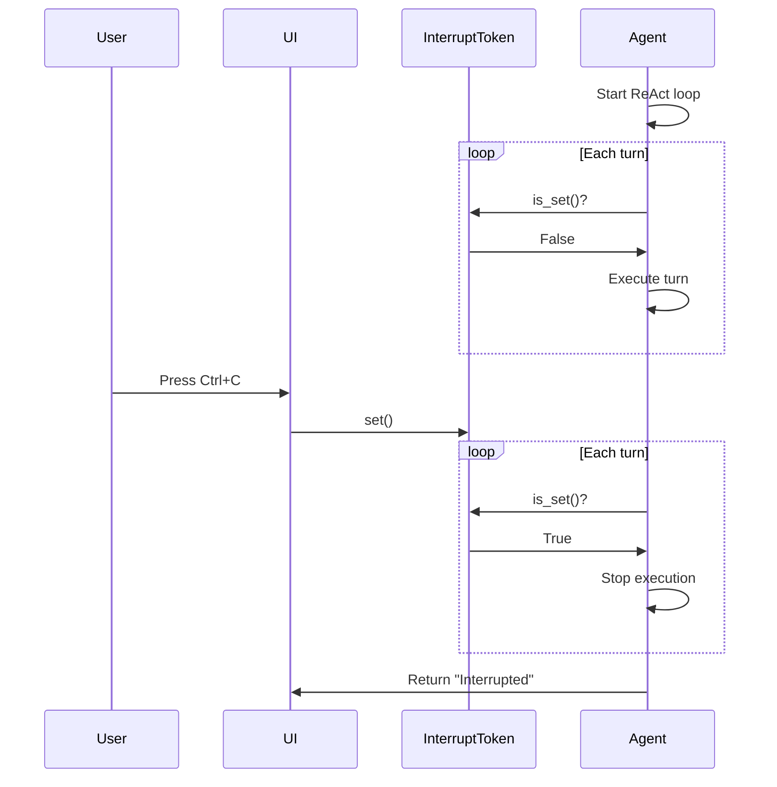
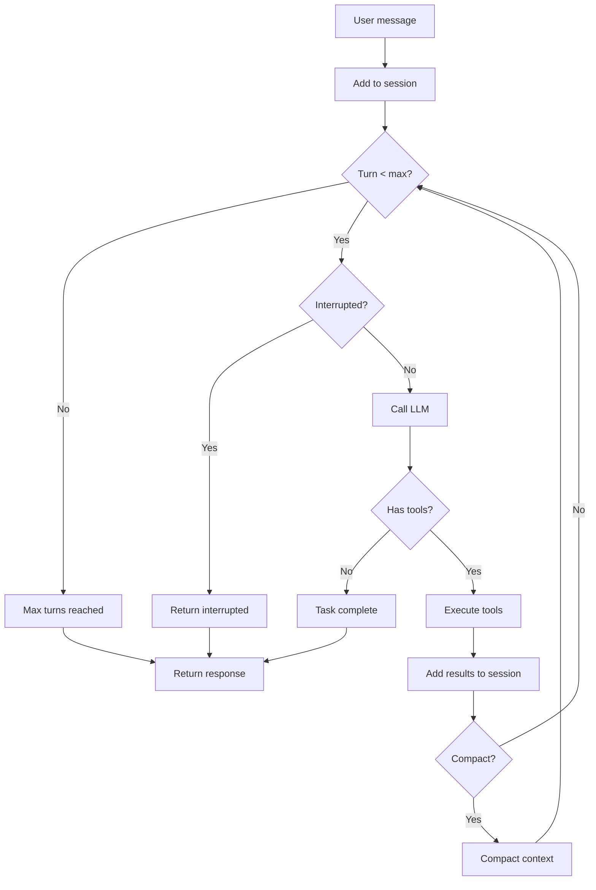

# Design Patterns

**File**: `08_design_patterns.md`
**Purpose**: Key patterns used throughout the codebase

---

## Table of Contents

- [Overview](#overview)
- [Dependency Injection](#dependency-injection)
- [Handler Pattern](#handler-pattern)
- [Message Validation](#message-validation)
- [Interrupt Token](#interrupt-token)
- [ReAct Loop with Graceful Completion](#react-loop-with-graceful-completion)
- [Approval Patterns](#approval-patterns)
- [Modular Prompt Composition](#modular-prompt-composition)
- [Lazy HTTP Client Initialization](#lazy-http-client-initialization)
- [Token-Efficient MCP Discovery](#token-efficient-mcp-discovery)
- [Session Indexing with Self-Healing](#session-indexing-with-self-healing)

---

## Overview

SWE-CLI employs several design patterns to achieve:
- **Maintainability**: Easy to modify and extend
- **Testability**: Easy to mock and test
- **Separation of concerns**: Clear boundaries between components
- **Flexibility**: Easy to swap implementations

This document catalogs the key patterns with examples and rationale.

---

## Dependency Injection

**Pattern**: Inject dependencies into agents instead of creating them internally

**Rationale**:
- Testability: Easy to mock dependencies
- Flexibility: Swap implementations (e.g., different storage backends)
- Clarity: Explicit dependencies visible in constructor

### Implementation

```python
# swecli/models/agent_deps.py
@dataclass
class AgentDependencies:
    """Dependency injection container"""

    mode_manager: ModeManager
    approval_manager: ApprovalManager
    session_manager: SessionManager
    tool_registry: ToolRegistry
    prompt_composer: PromptComposer
    llm_client: LLMHTTPClient
    config: RuntimeConfig
```

### Usage

```python
# Create dependencies
deps = AgentDependencies(
    mode_manager=mode_manager,
    approval_manager=approval_manager,
    session_manager=session_manager,
    tool_registry=tool_registry,
    prompt_composer=prompt_composer,
    llm_client=llm_client,
    config=config
)

# Inject into agent
agent = MainAgent(deps)

# Agent accesses dependencies
async def run(self, message: str):
    await self.deps.session_manager.save_session(self.session)
    approved = await self.deps.approval_manager.request_approval(...)
```

### Benefits

**Testability**:
```python
# Easy to mock in tests
class MockSessionManager:
    async def save_session(self, session):
        pass  # No actual file I/O

deps = AgentDependencies(
    session_manager=MockSessionManager(),
    # ... other deps
)

agent = MainAgent(deps)
# Test without file I/O
```

**Flexibility**:
```python
# Easy to swap implementations
class SQLiteSessionManager:
    async def save_session(self, session):
        # Save to SQLite instead of JSON files
        ...

deps = AgentDependencies(
    session_manager=SQLiteSessionManager(),  # Swap implementation
    # ... other deps
)
```

---

## Handler Pattern

**Pattern**: Dispatch operations to specialized handlers based on category

**Rationale**:
- Separation of concerns: File operations separate from process execution
- Extensibility: Add new handlers without modifying registry
- Single Responsibility: Each handler manages one category

### Implementation

```python
# swecli/core/context_engineering/tools/registry.py
class ToolRegistry:
    """Central registry with handler dispatch"""

    def __init__(self):
        self.handlers = {
            "file": FileOperationHandler(),
            "process": ProcessExecutionHandler(),
            "web": WebHandler(),
            "mcp": MCPHandler(),
        }

    async def execute_tool(self, tool_name: str, parameters: dict):
        """Dispatch to appropriate handler"""
        handler = self._get_handler_for_tool(tool_name)
        return await handler.execute(tool_name, parameters)

    def _get_handler_for_tool(self, tool_name: str):
        """Route tool to handler"""
        if tool_name in ["Read", "Write", "Edit", "Glob", "Grep"]:
            return self.handlers["file"]
        elif tool_name in ["Bash", "Task"]:
            return self.handlers["process"]
        elif tool_name in ["WebFetch", "WebSearch"]:
            return self.handlers["web"]
        else:
            return self.handlers["mcp"]
```

### Handler Interface

```python
# Base handler interface
class ToolHandler:
    @abstractmethod
    def get_tools(self) -> dict:
        """Return tools this handler provides"""
        pass

    @abstractmethod
    async def execute(self, tool_name: str, parameters: dict) -> str:
        """Execute a tool"""
        pass
```

### Sequence Diagram



---

## Message Validation

**Pattern**: Enforce invariants at write time with custom list class

**Rationale**:
- Early error detection: Fail fast on invalid messages
- LLM compatibility: Ensure message sequences are valid
- Prevent corruption: Enforce pairing rules

### Implementation

```python
# swecli/models/session.py
class ValidatedMessageList(list):
    """Enforce tool_use ↔ tool_result pairing"""

    def append(self, message: dict):
        """Append with validation"""
        # Validate structure
        if "role" not in message or "content" not in message:
            raise ValidationError("Invalid message structure")

        # Validate pairing
        if message["role"] == "tool_result":
            if not self._last_was_tool_use():
                raise ValidationError("tool_result without preceding tool_use")

        # Append if valid
        super().append(message)

    def _last_was_tool_use(self) -> bool:
        """Check if last assistant message had tool_calls"""
        for msg in reversed(self):
            if msg["role"] == "assistant":
                return "tool_calls" in msg
        return False
```

### Usage

```python
# Valid sequence
messages = ValidatedMessageList()
messages.append({"role": "user", "content": "Hello"})
messages.append({
    "role": "assistant",
    "content": "Let me read the file",
    "tool_calls": [{"id": "call_1", "function": {"name": "Read"}}]
})
messages.append({
    "role": "tool_result",
    "tool_call_id": "call_1",
    "content": "File contents"
})
# ✅ Valid

# Invalid sequence
messages = ValidatedMessageList()
messages.append({"role": "user", "content": "Hello"})
messages.append({
    "role": "tool_result",  # ❌ No preceding tool_use
    "content": "Result"
})
# Raises ValidationError
```

### Invariants Enforced

1. **Tool_use → Tool_result pairing**: Every tool_use must be followed by tool_result(s)
2. **No orphan tool_results**: Tool_result must follow tool_use
3. **Matching IDs**: Tool_call_id must match tool_use ID

---

## Interrupt Token

**Pattern**: Thread-safe cancellation mechanism using Event

**Rationale**:
- Graceful cancellation: Allow agent to stop cleanly
- Thread-safe: Works across threads
- Simple API: Just set() and is_set()

### Implementation

```python
# swecli/core/interrupt/token.py
import threading

class InterruptToken:
    """Thread-safe cancellation token"""

    def __init__(self):
        self._event = threading.Event()

    def set(self):
        """Signal interrupt"""
        self._event.set()

    def is_set(self) -> bool:
        """Check if interrupted"""
        return self._event.is_set()

    def reset(self):
        """Clear interrupt"""
        self._event.clear()
```

### Usage in Agent

```python
# Agent checks token at each turn
async def run(self, message: str, interrupt_token: InterruptToken = None):
    for turn in range(self.max_turns):
        # Check interrupt
        if interrupt_token and interrupt_token.is_set():
            self.session.add_message({
                "role": "assistant",
                "content": "Task interrupted by user."
            })
            return "Interrupted"

        # Continue execution
        response = await self.llm_client.create_message(...)
        ...
```

### Usage in UI

```python
# TUI: User presses Ctrl+C
async def on_key(self, key: str):
    if key == "ctrl+c":
        self.interrupt_token.set()
        # Agent will stop at next turn

# Web: User clicks cancel button
@app.post("/api/cancel")
async def cancel():
    state.interrupt_token.set()
    return {"status": "cancelled"}
```

### Sequence Diagram



---

## ReAct Loop with Graceful Completion

**Pattern**: Iterative reasoning-acting loop with LLM-controlled completion

**Rationale**:
- No hard-coded branching: LLM decides when task is complete
- Graceful limits: Max turns prevent infinite loops
- Adaptive: LLM can adjust strategy based on results

### Implementation

```python
# swecli/core/agents/main_agent.py
async def run(self, message: str, interrupt_token: InterruptToken = None):
    """ReAct loop with graceful completion"""

    self.session.add_message({"role": "user", "content": message})

    for turn in range(self.max_turns):
        # Check interrupt
        if interrupt_token and interrupt_token.is_set():
            return "Interrupted"

        # 1. Reasoning: Get LLM response
        response = await self.llm_client.create_message(
            messages=self.session.messages,
            tools=self.tool_registry.get_tool_schemas(),
            system=self.prompt_composer.compose()
        )

        # 2. Action: Execute tools if requested
        if response.tool_calls:
            # LLM wants to execute tools (continue loop)
            results = await self.tool_registry.execute_tools(
                response.tool_calls,
                interrupt_token
            )

            self.session.add_message({
                "role": "assistant",
                "content": response.content,
                "tool_calls": response.tool_calls
            })

            for result in results:
                self.session.add_message({
                    "role": "tool_result",
                    "content": result
                })

            # Auto-compact if needed
            if self.session.token_count > self.max_tokens * 0.9:
                await self.compact_context()

        else:
            # LLM returned no tool calls → task complete
            self.session.add_message({
                "role": "assistant",
                "content": response.content
            })
            return response.content

    # Max turns reached
    return "Max turns reached. Task may be incomplete."
```

### Flow Diagram



### Key Points

1. **LLM decides completion**: No `if task_complete:` checks
2. **Max turns as safety**: Prevents infinite loops
3. **Interrupt support**: Graceful cancellation
4. **Auto-compaction**: Manage context size

---

## Approval Patterns

**Pattern**: Different approval implementations for TUI (blocking) vs Web (polling)

**Rationale**:
- TUI can block on modal dialog
- Web must poll shared state (agent runs in thread)
- Same approval interface for both

### TUI Approval (Blocking)

```python
# swecli/ui_textual/ui_callback.py
class TUICallback:
    async def request_approval(self, operation: str) -> bool:
        """Blocking modal approval"""
        modal = ApprovalModal(operation)

        # Push modal (blocks UI)
        await self.app.push_screen(modal)

        # Wait for response (blocks agent)
        result = await modal.wait_for_response()

        return result
```

### Web Approval (Polling)

```python
# swecli/web/managers/approval_manager.py
class WebApprovalManager:
    async def request_approval(self, operation: str) -> bool:
        """Non-blocking polling approval"""
        approval_id = str(uuid.uuid4())

        # Add to pending approvals
        state._pending_approvals[approval_id] = None

        # Broadcast to frontend (from thread)
        asyncio.run_coroutine_threadsafe(
            websocket_manager.broadcast({
                "type": "approval_required",
                "id": approval_id,
                "operation": operation
            }),
            loop
        )

        # Poll for response
        while True:
            if state._pending_approvals.get(approval_id) is not None:
                result = state._pending_approvals.pop(approval_id)
                return result
            await asyncio.sleep(0.5)
```

### Comparison

| Aspect | TUI | Web |
|--------|-----|-----|
| **Pattern** | Blocking modal | Polling shared state |
| **Agent thread** | Same thread as UI | Different thread (ThreadPoolExecutor) |
| **Response time** | Immediate | Polled every 500ms |
| **Implementation** | Modal widget | WebSocket broadcast + state |

---

## Modular Prompt Composition

**Pattern**: Assemble system prompts from individual markdown sections with priority-based ordering

**Rationale**:
- Easy to modify: Edit section files without touching code
- Modular: Add new sections without changing existing ones
- Conditional: Include sections based on context (e.g., git status)

### Implementation

```python
# swecli/core/agents/prompts/composition.py
class PromptComposer:
    """Compose prompts from modular sections"""

    def __init__(self, config: RuntimeConfig):
        self.sections = []
        self._register_sections()

    def _register_sections(self):
        """Register all prompt sections"""
        self.register_section(
            name="security-policy",
            template="security-policy.md",
            priority=100,
            condition=None  # Always included
        )
        self.register_section(
            name="git-workflow",
            template="git-workflow.md",
            priority=90,
            condition=lambda ctx: ctx.is_git_repo  # Only in git repos
        )
        # ... more sections

    def compose(self, context: PromptContext = None) -> str:
        """Compose final prompt"""
        # Filter active sections
        active = [s for s in self.sections if not s["condition"] or s["condition"](context)]

        # Sort by priority (high to low)
        active.sort(key=lambda s: s["priority"], reverse=True)

        # Render each section
        rendered = [self._render_section(s, context) for s in active]

        # Join with separators
        return "\n\n---\n\n".join(rendered)
```

### Section Registration

```python
self.register_section(
    name="section-name",
    template="section-file.md",
    priority=80,  # Higher = earlier in prompt
    condition=lambda ctx: ctx.some_condition  # Optional
)
```

### Benefits

1. **Easy modification**: Edit markdown files, no code changes
2. **Conditional inclusion**: Only include relevant sections
3. **Clear ordering**: Priority-based composition
4. **Testability**: Easy to test individual sections

---

## Lazy HTTP Client Initialization

**Pattern**: Create HTTP clients only when first needed

**Rationale**:
- Fast startup: Don't create clients until first LLM call
- Resource efficiency: Don't hold connections unnecessarily
- Flexibility: Can change provider without recreating agent

### Implementation

```python
# swecli/core/llm/http_client.py
class LLMHTTPClient:
    """HTTP client with lazy initialization"""

    def __init__(self, api_key: str, api_base: str = None):
        self.api_key = api_key
        self.api_base = api_base
        self._client = None  # Not created yet

    async def create_message(self, messages: list, tools: list = None):
        """Create message (lazy init client)"""
        # Create client on first use
        if not self._client:
            self._client = self._create_client()

        response = await self._client.post(...)
        return response

    def _create_client(self):
        """Create HTTP client"""
        import httpx
        return httpx.AsyncClient(
            base_url=self.api_base,
            headers={"Authorization": f"Bearer {self.api_key}"},
            timeout=60.0
        )

    async def close(self):
        """Close client if created"""
        if self._client:
            await self._client.aclose()
```

### Benefits

1. **Fast startup**: Agent ready immediately
2. **Resource efficiency**: Connection pool only when needed
3. **Failure isolation**: Client creation failures happen during use, not init

---

## Token-Efficient MCP Discovery

**Pattern**: Cache MCP tool schemas to avoid repeated discovery

**Rationale**:
- Token efficiency: Avoid sending full tool schemas on every request
- Performance: No need to query MCP servers repeatedly
- Freshness: 24h TTL ensures tools stay up-to-date

### Implementation

```python
# swecli/core/context_engineering/mcp/discovery.py
class MCPToolDiscovery:
    """Token-efficient MCP tool discovery with caching"""

    def __init__(self, cache_dir: str = "~/.opendev/cache/mcp"):
        self.cache_dir = Path(cache_dir).expanduser()
        self.cache_ttl = 86400  # 24 hours

    async def discover_tools(self, server_name: str) -> list:
        """Discover tools with caching"""
        # Check cache
        cached = self._get_cached_tools(server_name)
        if cached and not self._is_cache_expired(server_name):
            return cached

        # Fetch from MCP server
        client = await self.mcp_manager.get_client(server_name)
        tools = await client.list_tools()

        # Cache for 24h
        self._cache_tools(server_name, tools)

        return tools

    def _get_cached_tools(self, server_name: str) -> list:
        """Get cached tools"""
        cache_file = self.cache_dir / f"{server_name}.json"
        if cache_file.exists():
            with open(cache_file) as f:
                return json.load(f)
        return None

    def _is_cache_expired(self, server_name: str) -> bool:
        """Check if cache expired"""
        cache_file = self.cache_dir / f"{server_name}.json"
        if not cache_file.exists():
            return True

        age = time.time() - cache_file.stat().st_mtime
        return age > self.cache_ttl

    def _cache_tools(self, server_name: str, tools: list):
        """Cache tools to disk"""
        self.cache_dir.mkdir(parents=True, exist_ok=True)
        cache_file = self.cache_dir / f"{server_name}.json"

        with open(cache_file, "w") as f:
            json.dump(tools, f, indent=2)
```

### Benefits

1. **Token efficiency**: Avoid sending redundant tool schemas
2. **Performance**: No repeated MCP server queries
3. **Offline capability**: Can use cached tools if server unavailable

---

## Session Indexing with Self-Healing

**Pattern**: Maintain index for fast lookups with automatic repair on corruption

**Rationale**:
- Performance: Fast session lookup without scanning all files
- Robustness: Auto-repair if index corrupted
- Simplicity: Transparent to users

### Implementation

```python
# swecli/core/context_engineering/history/session_manager.py
class SessionManager:
    """Session manager with self-healing index"""

    def __init__(self, sessions_dir: str = "~/.opendev/sessions"):
        self.sessions_dir = Path(sessions_dir).expanduser()
        self.index_path = self.sessions_dir / "sessions-index.json"

    async def list_sessions(self) -> list:
        """List all sessions (use index if valid)"""
        try:
            # Try to load index
            with open(self.index_path) as f:
                index = json.load(f)
            return index
        except (FileNotFoundError, json.JSONDecodeError):
            # Index corrupted or missing, rebuild
            index = await self._rebuild_index()
            return index

    async def _rebuild_index(self) -> dict:
        """Rebuild index by scanning all session files"""
        index = {}

        # Scan all .jsonl files
        for session_file in self.sessions_dir.glob("*.jsonl"):
            session_id = session_file.stem

            # Read first and last message for metadata
            with open(session_file) as f:
                lines = f.readlines()
                if not lines:
                    continue

                first_msg = json.loads(lines[0])
                last_msg = json.loads(lines[-1])

                # Detect topic for title
                title = self._detect_topic(lines) or f"Session {session_id}"

                index[session_id] = {
                    "title": title,
                    "created_at": first_msg.get("timestamp"),
                    "updated_at": last_msg.get("timestamp"),
                    "message_count": len(lines)
                }

        # Save rebuilt index
        with open(self.index_path, "w") as f:
            json.dump(index, f, indent=2)

        return index

    def _detect_topic(self, messages: list) -> str:
        """Detect session topic from messages"""
        # Use TopicDetector to extract title
        ...
```

### Benefits

1. **Fast lookups**: O(1) session lookup via index
2. **Self-healing**: Auto-rebuild if corrupted
3. **Transparent**: Users don't see rebuilding

---

## Summary

| Pattern | Purpose | Key Benefit |
|---------|---------|-------------|
| **Dependency Injection** | Inject services into agents | Testability, flexibility |
| **Handler Pattern** | Dispatch tools to specialized handlers | Separation of concerns |
| **Message Validation** | Enforce invariants at write time | Early error detection |
| **Interrupt Token** | Thread-safe cancellation | Graceful agent stops |
| **ReAct Loop** | LLM-controlled completion | No hard-coded branching |
| **Approval Patterns** | TUI blocking vs Web polling | UI-appropriate patterns |
| **Prompt Composition** | Modular section assembly | Easy modification |
| **Lazy Initialization** | Create resources on first use | Fast startup |
| **MCP Discovery** | Cached tool schemas | Token efficiency |
| **Self-Healing Index** | Auto-repair corrupted index | Robustness |

---

## Next Steps

- **For extension guide**: See [Extension Points](./09_extension_points.md)

---

**[← Back to Index](./00_INDEX.md)** | **[Next: Extension Points →](./09_extension_points.md)**
