# Context Engineering Layer Architecture

> Definitive reference for `swecli/core/context_engineering/` - every subsystem, data flow, and integration point.

---

## 1. Layer Overview

```mermaid
graph TB
    subgraph UserInput["User Input"]
        QP[QueryProcessor]
        QE[QueryEnhancer]
    end

    subgraph Root["Root Components"]
        VML[ValidatedMessageList]
        MPV[MessagePairValidator]
        CC[ContextCompactor]
        CTX[ToolExecutionContext]
    end

    subgraph History["History & Persistence"]
        SM[SessionManager]
        TD[TopicDetector]
        UM[UndoManager]
        FL[file_locks]
    end

    subgraph Memory["Memory / ACE"]
        PB[Playbook]
        DT[Delta / DeltaBatch]
        RF[Reflector]
        CU[Curator]
        BS[BulletSelector]
        EC[EmbeddingCache]
        CS[ConversationSummarizer]
    end

    subgraph MCP["MCP Integration"]
        MCfg[MCPConfig]
        MMgr[MCPManager]
        MHnd[McpToolHandler]
        STH[SearchToolsHandler]
    end

    subgraph Retrieval["Retrieval & Context Assembly"]
        TM[ContextTokenMonitor]
        CI[CodebaseIndexer]
        CR[ContextRetriever]
        CP[ContextPicker]
        CT[ContextTracer]
    end

    subgraph ToolSystem["Tool System"]
        TR[ToolRegistry]
        FH[FileToolHandler]
        PH[ProcessToolHandler]
        WH[WebToolHandler]
        TDH[TodoHandler]
        THH[ThinkingHandler]
        BTM[BackgroundTaskManager]
    end

    subgraph SymbolLSP["Symbol Tools + LSP"]
        SR[SymbolRetriever]
        LSPw[LSPServerWrapper]
        LS[37 Language Servers]
    end

    subgraph Skills["Skills System"]
        SL[SkillLoader]
        SKM[SkillMetadata]
        LSK[LoadedSkill]
    end

    subgraph Hooks["Hooks System"]
        HM[HookManager]
        HE[HookCommandExecutor]
        HC[HookConfig]
        HL[loader]
    end

    QP --> QE
    QE --> CP
    CP --> VML
    CP --> PB
    CP --> SM
    CP --> TM

    VML --> CC
    CC --> TM

    QP --> TR
    TR --> FH & PH & WH & TDH & THH
    TR --> MHnd
    TR --> STH
    MHnd --> MMgr
    STH --> MMgr

    FH --> SR
    SR --> LSPw --> LS

    PH --> BTM

    TR --> CTX
    CTX --> SM & UM

    RF --> CU --> DT --> PB
    BS --> EC

    SM --> FL
    SM --> TD

    TR --> SL
    SL --> SKM & LSK

    HM --> HE
    HL --> HC --> HM
    TR -.->|PreToolUse / PostToolUse| HM
    QP -.->|UserPromptSubmit| HM
    CC -.->|PreCompact| HM
```

**Ten subsystems**, 90+ source files. The flow is: **User input** enters via `QueryProcessor`, gets enhanced with `@file` references, assembled by `ContextPicker` into `AssembledContext`, wrapped in `ValidatedMessageList`, checked by `ContextCompactor`, then fed to the ReAct loop. The `ToolRegistry` dispatches to 13+ handlers, each delegating to specialized implementations. `SessionManager` persists everything; `ACE` learns from outcomes. **Skills** provide on-demand knowledge injection via `invoke_skill`. **Hooks** fire shell commands at lifecycle events (tool use, session start/end, compaction) for user-defined automation.

---

## 2. Message Integrity & Validation

### ValidatedMessageList State Machine

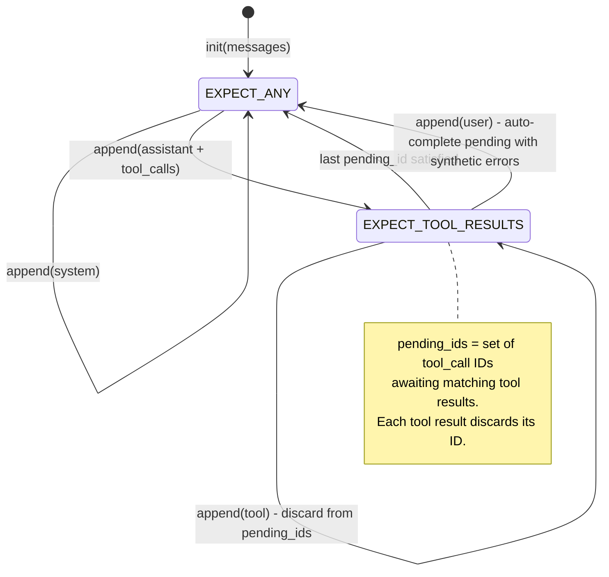

**`ValidatedMessageList`** (`validated_message_list.py`) is a `list` subclass with write-time enforcement:

- **Thread-safe**: `threading.Lock` guards all mutations
- **`_pending_tool_ids: set[str]`**: Tracks tool call IDs awaiting results
- **`_strict: bool`**: `True` raises on violations; `False` auto-repairs with warnings
- **`SYNTHETIC_TOOL_RESULT`**: Error placeholder inserted for missing results

Intercepted mutations: `append`, `extend`, `__setitem__`, `insert`. All reads pass through unmodified.

### MessagePairValidator

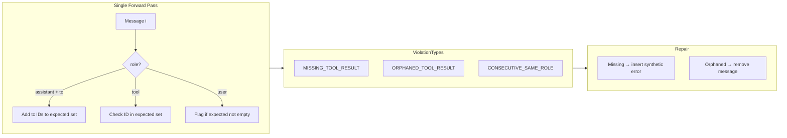

**`validate_tool_results_complete()`** is the pre-batch guard called by `ReactExecutor` before adding results to history. Fills missing entries with synthetic errors containing `success: False`.

### ToolExecutionContext

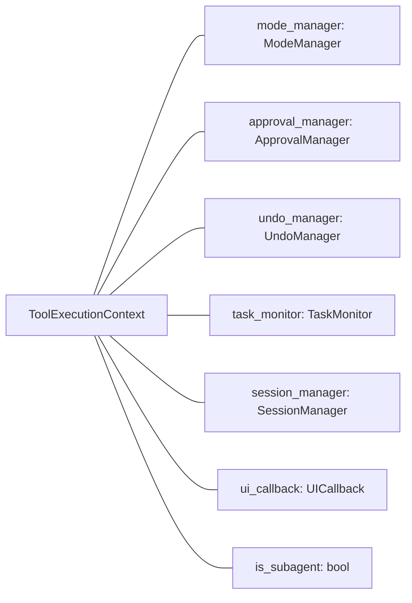

Created per tool call in `ToolRegistry.execute_tool()`. Handlers extract the managers they need.

---

## 3. Context Compaction Pipeline

### Token Counting Strategy

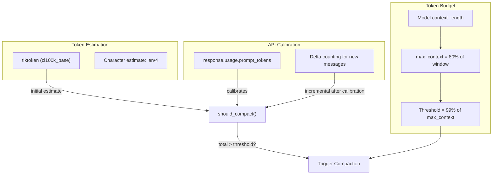

### Compaction Flow

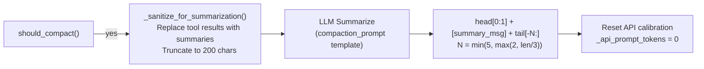

**Key constants**:
- `COMPACTION_THRESHOLD = 0.99` - trigger at 99% of max_context
- `max_context = config.max_context_tokens` - defaults to 80% of model window (e.g., 100K for 128K models)
- `keep_recent = min(5, max(2, len(messages) // 3))` - preserve tail
- Sanitization: `result_summary` preferred, else truncate to 200 chars

---

## 4. Session & History Management

### SessionManager Architecture

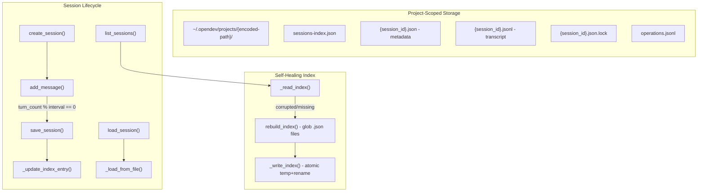

**Key parameters**:
- `_INDEX_VERSION = 1`
- Lock timeout: **10.0 seconds** (fcntl exclusive lock)
- Auto-save interval: **5 turns** (configurable)
- Title length: **50 characters** max
- Session ID: **12-char hex** UUID

### Session Lifecycle Sequence

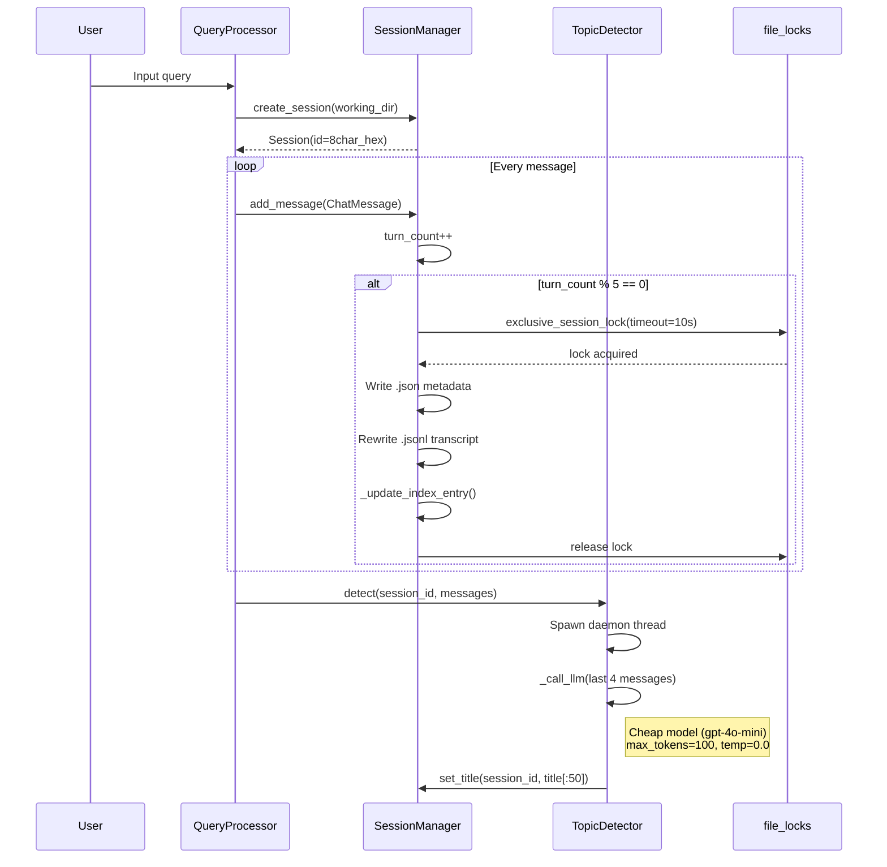

### UndoManager

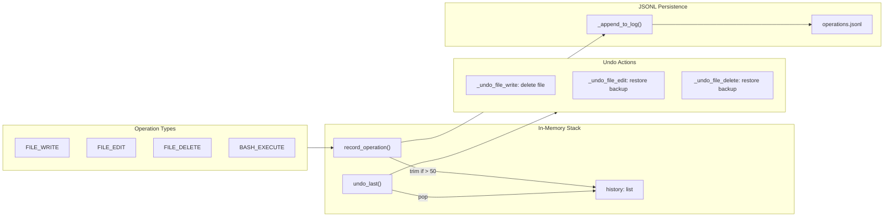

**Capacity**: `max_history = 50` operations. JSONL append-only log (no locks needed).

---

## 5. Memory & Learning (ACE)

### ACE Learning Loop

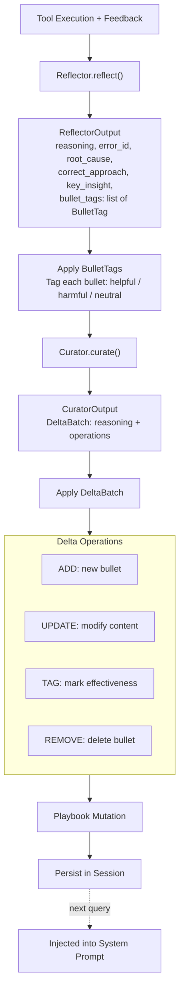

### Playbook Data Model

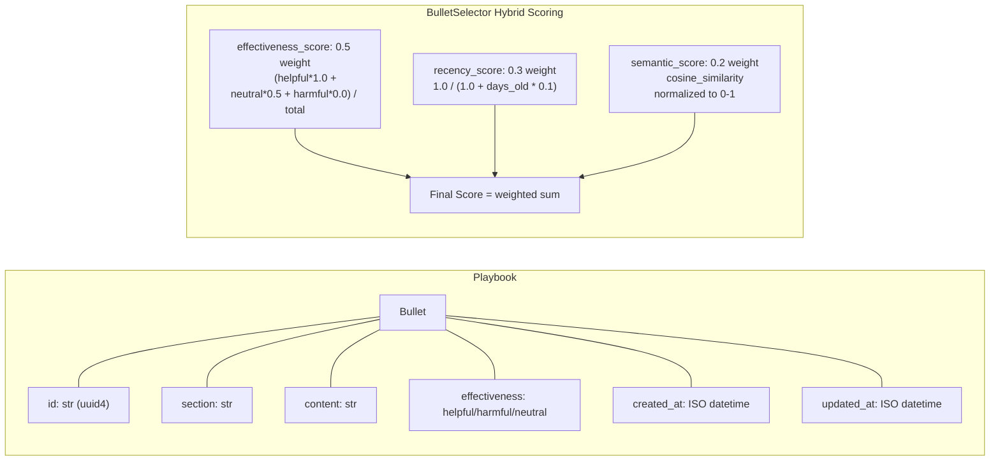

### Scoring Examples

| Age | Recency Score | Effectiveness (all helpful) | Semantic (0.8 cosine) | Final Score |
|-----|--------------|---------------------------|----------------------|-------------|
| 0 days | 1.00 | 1.00 | 0.90 | 0.98 |
| 7 days | 0.59 | 1.00 | 0.90 | 0.86 |
| 30 days | 0.25 | 0.50 | 0.70 | 0.57 |

### ConversationSummarizer

- **Incremental**: Only new messages since `last_summarized_index` are sent to LLM
- **Merge**: New summary merged with previous via prompt template
- **Trigger**: `regenerate_threshold = 5` new messages
- **Exclusion**: Last 6 messages always excluded (`exclude_last_n = 6`)
- **Max length**: 500 characters

### EmbeddingCache

- **Model**: `text-embedding-3-small` (default)
- **Cache key**: SHA256 of `"{model}:{text}"` (first 16 chars)
- **Persistence**: JSON file (in-memory + disk)
- **Batch optimization**: Single API call for all missing embeddings
- **Similarity**: `cosine_similarity()` with numpy vectorization

---

## 6. MCP Integration

### Connection Lifecycle

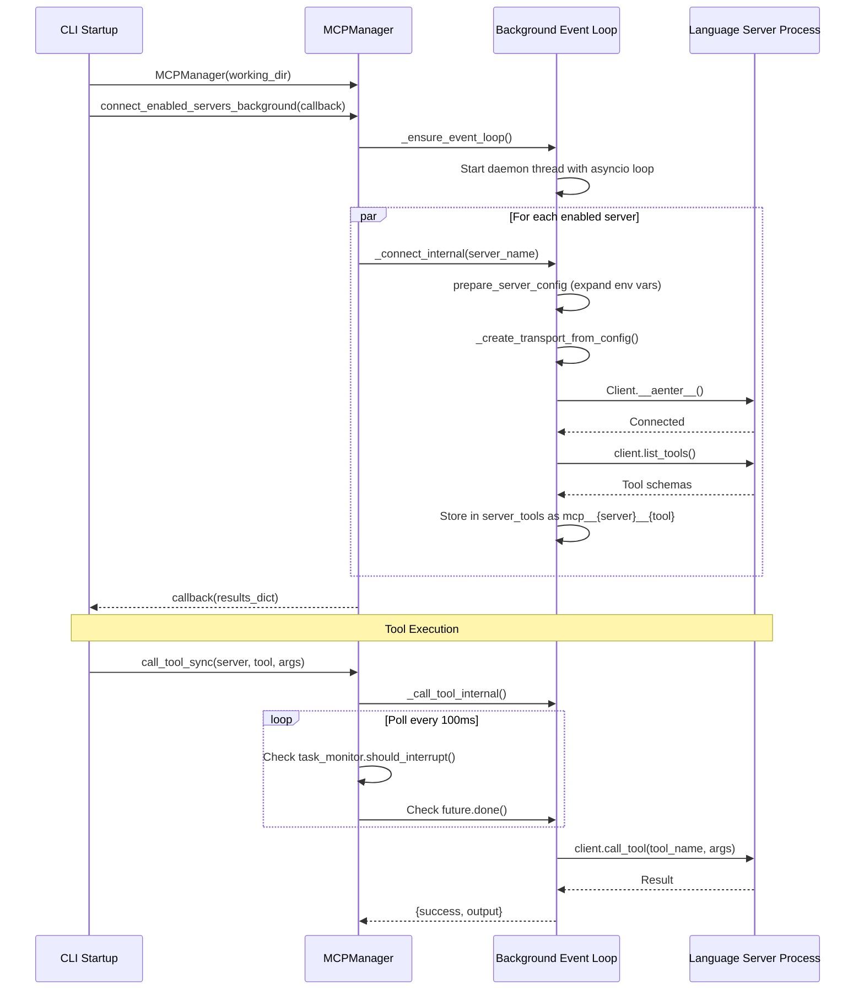

### MCP Architecture

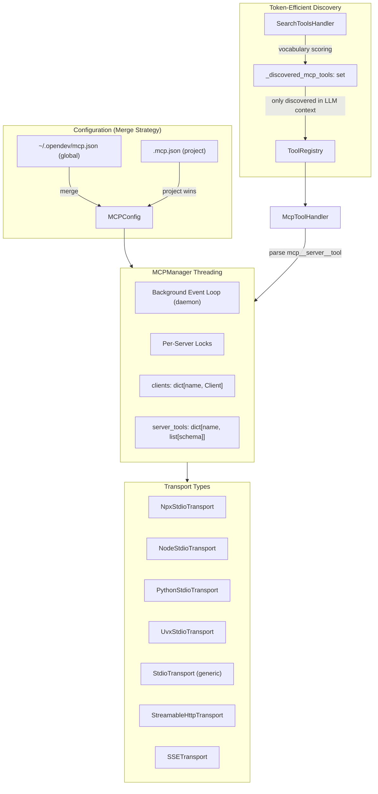

**Key constants**:
- Tool call timeout: **30 seconds**
- Poll interval: **100ms** (interrupt-responsive)
- Connection timeout: **60 seconds**
- Name format: `mcp__{server_name}__{tool_name}`

---

## 7. Retrieval & Context Assembly

### Context Assembly Pipeline

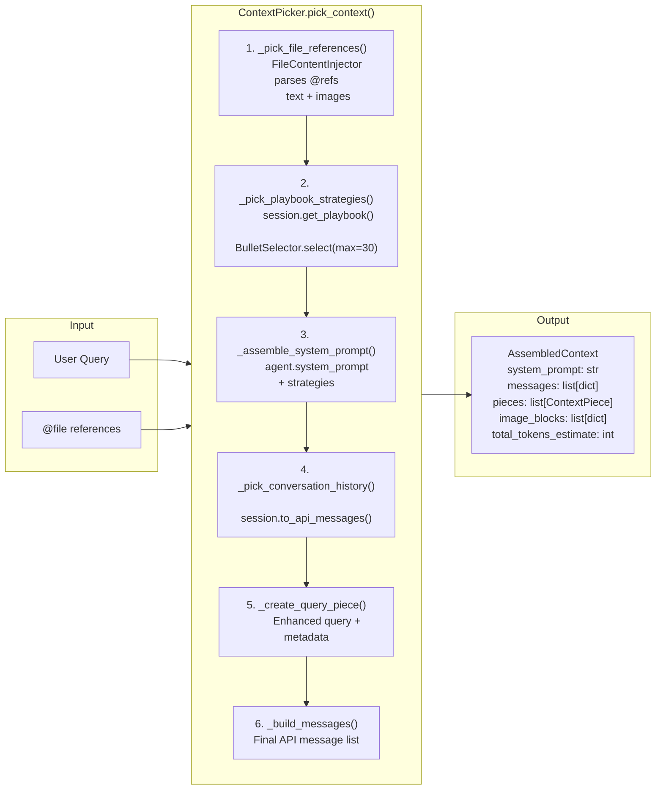

### ContextPiece Order & Categories

| Order | Category | Source |
|-------|----------|--------|
| 0 | `SYSTEM_PROMPT` | Agent system prompt + strategies |
| 5 | `PLAYBOOK_STRATEGY` | Selected playbook bullets |
| 10 | `FILE_REFERENCE` | @file text content |
| 15 | `IMAGE_CONTENT` | @file image blocks |
| 50 | `CONVERSATION_HISTORY` | Session messages |
| 100 | `USER_QUERY` | Current query |

### Supporting Components

**ContextTokenMonitor** - tiktoken-based counting with `cl100k_base` fallback. Methods: `count_tokens(text)`, `count_message_tokens(ChatMessage)`, `count_messages_total(list)`.

**CodebaseIndexer** - Generates OPENDEV.md summaries. Target: 3000 tokens. Sections: overview, structure (`tree -L 2`), key files, dependencies. Auto-compresses if over budget.

**EntityExtractor** - Regex patterns for 50+ file extensions. Extracts: `file_path`, `function`, `class`, `variable`, `action` entities from user input.

**ContextRetriever** - JIT context loading. Resolves file paths (direct then rglob), searches with ripgrep (fallback to grep). Returns up to 10 files with reasons.

**ContextTracer** - Logs all decisions. `export_trace()` writes JSON with timestamp, piece counts, and category breakdown.

---

## 8. Tool System Architecture

### Registry & Handler Wiring

```mermaid
graph TB
    subgraph Registry["ToolRegistry (Central Dispatcher)"]
        EX["execute_tool(name, args, **context)"]
    end

    subgraph Handlers["13 Handlers"]
        FTH["FileToolHandler"]
        PTH["ProcessToolHandler"]
        WTH["WebToolHandler"]
        WSH["WebSearchHandler"]
        NEH["NotebookEditHandler"]
        AUH["AskUserHandler"]
        SSH["ScreenshotToolHandler"]
        TDH2["TodoHandler"]
        THH2["ThinkingHandler"]
        CRH["CritiqueHandler"]
        BTH["BatchToolHandler"]
        MCH["McpToolHandler"]
        STSH["SearchToolsHandler"]
    end

    subgraph Implementations["18 Implementations"]
        FO["FileOperations"]
        WT["WriteTool"]
        ET["EditTool"]
        BT["BashTool"]
        WFT["WebFetchTool"]
        WST["WebSearchTool"]
        WSSr["WebScreenshotTool"]
        AUT["AskUserTool"]
        NET["NotebookEditTool"]
        OBT["OpenBrowserTool"]
        PDT["PDFTool"]
        VLT["VLMTool"]
        DPR["DiffPreview"]
        TCT["TaskCompleteTool"]
        PPT["PresentPlanTool"]
        BAT["BatchTool"]
        BASE["BaseTool (ABC)"]
        BGM["BackgroundTaskManager"]
    end

    EX --> FTH & PTH & WTH & WSH & NEH & AUH & SSH
    EX --> TDH2 & THH2 & CRH & BTH & MCH & STSH

    FTH --> FO & WT & ET
    PTH --> BT --> BGM
    WTH --> WFT
    WSH --> WST
    NEH --> NET
    AUH --> AUT
    BTH --> BAT
```

### Handler-to-Tool Mapping

| Tool Name | Handler | Implementation |
|-----------|---------|----------------|
| `read_file` | FileToolHandler | FileOperations.read_file |
| `write_file` | FileToolHandler | WriteTool.write_file |
| `edit_file` | FileToolHandler | EditTool.edit_file |
| `list_files` | FileToolHandler | FileOperations.list_directory |
| `search` | FileToolHandler | FileOperations.grep_files / ast_grep |
| `run_command` | ProcessToolHandler | BashTool.execute |
| `list_processes` | ProcessToolHandler | BashTool.list_processes |
| `get_process_output` | ProcessToolHandler | BashTool.get_process_output |
| `kill_process` | ProcessToolHandler | BashTool.kill_process |
| `fetch_url` | WebToolHandler | WebFetchTool.fetch_url |
| `web_search` | WebSearchHandler | WebSearchTool.search |
| `capture_web_screenshot` | (direct) | WebScreenshotTool |
| `capture_screenshot` | ScreenshotToolHandler | mss library |
| `ask_user` | AskUserHandler | AskUserTool.ask |
| `notebook_edit` | NotebookEditHandler | NotebookEditTool.edit_cell |
| `read_pdf` | (direct) | PDFTool.extract_text |
| `analyze_image` | (direct) | VLMTool.analyze_image |
| `open_browser` | (direct) | OpenBrowserTool |
| `write_todos` / `update_todo` / `complete_todo` | TodoHandler | (in-memory) |
| `think` | ThinkingHandler | 5 levels: OFF/LOW/MED/HIGH/SELF_CRITIQUE |
| `task_complete` | (direct) | TaskCompleteTool |
| `present_plan` | (direct) | PresentPlanTool |
| `batch_tool` | BatchToolHandler | BatchTool (parallel/serial) |
| `search_tools` | SearchToolsHandler | vocabulary scoring + discovery |
| `invoke_skill` | (direct) | SkillLoader.load_skill (dedup per session) |
| `spawn_subagent` | (direct) | SubAgentDeps injection |
| `mcp__*` | McpToolHandler | MCPManager.call_tool_sync |
| `find_symbol` / `rename_symbol` / ... | (lambda) | SymbolRetriever → LSP |

### Key Tool Patterns

**BashTool safety**: SAFE_COMMANDS whitelist, DANGEROUS_PATTERNS regex, server detection (15+ frameworks auto-backgrounded), output cap at 30K chars (10K head + 10K tail).

**FileToolHandler approval flow**: Check `mode_manager.needs_approval()` → `approval_manager.request_approval()` → if denied, return `{denied: True}`. Record operation for undo via `UndoManager`.

**BatchTool**: `MAX_PARALLEL_WORKERS = 5`. Two modes: parallel (ThreadPoolExecutor) or serial.

**Hook interception**: Every `execute_tool()` call passes through `HookManager` if configured. PreToolUse fires before handler dispatch (can block or modify arguments); PostToolUse/PostToolUseFailure fires asynchronously after handler returns.

**TodoHandler**: In-memory state. Only one todo in "doing" at a time. Flexible ID matching: numeric, slug, partial, fuzzy.

**BackgroundTaskManager**: PTY-based streaming to `/tmp/swe-cli/{hash}/tasks/{id}.output`. Non-blocking `select()` with 0.5s poll. Listener callbacks for status changes.

---

## 9. Symbol Tools & LSP

### Symbol Operations Flow

```mermaid
graph LR
    subgraph SymbolOps["6 Symbol Operations"]
        FS["find_symbol"]
        FRS["find_referencing_symbols"]
        IBS["insert_before_symbol"]
        IAS["insert_after_symbol"]
        RSB["replace_symbol_body"]
        RNS["rename_symbol"]
    end

    subgraph Core["Core Classes"]
        SR2["SymbolRetriever"]
        SYM["Symbol (dataclass)
        name, kind, file_path,
        start/end line/char,
        children, parent"]
        NPM["NamePathMatcher
        exact, partial, wildcard, glob"]
    end

    subgraph LSP2["LSP Layer"]
        LSPW["LSPServerWrapper (singleton)"]
        SLS["SolidLanguageServer (ABC)"]
        SLSH["SolidLanguageServerHandler
        JSON-RPC 2.0 over stdin/stdout"]
    end

    subgraph Servers["37 Language Servers"]
        PYR["Pyright (Python)"]
        TSS["typescript-language-server"]
        RA["rust-analyzer"]
        GPL["gopls (Go)"]
        JDT["eclipse-jdtls (Java)"]
        CLG["clangd (C/C++)"]
        MORE["... 31 more"]
    end

    SymbolOps --> SR2
    SR2 --> LSPW
    SR2 --> NPM
    LSPW --> SLS --> SLSH --> Servers
    SLS --> SYM
```

### Supported Languages

35+ languages via `Language` enum: Python, TypeScript, Rust, Go, Java, Kotlin, C#, PHP, Ruby, Dart, C/C++, Bash, Swift, Scala, Clojure, Elixir, Elm, Erlang, Haskell, Julia, Fortran, R, Perl, Lua, Nix, Zig, Terraform, YAML, Markdown, AL, Rego, and experimental variants.

Each server extends `SolidLanguageServer`:
- Auto-installs runtime dependencies (rustup, npm packages, etc.)
- Custom log level classification to suppress false-positive errors
- Language-specific ignore patterns (node_modules, vendor, __pycache__)
- Two-level caching: raw LSP responses + processed DocumentSymbols, content-hash invalidation

**SymbolKind**: 26 values matching LSP spec (FILE=1 through TYPEPARAMETER=26).

---

## 10. Integration & Data Flow

### End-to-End Query Lifecycle

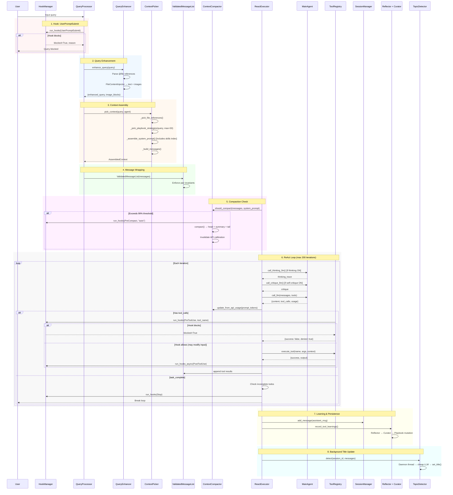

---

## 11. Skills System

### Skill Discovery & Loading

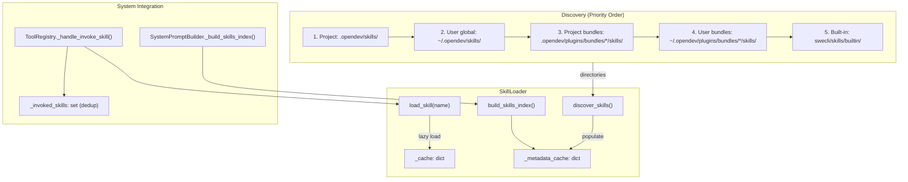

Skills are markdown files with YAML frontmatter providing on-demand knowledge injection into the agent's context.

### Skill File Format

```markdown
---
name: commit
description: Git commit best practices
namespace: default
---

# Skill content here (markdown)
```

**Frontmatter fields**: `name` (required, falls back to filename), `description` (required, defaults to "Skill: {name}"), `namespace` (optional, defaults to "default", used as prefix: `namespace:name`).

### Invoke Flow

1. **System prompt** includes an "Available Skills" index generated by `SkillLoader.build_skills_index()`, listing all discovered skills with names and descriptions
2. Agent calls `invoke_skill` tool with `skill_name`
3. `ToolRegistry._handle_invoke_skill()` checks `_invoked_skills` set for dedup
4. First invocation: loads full skill content via `SkillLoader.load_skill()`, adds to `_invoked_skills`, returns content
5. Second invocation of same skill: returns short reminder ("already loaded") to prevent context bloat
6. Agent follows skill instructions for the remainder of the conversation

### Initialization

`AgentFactory._initialize_skills()` runs at startup:
1. `ConfigManager.get_skill_dirs()` returns directories in priority order
2. Creates `SkillLoader(skill_dirs)`
3. `discover_skills()` populates the metadata cache (reads frontmatter only)
4. `tool_registry.set_skill_loader(loader)` wires the loader in

**Key classes**: `SkillMetadata` (name, description, namespace, path, source), `LoadedSkill` (metadata + stripped content), `SkillLoader` (discovery, loading, indexing, caching).

---

## 12. Hooks System

### Architecture

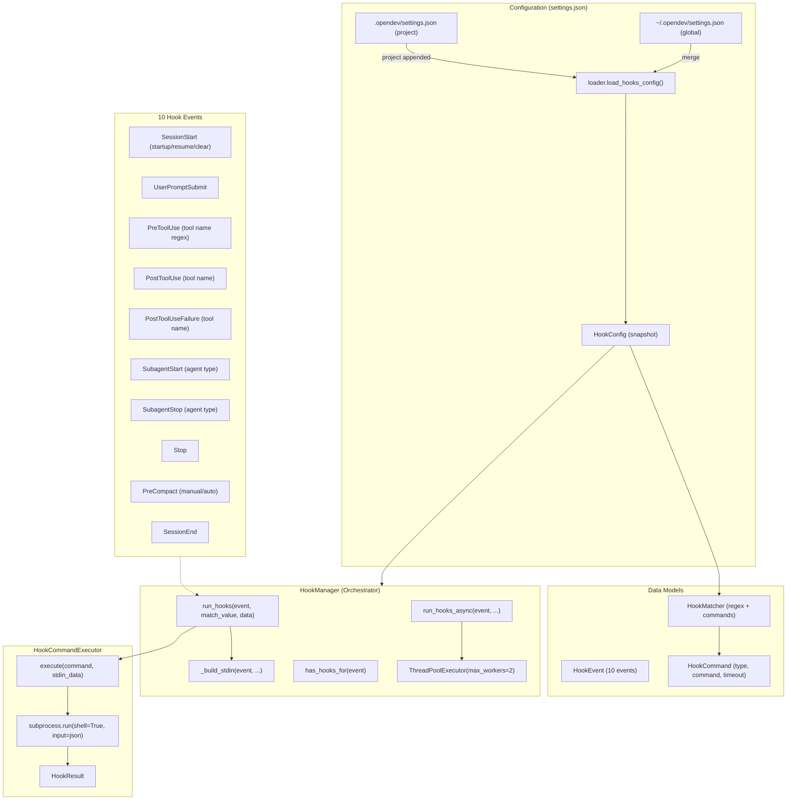

Hooks let users define shell commands that fire at lifecycle events. Configured in `settings.json`, they receive JSON on stdin and communicate via exit codes (0=proceed, 2=block) and JSON on stdout.

### Config Format

```json
{
  "hooks": {
    "PreToolUse": [
      {
        "matcher": "run_command",
        "hooks": [
          { "type": "command", "command": ".opendev/hooks/block-rm.sh", "timeout": 60 }
        ]
      }
    ]
  }
}
```

**Merge strategy**: Project matchers are appended after global matchers for the same event. Global hooks fire first, then project hooks.

### Hook Protocol

The hook command receives JSON on stdin:

```json
{
  "session_id": "abc123",
  "cwd": "/path/to/project",
  "hook_event_name": "PreToolUse",
  "tool_name": "run_command",
  "tool_input": {"command": "rm -rf /tmp/test"}
}
```

The command communicates back via:
- **Exit code 0**: Proceed normally
- **Exit code 2**: Block the operation
- **JSON stdout** (optional): `permissionDecision`, `updatedInput`, `additionalContext`, `decision`, `reason`

### Integration Points

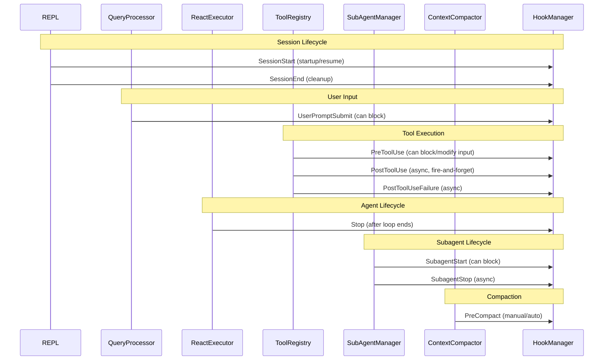

### Key Design Decisions

- **Snapshot at startup**: `HookConfig` is loaded once when `HookManager` is created. Mid-session changes to settings.json are not reflected (prevents TOCTOU security issues)
- **Setter injection**: `set_hook_manager()` on ToolRegistry, QueryProcessor, ReactExecutor, SubAgentManager, ContextCompactor. If None, hooks are a no-op (zero overhead)
- **Short-circuit on block**: If any hook returns exit code 2, remaining hooks are skipped and the operation is denied immediately
- **Async for post-events**: PostToolUse, PostToolUseFailure, SubagentStop use fire-and-forget via `ThreadPoolExecutor(max_workers=2)` to avoid blocking the agent
- **Tool names use OpenDev names**: Matchers match against `run_command`, `write_file`, `edit_file`, etc. (not Claude Code names)

### Wiring Flow

`REPL._init_hooks()` runs at startup:
1. `load_hooks_config(working_dir)` reads and merges global + project settings
2. Creates `HookManager(config, session_id, cwd)`
3. Wires into: `tool_registry.set_hook_manager()`, `query_processor.set_hook_manager()`, `subagent_manager.set_hook_manager()`, `compactor.set_hook_manager()`

---

## Key Files Reference

| Subsystem | Source Files |
|-----------|-------------|
| **Root** | `compaction.py`, `validated_message_list.py`, `message_pair_validator.py`, `context.py` |
| **History** | `history/session_manager.py`, `history/topic_detector.py`, `history/undo_manager.py`, `history/file_locks.py` |
| **Memory / ACE** | `memory/playbook.py`, `memory/delta.py`, `memory/roles.py`, `memory/conversation_summarizer.py`, `memory/selector.py`, `memory/embeddings.py`, `memory/reflection/reflector.py` |
| **MCP** | `mcp/config.py`, `mcp/models.py`, `mcp/manager.py`, `mcp/handler.py` |
| **Retrieval** | `retrieval/token_monitor.py`, `retrieval/indexer.py`, `retrieval/retriever.py` |
| **Context Picker** | `context_picker/picker.py`, `context_picker/models.py`, `context_picker/tracer.py` |
| **Tool System** | `tools/registry.py`, `tools/context.py`, `tools/path_utils.py`, `tools/background_task_manager.py`, `tools/handlers/*` (13 files), `tools/implementations/*` (18 files) |
| **Symbol / LSP** | `tools/symbol_tools/*` (6 files), `tools/lsp/*` (10+ core files), `tools/lsp/language_servers/*` (37 files) |
| **Skills** | `../../core/skills.py` (SkillLoader, SkillMetadata, LoadedSkill), `../../skills/builtin/` |
| **Hooks** | `../../core/hooks/models.py`, `../../core/hooks/executor.py`, `../../core/hooks/manager.py`, `../../core/hooks/loader.py` |
| **Integration** | `../../repl/repl.py`, `../../repl/query_processor.py`, `../../repl/react_executor.py`, `../../repl/query_enhancer.py`, `../../repl/tool_executor.py` |

## Constants & Thresholds Summary

| Component | Constant | Value |
|-----------|----------|-------|
| ContextCompactor | COMPACTION_THRESHOLD | 0.99 (99%) |
| ContextCompactor | max_context default | 100,000 tokens |
| SessionManager | _INDEX_VERSION | 1 |
| SessionManager | Lock timeout | 10.0 seconds |
| SessionManager | Auto-save interval | 5 turns |
| SessionManager | Title max length | 50 chars |
| TopicDetector | _MAX_RECENT_MESSAGES | 4 |
| TopicDetector | LLM max_tokens | 100 |
| TopicDetector | LLM temperature | 0.0 |
| UndoManager | max_history | 50 operations |
| file_locks | Poll interval | 0.05 seconds |
| BulletSelector | effectiveness weight | 0.5 |
| BulletSelector | recency weight | 0.3 |
| BulletSelector | semantic weight | 0.2 |
| BulletSelector | Recency decay rate | 0.1 per day |
| ConversationSummarizer | regenerate_threshold | 5 messages |
| ConversationSummarizer | exclude_last_n | 6 messages |
| ConversationSummarizer | max_summary_length | 500 chars |
| ExecutionReflector | min_tool_calls | 2 |
| ExecutionReflector | min_confidence | 0.6 |
| MCPManager | Tool call timeout | 30 seconds |
| MCPManager | Poll interval | 100ms |
| MCPManager | Connection timeout | 60 seconds |
| CodebaseIndexer | target_tokens | 3,000 |
| ContextPicker | DEFAULT_MAX_STRATEGIES | 30 |
| ContextRetriever | max_files | 10 |
| BashTool | MAX_OUTPUT_CHARS | 30,000 |
| BashTool | IDLE_TIMEOUT | 60 seconds |
| BashTool | MAX_TIMEOUT | 600 seconds |
| BatchTool | MAX_PARALLEL_WORKERS | 5 |
| ReactExecutor | MAX_REACT_ITERATIONS | 200 |
| ValidatedMessageList | SYNTHETIC_TOOL_RESULT | Error placeholder |
| EmbeddingCache | Model | text-embedding-3-small |
| EmbeddingCache | Hash | SHA256[:16] |
| SkillLoader | Default namespace | "default" |
| SkillLoader | Namespace separator | `:` |
| SkillLoader | Dedup scope | Per session |
| HookCommand | Default timeout | 60 seconds |
| HookCommand | Max timeout | 600 seconds |
| HookManager | Async pool workers | 2 |
| HookManager | Block exit code | 2 |
| HookConfig | Config snapshot | At startup (immutable) |
