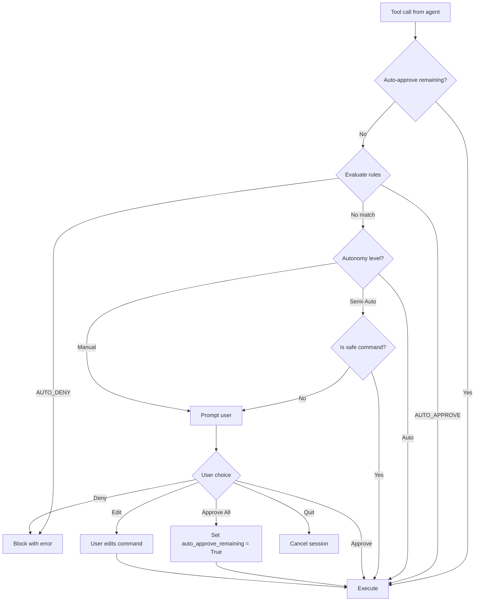
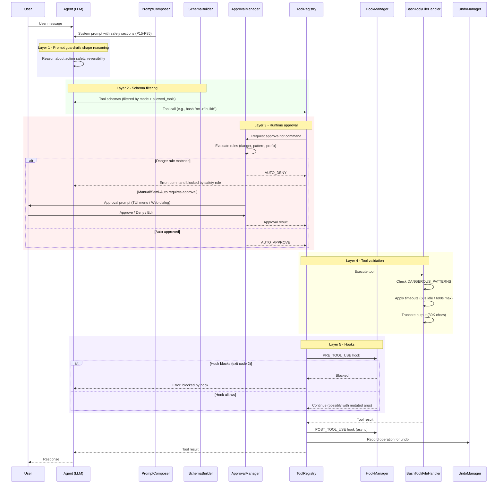

# Guardrails & Safety Architecture

> Definitive reference for the multi-layered safety system that governs tool execution, user consent, and destructive-action prevention across all SWE-CLI interfaces.

---

## 1. The Problem

An agentic coding tool operates in a fundamentally different trust environment than a traditional chatbot. The LLM can:

- **Execute arbitrary shell commands** via `bash_tool` - including `rm -rf /`, `chmod 777`, or piped curl-to-bash
- **Overwrite any file** the process can access - production configs, credentials, dotfiles
- **Spawn background processes** that outlive the session - servers, watchers, miners
- **Chain destructive operations** across multiple tool calls before the user notices

The model has no inherent safety. It follows instructions (system prompt) probabilistically, not deterministically. A single prompt injection in a file it reads, a hallucinated flag, or an ambiguous user request can trigger irreversible damage.

**Design constraint**: The system must prevent catastrophic outcomes while preserving the agent's ability to perform useful work - file edits, test runs, git operations, web fetches - with minimal friction for legitimate tasks.

---

## 2. Design Philosophy

SWE-CLI employs **defense-in-depth**: five independent layers, each sufficient on its own to prevent a class of harm. If any single layer fails (the model ignores a prompt instruction, a regex misses a pattern), the remaining layers catch the dangerous action before execution.

**Core principles**:

- **Fail-closed (deny by default)**: Unknown tools return errors. Unknown commands require approval. Plan mode restricts to a read-only whitelist. The default posture is "block unless explicitly allowed."
- **Principle of least privilege**: Subagents receive only the tools they need. Plan mode strips write tools. MCP tools are only available after explicit discovery.
- **User remains in control**: Every destructive action passes through an approval gate. Users can configure autonomy levels, persistent rules, and hooks to customize the safety boundary.
- **No single point of failure**: Prompt instructions, schema restrictions, runtime checks, tool-level validation, and user hooks each operate independently.

```
┌─────────────────────────────────────────────────────────────────┐
│                     User Request                                │
├─────────────────────────────────────────────────────────────────┤
│  Layer 1: Prompt-Level Guardrails                               │
│  ┌─────────────────────────────────────────────────────────┐    │
│  │ Security policy · Action safety · Git workflow ·        │    │
│  │ Read-before-edit · Error recovery                       │    │
│  └─────────────────────────────────────────────────────────┘    │
│  Layer 2: Mode-Based Tool Restrictions                          │
│  ┌─────────────────────────────────────────────────────────┐    │
│  │ Plan mode whitelist · Subagent allowed_tools ·          │    │
│  │ MCP discovery gating                                    │    │
│  └─────────────────────────────────────────────────────────┘    │
│  Layer 3: Runtime Approval System                               │
│  ┌─────────────────────────────────────────────────────────┐    │
│  │ Manual / Semi-Auto / Auto · Pattern rules ·             │    │
│  │ Danger rules · Persistent permissions                   │    │
│  └─────────────────────────────────────────────────────────┘    │
│  Layer 4: Tool-Level Validation                                 │
│  ┌─────────────────────────────────────────────────────────┐    │
│  │ SAFE_COMMANDS allowlist · DANGEROUS_PATTERNS blocklist · │    │
│  │ Stale-read detection · Output truncation · Timeouts     │    │
│  └─────────────────────────────────────────────────────────┘    │
│  Layer 5: Hooks & Extensibility                                 │
│  ┌─────────────────────────────────────────────────────────┐    │
│  │ Pre-tool blocking · Post-tool audit · Regex matchers ·  │    │
│  │ JSON stdin protocol                                     │    │
│  └─────────────────────────────────────────────────────────┘    │
├─────────────────────────────────────────────────────────────────┤
│                     Tool Execution                              │
└─────────────────────────────────────────────────────────────────┘
```

---

## 3. Layer 1: Prompt-Level Guardrails

The first defense layer is behavioral: system prompt sections that instruct the model to avoid dangerous actions. These are soft guardrails - the model follows them with high but not perfect reliability.

**Key insight**: Prompt guardrails are the only layer that can prevent the model from *attempting* a dangerous action. All other layers intercept after the model has already decided to act. This makes prompt instructions the most cost-effective layer (no wasted API round-trips on blocked actions).

### Prompt Sections (Priority Order)

Sections are registered in `PromptComposer` with numeric priorities. Lower numbers appear earlier in the system prompt and receive more attention from the model.

`swecli/core/agents/prompts/composition.py` - `create_default_composer()`

- **Priority 15** - `main-security-policy.md`: Core security rules. Prohibits generating URLs, blocks prompt injection patterns, restricts assistance with offensive security to authorized contexts only.

- **Priority 56** - `main-action-safety.md`: Action reversibility awareness. Instructs the model to consider blast radius before acting, prefer local reversible operations, confirm before destructive or shared-state operations (force push, branch deletion, process killing).

- **Priority 58** - `main-read-before-edit.md`: Read-before-write discipline. Requires the model to read a file before editing it, preventing blind overwrites of code the model hasn't seen.

- **Priority 60** - `main-error-recovery.md`: Error handling guidance. Prevents retry loops on failing commands, instructs the model to diagnose root causes rather than brute-forcing past errors.

- **Priority 70** - `main-git-workflow.md` (conditional: `ctx.get("in_git_repo")`): Git safety protocol. Never amend published commits, never force push to main, never skip hooks, prefer new commits over amends after hook failures, warn before destructive git operations.

- **Priority 85** - `main-output-awareness.md`: Output handling awareness. Guides the model on how to handle large outputs, truncation, and result interpretation.

### System Reminders as Mid-Conversation Reinforcement

System prompt instructions fade in effectiveness as the conversation grows longer. SWE-CLI counteracts this with **system reminders** - injected at strategic points during the conversation to reinforce critical rules.

Reminders are attached to tool results and user messages via `<system-reminder>` tags. They carry the same authority as the original system prompt but appear closer to the model's current attention window, increasing compliance on long sessions.

### Key Design Decision

Priority bands are intentional: security policy (15) appears before tool-use guidance (40-50) and code quality rules (55-65). This ensures the model processes safety constraints before it starts reasoning about tool selection.

---

## 4. Layer 2: Mode-Based Tool Restrictions

The second layer is structural: the set of tools available to the model is restricted based on operating mode. This is enforced at the schema level - tools not in the allowed set are never sent to the LLM, so the model cannot call them even if it wanted to.

### Plan Mode: Read-Only Whitelist

When the user switches to Plan mode (via `/mode` or Shift+Tab), the agent receives only read-only tools:

`swecli/core/agents/components/schemas/planning_builder.py`

```python
PLANNING_TOOLS = {
    "read_file", "list_files", "search", "fetch_url", "web_search",
    "list_processes", "get_process_output", "read_pdf",
    "find_symbol", "find_referencing_symbols",
    "search_tools", "spawn_subagent", "ask_user", "task_complete",
}
```

Write tools (`write_file`, `edit_file`, `bash`, `delete_file`) are absent from the schema entirely. The model cannot attempt file modifications or command execution in Plan mode.

### Subagent Tool Filtering

Each subagent receives a tailored tool set via the `allowed_tools` parameter:

`swecli/core/agents/components/schemas/normal_builder.py`

```python
class ToolSchemaBuilder:
    def __init__(self, tool_registry, allowed_tools=None):
        self.allowed_tools = allowed_tools  # None = all tools

    def build(self):
        # Filters _BUILTIN_TOOL_SCHEMAS to only allowed_tools
        # Also filters MCP schemas against allowed_tools
```

The `SubAgentManager` (`swecli/core/agents/subagents/manager.py`) defines per-agent tool lists via `AgentConfig.get_tool_list()`:
- `"*"` - all tools (main agent only)
- Explicit list - those specific tools
- `{"exclude": [...]}` - all minus excluded

### MCP Discovery Gating

MCP tools are not available by default. They require explicit discovery via `search_tools`, which queries registered MCP servers and caches results. This prevents the model from calling unknown external tools without first discovering what is available - a token-efficient approach that also acts as a natural access control.

### Key Design Decision

Schema-level filtering is the strongest form of tool restriction - it is impossible for the model to bypass because the tool definition never appears in its context. This is strictly stronger than prompt-level instructions ("don't use tool X") which the model might ignore.

---

## 5. Layer 3: Runtime Approval System

The third layer is interactive: before executing a tool call, the system checks whether the user has authorized it. This is the primary user-facing safety mechanism.

### Autonomy Levels

Three levels control how much freedom the agent has:

- **Manual**: Every tool call requires explicit user approval
- **Semi-Auto**: Safe commands (read-only operations) are auto-approved; write operations require approval
- **Auto**: All operations auto-approved (for trusted workflows)

### ApprovalRulesManager

`swecli/core/runtime/approval/rules.py`

The rules engine evaluates commands against a prioritized rule set. Rules are evaluated in priority order (highest priority first); the first matching rule determines the action.

**Rule types** (`RuleType` enum):
- `PATTERN` - regex match against the full command string
- `COMMAND` - exact match against the command name
- `PREFIX` - prefix match (e.g., "git" matches "git status", "git push")
- `DANGER` - regex match with auto-deny semantics

**Rule actions** (`RuleAction` enum):
- `AUTO_APPROVE` - execute without asking
- `AUTO_DENY` - block without asking
- `REQUIRE_APPROVAL` - prompt the user
- `REQUIRE_EDIT` - let the user modify the command before execution

**Default danger rules** (priority 100, always present):

```python
# Pattern: r"rm\s+(-rf?|-fr?)\s+(/|\*|~)"
# Matches: rm -rf /, rm -rf *, rm -rf ~

# Pattern: r"chmod\s+777"
# Matches: chmod 777 on any path
```

### Persistent Rules

Users can save approval rules that persist across sessions:

- **User-global**: `~/.opendev/permissions.json`
- **Project-scoped**: `.opendev/permissions.json` (higher priority)

Project rules override user rules for the same pattern, enabling per-project trust boundaries. Rules are managed via the `/permissions` command.

### Approval Flow



### TUI vs Web Approval

- **TUI** (`swecli/core/runtime/approval/manager.py`): Blocking `prompt_toolkit` menu with arrow-key navigation. The agent thread blocks until the user responds.
- **Web UI** (`swecli/web/web_approval_manager.py`): Non-blocking WebSocket flow. Broadcasts `approval_required` event, then polls `threading.Event` with 300-second timeout. Frontend renders an approval dialog.

### SAFE_COMMANDS (Semi-Auto Mode)

`swecli/web/web_approval_manager.py`

Commands auto-approved in Semi-Auto mode:

```python
SAFE_COMMANDS = [
    "ls", "cat", "head", "tail", "grep", "find", "wc",
    "pwd", "echo", "which",
    "git status", "git log", "git diff", ...
]
```

These are read-only operations that cannot modify the filesystem or system state.

---

## 6. Layer 4: Tool-Level Validation

The fourth layer is mechanical: hardcoded checks at the tool execution boundary that cannot be overridden by the model, user configuration, or approval decisions. These are the last line of defense before a command actually runs.

### Bash Tool Safety

`swecli/core/context_engineering/tools/implementations/bash_tool.py`

**Allowlist - commands that bypass danger checks:**

```python
SAFE_COMMANDS = [
    "ls", "cat", "head", "tail", "grep", "find", "wc",
    "echo", "pwd", "which", "whoami",
    "git", "pytest", "python", "python3", "pip",
    "node", "npm", "npx", "yarn",
    "docker", "kubectl", "make", "cmake",
]
```

**Blocklist - patterns that trigger danger warnings:**

```python
DANGEROUS_PATTERNS = [
    r"rm\s+-rf\s+/",           # recursive delete from root
    r"sudo",                    # privilege escalation
    r"chmod\s+-R\s+777",       # recursive world-writable
    r":\(\)\{\s*:\|\:&\s*\};:", # fork bomb
    r"mv\s+/",                 # move from root
    r">\s*/dev/sd[a-z]",       # overwrite block device
    r"dd\s+if=.*of=/dev",      # raw disk write
    r"curl.*\|\s*bash",        # piped remote execution
    r"wget.*\|\s*bash",        # piped remote execution
]
```

**Execution guards:**

| Guard | Value | Purpose |
|-------|-------|---------|
| `IDLE_TIMEOUT` | 60s | Kill commands that produce no output for 60 seconds |
| `MAX_TIMEOUT` | 600s | Absolute maximum execution time (10 minutes) |
| `MAX_OUTPUT_CHARS` | 30,000 | Truncate output to prevent context flooding |
| `KEEP_HEAD_CHARS` | 10,000 | Preserve first 10K chars when truncating |
| `KEEP_TAIL_CHARS` | 10,000 | Preserve last 10K chars when truncating |

Output truncation uses a middle-cut strategy: the first 10K and last 10K characters are preserved, with a `[... truncated ...]` marker in between. This ensures the model sees both the beginning (headers, initial output) and end (final results, error messages) of long outputs.

**Server command detection:** Commands matching patterns like `flask run`, `uvicorn`, `npm start`, `npm run dev` are automatically detected and run in the background to prevent blocking the agent loop.

**Interactive command detection:** Commands matching `npx`, `npm init`, `yarn create`, and framework CLI patterns are auto-confirmed with `yes` to prevent the agent from hanging on interactive prompts.

### File Operation Safety

`swecli/core/context_engineering/tools/handlers/file_handlers.py`

**Stale-read detection** - The `FileTimeTracker` (`swecli/core/context_engineering/tools/file_time.py`) prevents the model from editing a file that has changed since it was last read:

```python
class FileTimeTracker:
    MTIME_TOLERANCE_SECS = 0.05  # 50ms for filesystem timestamp fuzz

    def record_read(self, file_path):
        # Records time.time() for the absolute path

    def assert_fresh(self, file_path):
        # Compares file's current mtime against recorded read time
        # Returns error string if file was modified externally

    def invalidate(self, file_path):
        # Clears record after successful edit (forces re-read)
```

The flow: `read_file()` records a timestamp → `edit_file()` calls `assert_fresh()` before applying changes → if the file was modified externally (by the user, another process, or a git operation), the edit is rejected with an error instructing the model to re-read.

**Backup creation** - File edits pass `backup=True` to the underlying implementation, creating a backup copy before modification. This enables the undo system (see Section 8).

**LSP diagnostics after edit** - After a successful edit, the system runs LSP diagnostics and appends any Error-level issues to the tool result. This provides immediate feedback if the edit introduced syntax errors or type mismatches.

### Path Sanitization

`swecli/core/context_engineering/tools/path_utils.py`

The `sanitize_path()` function strips `@` and `#` mention prefixes that the model sometimes hallucinates from chat-style formatting, preventing path resolution errors.

---

## 7. Layer 5: Hooks & Extensibility

The fifth layer is user-defined: hooks allow users to inject custom logic at tool execution boundaries without modifying core code.

### Hook Events

`swecli/core/hooks/models.py`

Ten lifecycle events are available:

- `SESSION_START` - session begins
- `USER_PROMPT_SUBMIT` - user sends a message
- `PRE_TOOL_USE` - before a tool executes (can block)
- `POST_TOOL_USE` - after successful tool execution
- `POST_TOOL_USE_FAILURE` - after failed tool execution
- `SUBAGENT_START` / `SUBAGENT_STOP` - subagent lifecycle
- `PRE_COMPACT` - before context compaction
- `SESSION_END` - session terminates
- `STOP` - agent stops

### Hook Execution Model

`swecli/core/hooks/manager.py`

**Pre-tool hooks** run synchronously before tool execution:
- A hook returning **exit code 2** blocks the tool call entirely. The tool returns an error to the model.
- A hook can return JSON with `updatedInput` to mutate the tool's arguments before execution.
- A hook can return JSON with `permissionDecision` to override the approval decision.

**Post-tool hooks** run asynchronously via `ThreadPoolExecutor` (max 2 workers) - they cannot block execution but can log, audit, or trigger side effects.

### Matcher System

Hooks are configured with `HookMatcher` objects that use compiled regex patterns to match tool names. A matcher with no pattern matches all tools. This allows fine-grained targeting: a hook can fire only for `bash` calls, only for `write_file`, or for all tools.

### Hook Protocol

Hooks receive context via JSON on stdin:

```json
{
    "session_id": "abc12345",
    "cwd": "/Users/dev/project",
    "hook_event_name": "pre_tool_use",
    "tool_name": "bash",
    "tool_input": {"command": "rm -rf build/"},
    "tool_response": null
}
```

### Integration Points

`swecli/core/context_engineering/tools/registry.py`

- **Pre-tool** (registry execution path): After schema validation but before handler dispatch. If the hook outcome is `blocked`, the tool returns immediately with an error.
- **Post-tool** (registry execution path): After handler returns a result. Runs asynchronously - does not delay the response to the model.

### Key Design Decision

Hooks follow the Claude Code protocol for compatibility. The blocking semantics (exit code 2 = block) provide a hard stop that is independent of all other safety layers. A corporate security team can deploy a pre-tool hook that blocks any `bash` command matching their deny list, and no amount of prompt engineering or approval-level changes can bypass it.

---

## 8. Cross-Cutting: Undo, Audit, Subagent Isolation

Three additional mechanisms cut across all five layers:

### UndoManager

`swecli/core/context_engineering/history/undo_manager.py`

Every file operation is recorded in an in-memory list (max 50 entries) and a persistent JSONL log (`session_dir/operations.jsonl`). Supported undo operations:

- **FILE_WRITE** → deletes the created file
- **FILE_EDIT** → restores from backup via `shutil.copy2()`
- **FILE_DELETE** → restores from backup

The `/undo` command in the REPL pops the last operation and reverses it. Operations are logged with timestamps, types, paths, and unique IDs.

For git-tracked files, the **shadow git snapshot system** provides an additional undo path: a parallel bare repository at `~/.opendev/snapshot/<id>/` takes tree-hash snapshots at each agent step, enabling per-step rollback via `/undo`.

### Command History & Audit Trail

`swecli/core/runtime/approval/rules.py` - `CommandHistory`

Every approval decision is recorded: the command, the action taken (approved, denied, edited), the rule that matched, and the timestamp. This provides a full audit trail of what the agent attempted and what the user authorized.

### Subagent Isolation

Subagents operate with reduced privileges:

- **Tool restriction**: Each subagent receives only the tools specified in its `AgentConfig`. The `ToolSchemaBuilder` filters both builtin and MCP schemas.
- **Context flag**: `ToolExecutionContext.is_subagent = True` signals handlers to adjust behavior (e.g., auto-confirming interactive commands instead of blocking).
- **Prompt reinforcement**: Subagent system prompts include read-only instructions appropriate to their role (e.g., Code Explorer cannot write files).
- **No approval escalation**: Subagents inherit the parent session's approval state but cannot grant themselves additional permissions.

---

## 9. Architecture Diagram

```
┌──────────────────────────────────────────────────────────────────────────┐
│                          USER REQUEST                                    │
└──────────────────────┬───────────────────────────────────────────────────┘
                       │
                       ▼
┌──────────────────────────────────────────────────────────────────────────┐
│  LAYER 1: PROMPT-LEVEL GUARDRAILS                                        │
│                                                                          │
│  ┌──────────────┐ ┌──────────────┐ ┌──────────────┐ ┌──────────────┐   │
│  │ Security     │ │ Action       │ │ Read-Before  │ │ Git          │   │
│  │ Policy (P15) │ │ Safety (P56) │ │ -Edit (P58)  │ │ Workflow(P70)│   │
│  └──────────────┘ └──────────────┘ └──────────────┘ └──────────────┘   │
│  ┌──────────────┐ ┌──────────────┐                                      │
│  │ Error        │ │ Output       │  + System reminders mid-conversation │
│  │ Recovery(P60)│ │ Awareness(85)│                                      │
│  └──────────────┘ └──────────────┘                                      │
└──────────────────────┬───────────────────────────────────────────────────┘
                       │ Model decides tool call
                       ▼
┌──────────────────────────────────────────────────────────────────────────┐
│  LAYER 2: MODE-BASED TOOL RESTRICTIONS                                   │
│                                                                          │
│  Normal Mode ──── Full tool set (all builtin + discovered MCP)          │
│  Plan Mode ────── PLANNING_TOOLS whitelist (14 read-only tools)         │
│  Subagent ─────── AgentConfig.get_tool_list() (per-agent filtering)     │
│                                                                          │
│  Schema-level enforcement: tools not in set are never sent to LLM       │
└──────────────────────┬───────────────────────────────────────────────────┘
                       │ Tool call reaches runtime
                       ▼
┌──────────────────────────────────────────────────────────────────────────┐
│  LAYER 3: RUNTIME APPROVAL                                               │
│                                                                          │
│  ApprovalRulesManager ─── Pattern/Command/Prefix/Danger rules           │
│  Autonomy Level ──────── Manual / Semi-Auto / Auto                      │
│  Persistent Rules ────── ~/.opendev/permissions.json (user)             │
│                           .opendev/permissions.json (project)           │
│  Default Dangers ─────── rm -rf /, chmod 777 (always active)            │
│                                                                          │
│  TUI: blocking prompt_toolkit menu                                      │
│  Web: WebSocket broadcast + polling (300s timeout)                      │
└──────────────────────┬───────────────────────────────────────────────────┘
                       │ Approved
                       ▼
┌──────────────────────────────────────────────────────────────────────────┐
│  LAYER 4: TOOL-LEVEL VALIDATION                                          │
│                                                                          │
│  Bash ────── SAFE_COMMANDS allowlist │ DANGEROUS_PATTERNS blocklist      │
│              60s idle timeout │ 600s max │ 30K output truncation         │
│  Files ───── FileTimeTracker (50ms mtime tolerance)                     │
│              Backup creation │ LSP diagnostics post-edit                 │
│  Process ─── Server detection (auto-background)                         │
│              Interactive command auto-confirm                            │
│  Paths ───── sanitize_path() strips @ and # prefixes                    │
└──────────────────────┬───────────────────────────────────────────────────┘
                       │ Validated
                       ▼
┌──────────────────────────────────────────────────────────────────────────┐
│  LAYER 5: HOOKS                                                          │
│                                                                          │
│  PRE_TOOL_USE ── Sync execution │ Exit code 2 = block                   │
│                  Can mutate args (updatedInput)                          │
│  POST_TOOL_USE ─ Async execution │ Audit/logging                        │
│  10 event types │ Regex matchers │ JSON stdin protocol                   │
└──────────────────────┬───────────────────────────────────────────────────┘
                       │
                       ▼
┌──────────────────────────────────────────────────────────────────────────┐
│                      TOOL EXECUTION                                      │
│                                                                          │
│  UndoManager records operation │ CommandHistory logs decision            │
│  Snapshot system captures git state                                      │
└──────────────────────────────────────────────────────────────────────────┘
```

---

## 10. Runtime Flow



---

## Key Files Reference

| Component | File | Key Elements |
|-----------|------|-------------|
| **Prompt composition** | `swecli/core/agents/prompts/composition.py` | `PromptComposer`, `create_default_composer()`, priority registration |
| **Security policy** | `swecli/core/agents/prompts/templates/system/main/main-security-policy.md` | Core security instructions |
| **Action safety** | `swecli/core/agents/prompts/templates/system/main/main-action-safety.md` | Reversibility awareness |
| **Git workflow** | `swecli/core/agents/prompts/templates/system/main/main-git-workflow.md` | Git safety protocol |
| **Planning tools** | `swecli/core/agents/components/schemas/planning_builder.py` | `PLANNING_TOOLS` whitelist |
| **Schema builder** | `swecli/core/agents/components/schemas/normal_builder.py` | `ToolSchemaBuilder`, `allowed_tools` filtering |
| **Approval rules** | `swecli/core/runtime/approval/rules.py` | `ApprovalRulesManager`, `RuleType`, `RuleAction`, danger rules |
| **Approval manager** | `swecli/core/runtime/approval/manager.py` | `ApprovalManager`, TUI blocking menu |
| **Web approval** | `swecli/web/web_approval_manager.py` | `WebApprovalManager`, `SAFE_COMMANDS`, autonomy levels |
| **Bash tool** | `swecli/core/context_engineering/tools/implementations/bash_tool.py` | `SAFE_COMMANDS`, `DANGEROUS_PATTERNS`, timeouts |
| **File handlers** | `swecli/core/context_engineering/tools/handlers/file_handlers.py` | Stale-read check, backup creation, LSP diagnostics |
| **FileTimeTracker** | `swecli/core/context_engineering/tools/file_time.py` | Mtime-based freshness, 50ms tolerance |
| **Path utils** | `swecli/core/context_engineering/tools/path_utils.py` | `sanitize_path()` |
| **Hook models** | `swecli/core/hooks/models.py` | `HookEvent`, `HookMatcher`, `HookCommand` |
| **Hook manager** | `swecli/core/hooks/manager.py` | `HookManager`, blocking/async execution |
| **Hook integration** | `swecli/core/context_engineering/tools/registry.py` | Pre/post hook invocation points |
| **Undo manager** | `swecli/core/context_engineering/history/undo_manager.py` | `UndoManager`, operation log, rollback |
| **Subagent manager** | `swecli/core/agents/subagents/manager.py` | `SubAgentManager`, per-agent tool lists |
| **Mode manager** | `swecli/core/runtime/mode_manager.py` | `ModeManager`, `OperationMode` |
| **Tool registry** | `swecli/core/context_engineering/tools/registry.py` | `ToolRegistry`, dispatch, hook integration |

## Constants & Thresholds

| Constant | Value | Location |
|----------|-------|----------|
| `IDLE_TIMEOUT` | 60s | `bash_tool.py` |
| `MAX_TIMEOUT` | 600s | `bash_tool.py` |
| `MAX_OUTPUT_CHARS` | 30,000 | `bash_tool.py` |
| `KEEP_HEAD_CHARS` | 10,000 | `bash_tool.py` |
| `KEEP_TAIL_CHARS` | 10,000 | `bash_tool.py` |
| `MTIME_TOLERANCE_SECS` | 0.05 | `file_time.py` |
| `max_history` (undo) | 50 | `undo_manager.py` |
| Hook timeout range | 1–600s | `models.py` |
| Web approval timeout | 300s | `web_approval_manager.py` |
| Danger rule priority | 100 | `rules.py` |

---

**[← Back to Index](./00_INDEX.md)**
