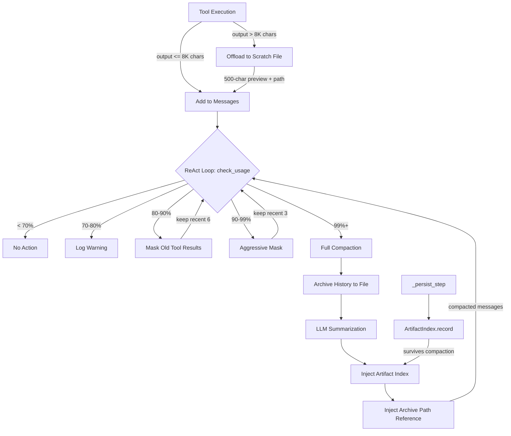

# Progressive Context Decay

> *Your agent reads a 500-line file at step 3. At step 30, those 500 lines are still sitting in context, consuming 2,000 tokens, even though the agent hasn't looked at them in 27 steps. Multiply by every tool call in the session. That's where 80% of your context window goes.*

---

## The Problem: Context Obesity

Every tool call in a ReAct loop produces output. A `read_file` returns the file contents. A `bash` command returns stdout. A `search` returns matching lines. These outputs are appended to the conversation and sent to the LLM on every subsequent turn.

Here's what a typical 40-step coding session looks like in terms of token allocation:

```
System prompt:     ~3,000 tokens  ( 3%)
User messages:     ~2,000 tokens  ( 2%)
Assistant text:    ~5,000 tokens  ( 5%)
Tool outputs:     ~80,000 tokens  (80%)  <-- The problem
Tool call args:   ~10,000 tokens  (10%)
```

Tool outputs dominate. And most of them are stale - the agent read that file 25 steps ago and has long moved on. But those tokens are still there, crowding out the context window, pushing the system toward emergency compaction.

The old approach was binary: do nothing until 99% full, then perform expensive LLM-powered summarization that inevitably loses information. By the time compaction fires, it's an emergency - and emergency surgery always has collateral damage.

---

## The Insight: Decay, Don't Delete

The key insight comes from a principle in the [Agent-Skills-for-Context-Engineering](https://github.com/coyotespike/agent-skills-for-context-engineering) repository (cited by Peking University, 2026):

> **"Context engineering (curation of what enters the model) matters more than context window size."**

The fix isn't a bigger context window. It's proactive reduction - making old observations fade gracefully instead of persisting at full resolution until crisis.

Physical memory works this way. Recent events are vivid. Older ones compress into gist. Very old ones become a vague "I know I did something with that file." The information isn't gone - it's stored elsewhere (long-term memory, written notes) and retrievable on demand. But it doesn't occupy active working memory.

Progressive Context Decay applies this principle to agent context management through four complementary mechanisms:

1. **Staged optimization triggers** - act early, not at emergency
2. **Observation masking** - old tool results fade to compact references
3. **Output offloading** - large outputs never enter context at all
4. **Artifact persistence** - file awareness survives compaction

---

## Architecture

### Before: Binary Compaction

```
Context usage over time:

100% |                                          ╔═══╗
 99% |------------------------------------------║   ║--- threshold
     |                                     ╔════╝   ║
 80% |                                ╔════╝        ║
 60% |                          ╔═════╝             ║
 40% |                  ╔═══════╝                   ║
 20% |          ╔═══════╝                           ╚══> drops to ~30%
  0% |══════════╝                                        after compaction
     +--step 1----step 10----step 20----step 30----step 40-->

Problem: Nothing happens until 99%. Then expensive emergency compaction.
```

### After: Progressive Decay

```
Context usage over time:

100% |
 99% |-------------------------------------------------------- compact
 90% |----------------------------------------------- aggressive mask
 80% |-------------------------------------- observation mask
 70% |----------------------------- warning
     |                          ╔══╗
 60% |                     ╔════╝  ╚══╗    masking keeps usage
 50% |                ╔════╝          ╚══╗  oscillating in the
 40% |          ╔═════╝                  ╚══╗ 60-80% range
 20% |    ╔═════╝                           ╚═══
  0% |════╝
     +--step 1----step 10----step 20----step 30----step 40-->

Effect: Usage stays in the productive zone. Full compaction rarely needed.
```

---

## The Four Mechanisms

### 1. Staged Optimization Triggers

The old system had one constant: `COMPACTION_THRESHOLD = 0.99`. The new system has four stages:

```python
STAGE_WARNING    = 0.70   # Log, start tracking
STAGE_MASK       = 0.80   # Progressive observation masking
STAGE_AGGRESSIVE = 0.90   # Aggressive masking (fewer recent kept)
STAGE_COMPACT    = 0.99   # Full LLM-powered compaction (last resort)
```

The `check_usage()` method replaces the binary `should_compact()`:

```python
def check_usage(self, messages, system_prompt) -> str:
    """Returns: 'none', 'warning', 'mask', 'aggressive', or 'compact'."""
```

The ReAct executor checks this every iteration and applies the appropriate optimization:

```python
level = compactor.check_usage(ctx.messages, system_prompt)

if level in (MASK, AGGRESSIVE):
    compactor.mask_old_observations(ctx.messages, level)

if level == COMPACT or force_compact:
    compacted = compactor.compact(ctx.messages, system_prompt)
    ctx.messages[:] = compacted
```

**Why staged?** Because each stage is cheaper than the next. Masking is free (string replacement). Compaction requires an LLM call. By masking early, we often avoid needing compaction at all.

---

### 2. Progressive Observation Masking

This is the core innovation. Tool result messages that are N+ turns old get replaced with minimal references:

```
Before (consuming ~500 tokens):
  {"role": "tool", "tool_call_id": "call_abc", "content": "1  import os\n2  import sys\n3  ..."}

After (consuming ~15 tokens):
  {"role": "tool", "tool_call_id": "call_abc", "content": "[ref: tool result call_abc - see history]"}
```

The threshold depends on the optimization level:

| Level | Recent tool results kept intact | Older results masked |
|-------|-------------------------------|---------------------|
| MASK (80%) | Last 6 | All others |
| AGGRESSIVE (90%) | Last 3 | All others |

**Why this works:** The LLM rarely needs the raw output of a tool call from 10 steps ago. It already processed that information, made decisions based on it, and moved on. The tool call ID is preserved so the message structure remains valid - the LLM can see *that* a read_file happened without seeing the full contents again.

**Why not just delete them?** API message format requires tool result messages to exist for every tool_call. Deleting them breaks the conversation structure. Replacing content preserves structure while recovering tokens.

**Safety:** Already-masked messages (content starting with `[ref:`) are skipped on subsequent passes, preventing double-masking.

---

### 3. Tool Output Offloading

Some tool outputs are enormous. A `read_file` on a 500-line file produces ~12,000 characters (~3,000 tokens). A `bash` command running tests might produce 20,000 characters of output.

Output offloading catches these at the source - before they ever enter the message list:

```python
OFFLOAD_THRESHOLD = 8000  # chars (~2,000 tokens)
```

When a tool result exceeds this threshold, the full output is written to a scratch file and replaced with a preview:

```
{first 500 chars of the output}
...

[Output offloaded: 450 lines, 12000 chars → ~/.opendev/scratch/abc123/read_file_call0001.txt]
Use read_file to see full output if needed.
```

The agent gets enough context to understand what happened (the 500-char preview) plus a path to the full output if it needs to re-examine it. This turns a 3,000-token tool result into a ~200-token summary.

**What's excluded from offloading:**
- Small outputs (under 8,000 chars) - not worth the indirection
- Subagent results (contain completion_status markers the ReAct loop needs)

**File organization:**
```
~/.opendev/scratch/{session_id}/
  read_file_call0001.txt
  run_command_call0002.txt
  search_call0003.txt
```

---

### 4. Artifact Index

Evaluations of agent compaction quality consistently show that **artifact trail** is the weakest dimension - scoring 2.2-2.5 out of 5.0. After compaction, agents forget which files they created, modified, or read. They re-read files they already have context on. They lose track of their own changes.

The `ArtifactIndex` is a separate data structure that records every file operation during a session:

```python
class ArtifactIndex:
    def record(self, file_path, operation, details=""):
        """Track: created, modified, read, deleted."""
```

It builds a compact summary that gets injected into the compaction output:

```markdown
## Artifact Index (files touched this session)
- `src/api/routes.py` [read, modified] - +45/-12
- `src/api/middleware.py` [created] - 80 lines
- `tests/test_routes.py` [created] - 120 lines
- `requirements.txt` [read, modified] - +2/-0
- `src/config.py` [read] - 50 lines
```

This survives compaction because it's injected into the summary message, not stored in the compacted-away middle messages. The agent retains awareness of its workspace state even after aggressive summarization.

**Integration point:** The `_persist_step()` method in the ReAct executor records artifacts as tool calls are processed:

```python
# read_file → record("src/main.py", "read", "150 lines")
# write_file → record("src/main.py", "created", "50 lines")
# edit_file → record("src/main.py", "modified", "+10/-5")
```

---

## History Archival: Making Compaction Non-Destructive

Before compaction runs, the full conversation is written to a markdown file:

```
~/.opendev/scratch/{session_id}/history_archive_20260226_143052.md
```

The archive path is included in the compaction summary:

```
**Note:** Full conversation history archived at
`~/.opendev/scratch/abc123/history_archive_20260226_143052.md`.
Use read_file to recover details if needed.
```

This makes compaction non-destructive. If the agent realizes it lost a critical detail - an error message, a specific line number, a decision rationale - it can `read_file` the archive and recover it. The information isn't gone; it's just moved from active context to retrievable storage.

---

## Data Flow



---

## Implementation

### Files Modified

| File | Changes |
|------|---------|
| `swecli/core/context_engineering/compaction.py` | Staged thresholds, `OptimizationLevel`, `ArtifactIndex`, `mask_old_observations()`, `archive_history()`, enhanced `compact()` |
| `swecli/repl/react_executor.py` | `_maybe_compact()` uses staged levels, `_record_artifact()` feeds artifact index, `_maybe_offload_output()` offloads large outputs |

### Key Classes

**`OptimizationLevel`** - Constants for the five stages (NONE, WARNING, MASK, AGGRESSIVE, COMPACT).

**`ArtifactIndex`** - Tracks files touched with operation history. Serializable via `to_dict()`/`from_dict()` for session persistence. Generates compact markdown summary via `as_summary()`.

**`ContextCompactor`** (enhanced) - Now exposes `check_usage()` returning optimization level, `mask_old_observations()` for progressive masking, `archive_history()` for pre-compaction archival.

### Backwards Compatibility

- `should_compact()` still works - returns True only at 99% (COMPACT level)
- `compact()` still works - now additionally archives history and injects artifact index
- `usage_pct` and `pct_until_compact` unchanged
- `update_from_api_usage()` unchanged

---

## Impact Analysis

### Token Savings

Consider a 40-step session where the agent makes 30 tool calls averaging 1,500 tokens of output each:

| Mechanism | Tokens saved | When |
|-----------|-------------|------|
| Output offloading (5 large outputs) | ~12,000 | Immediately at tool execution |
| Observation masking at 80% (24 old results) | ~30,000 | Step ~25 when hitting 80% |
| Aggressive masking at 90% (27 old results) | ~37,000 | Step ~35 if still growing |
| Total saved before compaction | ~45,000-50,000 | Continuously |

Without these mechanisms, all 45,000 tokens would persist until emergency compaction at 99%.

### Quality Improvements

- **Artifact trail**: Agent retains file awareness post-compaction (addresses weakest evaluation dimension)
- **Recoverability**: Full history archived to disk - agent can grep for lost details
- **Reduced compaction frequency**: Masking often keeps usage below 99%, avoiding the quality loss of full summarization entirely

---

## Design Decisions

**Why 80% for masking, not earlier?**
At 80%, roughly 20% of context remains as headroom. Starting masking earlier would degrade quality unnecessarily - the agent benefits from having recent-ish tool outputs available. The 80% threshold balances context quality against the risk of hitting emergency compaction.

**Why keep 6 recent tool results at MASK level?**
Six tool results corresponds to roughly 2-3 ReAct iterations (most iterations involve 2-3 tool calls). This ensures the agent has full context for its most recent work while recovering tokens from older activity.

**Why 8,000 chars for offloading?**
8,000 characters is approximately 2,000 tokens - about 2% of a 100K context window. Below this, the overhead of file I/O and the indirection cost (agent might need to re-read) outweighs the token savings. Above this, offloading pays for itself immediately.

**Why archive to markdown, not JSON?**
The agent's `read_file` tool returns plain text. Markdown is human-readable and grep-friendly. The archive is for the agent to search through with standard tools, not for programmatic parsing.

**Why not mask assistant messages too?**
Assistant messages contain reasoning, decisions, and plans. Masking them would lose the "why" - which is more valuable than the "what" of tool outputs. Tool outputs are raw data; assistant messages are processed understanding.

---

## Relationship to Research

This implementation draws from several findings in the Agent-Skills-for-Context-Engineering repository:

- **context-degradation**: Lost-in-middle mitigation via attention-aware placement (artifact index at summary edges)
- **context-optimization**: Observation masking pattern for proactive token reduction
- **context-compression**: History archival enabling non-destructive compaction
- **memory-systems**: Artifact index as a form of entity memory surviving context resets

The staged approach specifically addresses the finding that agents performing well at 10K tokens often fail identically at 100K tokens - because the problem isn't window size but context pollution. Reducing pollution proactively is more effective than increasing the window.

---

## Future Extensions

**Semantic masking**: Instead of age-based masking, use embedding similarity to keep tool results that are semantically relevant to the current task, regardless of age.

**Differential offloading**: For `edit_file` results, only keep the diff in context (already small) rather than the full file state.

**Cross-session artifact index**: Persist the artifact index across sessions so `--continue` sessions start with awareness of previously touched files.

**Adaptive thresholds**: Adjust stage thresholds based on observed compaction frequency - if compaction fires often, lower thresholds; if never, raise them to avoid unnecessary masking.
