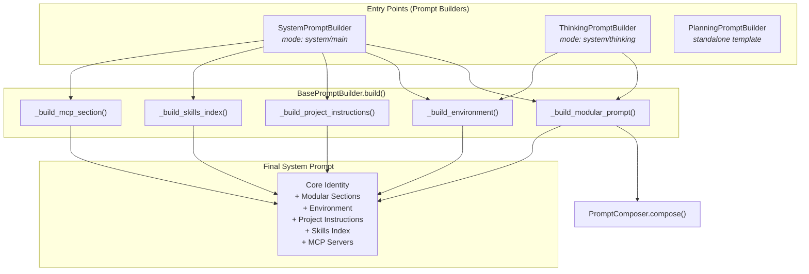
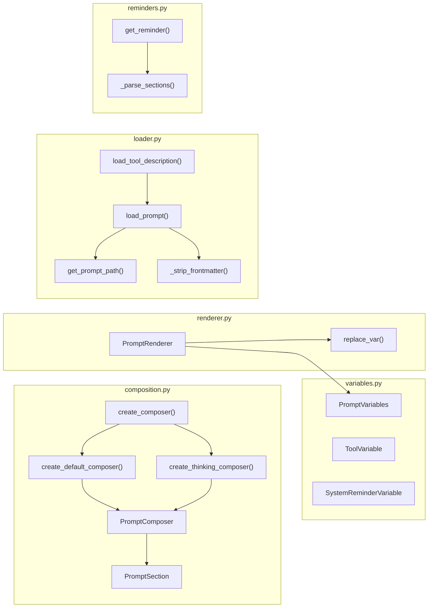
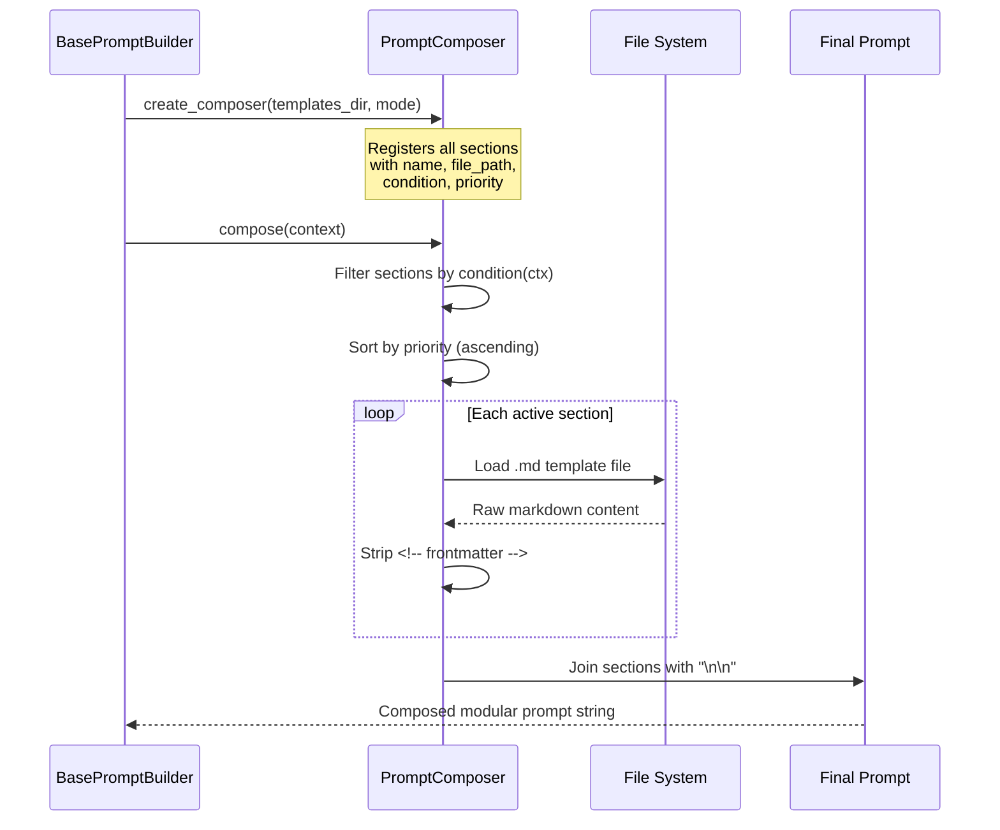
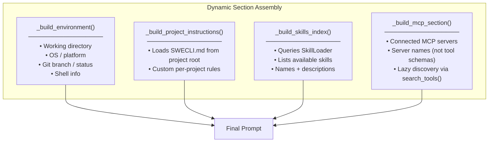
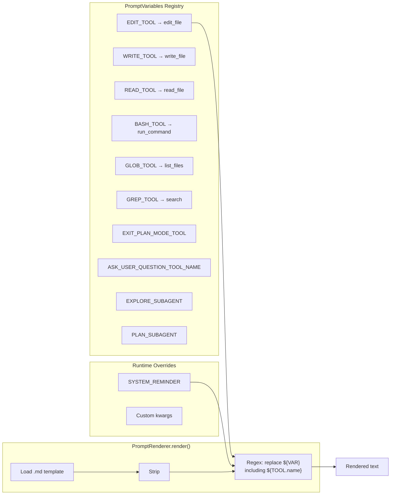
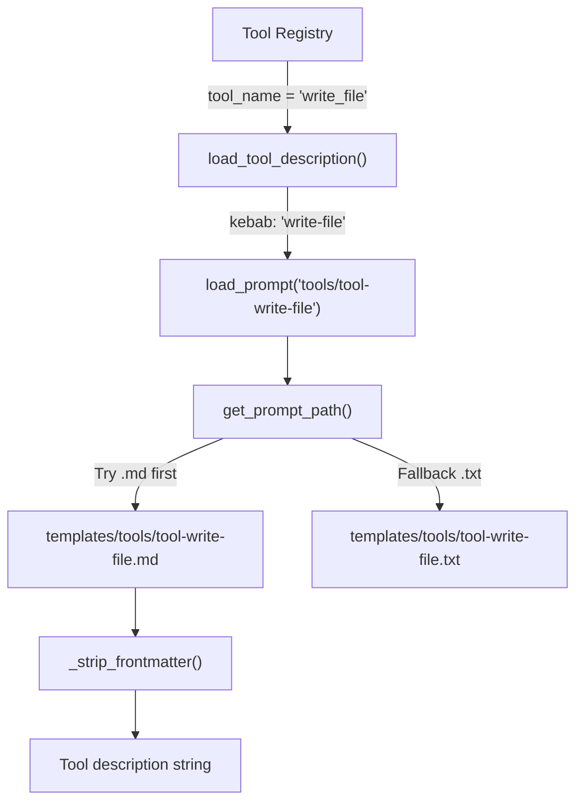
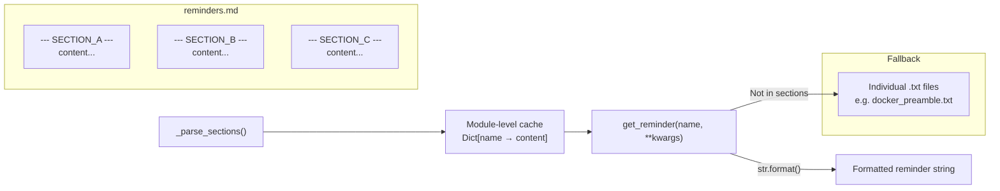
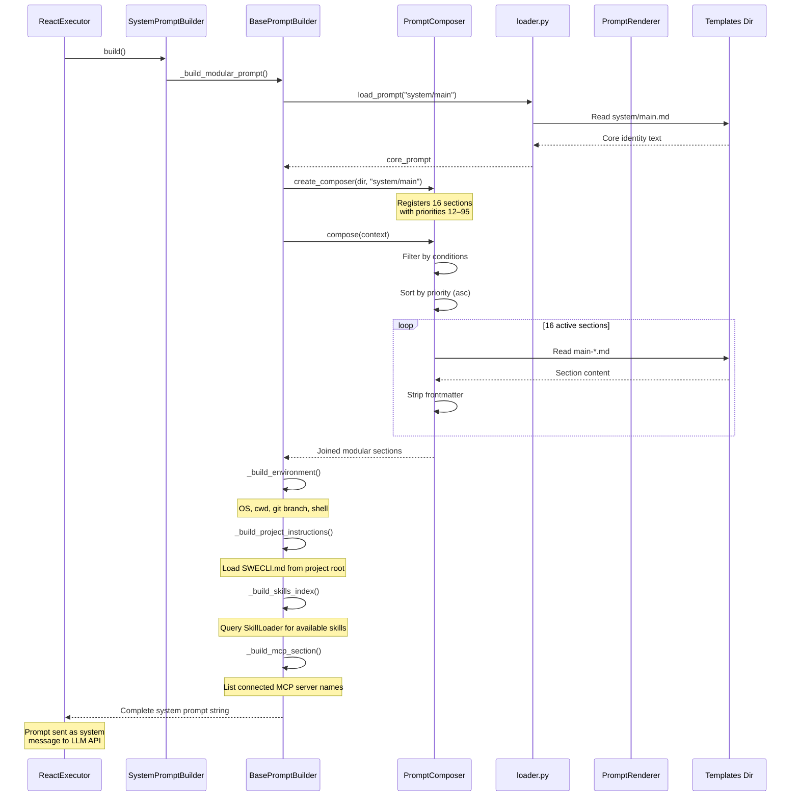

# Prompt Composition Architecture

A detailed architecture reference showing how OpenDev assembles system prompts from modular sections, variables, tools, and runtime context.

---

## High-Level Assembly Pipeline



---

## Detailed Component Architecture



---

## PromptComposer Internals

### Section Registration & Composition Flow



---

## Main Mode: 16 Registered Sections

All sections live in `swecli/core/agents/prompts/templates/system/main/`.

```
┌─────────────────────────────────────────────────────────────────────┐
│                    COMPOSED SYSTEM PROMPT                           │
│                  (Priority: lower = earlier)                        │
├──────┬──────────────────────────┬──────────┬────────────────────────┤
│ Pri  │ Section                  │ Cond.    │ File                   │
├──────┼──────────────────────────┼──────────┼────────────────────────┤
│      │ *** CORE IDENTITY ***    │          │                        │
│  12  │ Mode Awareness           │ Always   │ main-mode-awareness    │
│  15  │ Security Policy          │ Always   │ main-security-policy   │
│  20  │ Tone and Style           │ Always   │ main-tone-and-style    │
│  25  │ No Time Estimates        │ Always   │ main-no-time-estimates │
├──────┼──────────────────────────┼──────────┼────────────────────────┤
│      │ *** INTERACTION ***      │          │                        │
│  40  │ Interaction Pattern      │ Always   │ main-interaction-pat.  │
│  45  │ Available Tools          │ Always   │ main-available-tools   │
│  50  │ Tool Selection           │ Always   │ main-tool-selection    │
├──────┼──────────────────────────┼──────────┼────────────────────────┤
│      │ *** CODE & SAFETY ***    │          │                        │
│  55  │ Code Quality             │ Always   │ main-code-quality      │
│  56  │ Action Safety            │ Always   │ main-action-safety     │
│  58  │ Read Before Edit         │ Always   │ main-read-before-edit  │
│  60  │ Error Recovery           │ Always   │ main-error-recovery    │
├──────┼──────────────────────────┼──────────┼────────────────────────┤
│      │ *** CONDITIONAL ***      │          │                        │
│  65  │ Subagent Guide           │ has_sub  │ main-subagent-guide    │
│  70  │ Git Workflow             │ git_repo │ main-git-workflow      │
│  75  │ Task Tracking            │ todo_on  │ main-task-tracking     │
├──────┼──────────────────────────┼──────────┼────────────────────────┤
│      │ *** CONTEXT ***          │          │                        │
│  85  │ Output Awareness         │ Always   │ main-output-awareness  │
│  87  │ Scratchpad               │ session  │ main-scratchpad        │
│  90  │ Code References          │ Always   │ main-code-references   │
│  95  │ Reminders Note           │ Always   │ main-reminders-note    │
└──────┴──────────────────────────┴──────────┴────────────────────────┘
```

### Conditional Evaluation Logic

```python
context = {
    "in_git_repo":          env_context.is_git_repo,     # Git Workflow
    "has_subagents":        True,                         # Subagent Guide
    "todo_tracking_enabled": True,                        # Task Tracking
    "session_id":           session_id or None,           # Scratchpad
}
```

---

## Thinking Mode: 4 Registered Sections

Thinking mode is a reasoning pre-phase with **no tool execution**. It uses purpose-built sections from `system/thinking/`.

```
┌──────┬──────────────────────────┬────────────────────────────────────┐
│ Pri  │ Section                  │ File                               │
├──────┼──────────────────────────┼────────────────────────────────────┤
│  45  │ Available Tools          │ thinking-available-tools.md        │
│  50  │ Subagent Guide           │ thinking-subagent-guide.md         │
│  85  │ Code References          │ thinking-code-references.md        │
│  90  │ Output Rules             │ thinking-output-rules.md           │
└──────┴──────────────────────────┴────────────────────────────────────┘
```

---

## Dynamic Sections (Appended by Builder)

After the modular sections are composed, `BasePromptBuilder.build()` appends four dynamic sections:



---

## Variable Substitution Pipeline

Templates use `${VAR}` syntax. The `PromptRenderer` resolves variables from `PromptVariables` + runtime overrides.



### Substitution Examples

| Template Syntax | Resolved Value |
|---|---|
| `${EDIT_TOOL.name}` | `edit_file` |
| `${BASH_TOOL.name}` | `run_command` |
| `${GREP_TOOL.name}` | `search` |
| `${ASK_USER_QUESTION_TOOL_NAME}` | `ask_user` |
| `${SYSTEM_REMINDER.planFilePath}` | `/path/to/plan.md` |
| `${SYSTEM_REMINDER.planExists}` | `True` / *(empty if False)* |

---

## Tool Description Loading

Each of the 37 tools has its own markdown description file loaded lazily by the tool registry.



### Tool Templates (37 files)

```
templates/tools/
├── tool-analyze-image.md        ├── tool-list-files.md
├── tool-ask-user.md             ├── tool-list-processes.md
├── tool-batch-tool.md           ├── tool-list-todos.md
├── tool-capture-screenshot.md   ├── tool-notebook-edit.md
├── tool-capture-web-screenshot  ├── tool-open-browser.md
├── tool-complete-todo.md        ├── tool-read-file.md
├── tool-create-plan.md          ├── tool-read-pdf.md
├── tool-edit-file.md            ├── tool-rename-symbol.md
├── tool-edit-plan.md            ├── tool-replace-symbol-body.md
├── tool-enter-plan-mode.md      ├── tool-run-command.md
├── tool-exit-plan-mode.md       ├── tool-search-tools.md
├── tool-fetch-url.md            ├── tool-search.md
├── tool-find-referencing-sym.md ├── tool-task-complete.md
├── tool-find-symbol.md          ├── tool-update-todo.md
├── tool-get-process-output.md   ├── tool-web-search.md
├── tool-get-subagent-output.md  ├── tool-write-file.md
├── tool-insert-after-symbol.md  ├── tool-write-todos.md
├── tool-insert-before-symbol.md └── tool-invoke-skill.md
└── tool-kill-process.md
```

---

## Subagent Prompt Templates (8 files)

Each subagent gets its own system prompt template, loaded when the subagent is spawned.

```
templates/subagents/
├── subagent-ask-user.md           ├── subagent-pr-reviewer.md
├── subagent-code-explorer.md      ├── subagent-project-init.md
├── subagent-planner.md            ├── subagent-security-reviewer.md
├── subagent-web-clone.md          └── subagent-web-generator.md
```

---

## Reminder System

Short runtime nudges and signals are stored in `templates/reminders.md` as named sections, parsed by `reminders.py`.



---

## Specialized Prompt Templates

```
templates/
├── system/
│   ├── main.md              ← Core identity template (monolithic fallback)
│   ├── main/                ← 16 modular section files
│   ├── thinking.md          ← Thinking core identity
│   ├── thinking/            ← 4 thinking section files
│   ├── compaction.md        ← Context compaction prompt
│   ├── critique.md          ← Self-critique prompt
│   └── init.md              ← Initialization prompt
├── tools/                   ← 37 tool description files
├── subagents/               ← 8 subagent system prompts
├── generators/              ← 2 generator prompts
│   ├── generator-agent.md
│   └── generator-skill.md
├── memory/                  ← 3 memory analysis prompts
│   ├── memory-sentiment-analysis.md
│   ├── memory-topic-detection.md
│   └── memory-update-instructions.md
└── reminders.md             ← Named reminder sections
```

---

## End-to-End Assembly: SystemPromptBuilder



---

## File Reference

| File | Purpose |
|---|---|
| [composition.py](file:///Users/nghibui/codes/swe-cli/swecli/core/agents/prompts/composition.py) | `PromptComposer`, section registration, `create_default_composer()`, `create_thinking_composer()` |
| [renderer.py](file:///Users/nghibui/codes/swe-cli/swecli/core/agents/prompts/renderer.py) | `PromptRenderer` with `${VAR}` substitution |
| [variables.py](file:///Users/nghibui/codes/swe-cli/swecli/core/agents/prompts/variables.py) | `PromptVariables` registry (tool refs, agent refs) |
| [loader.py](file:///Users/nghibui/codes/swe-cli/swecli/core/agents/prompts/loader.py) | `load_prompt()`, `load_tool_description()`, frontmatter stripping |
| [reminders.py](file:///Users/nghibui/codes/swe-cli/swecli/core/agents/prompts/reminders.py) | `get_reminder()` for runtime nudge strings |
| [builders.py](file:///Users/nghibui/codes/swe-cli/swecli/core/agents/components/prompts/builders.py) | `SystemPromptBuilder`, `ThinkingPromptBuilder`, `PlanningPromptBuilder` |
