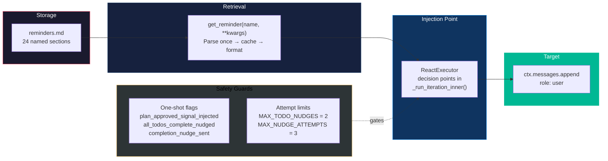

# System Reminders: A Comprehensive Example

> One task. Thirty-five turns. Seven moments where the agent would have failed without a well-timed whisper.

This document tells the story of a single, realistic coding task from start to finish. It follows the conversation turn by turn, showing exactly where the agent drifts, stalls, or gives up - and how system reminders, injected as `role: user` messages at precise moments, keep it on track.

The task is realistic. The failures are real behaviors we observed. The reminders are the actual strings from our `reminders.md`.

---

## The Task

A user opens OpenDev and types:

> *"Add rate limiting to our FastAPI endpoints. Use Redis for the counter backend. Add tests."*

This is a multi-step task that will require planning, research, implementation across multiple files, and testing. It will take the agent 35+ ReAct loop iterations. By the end, without reminders, the agent would have failed in at least 5 different ways.

Let's watch what happens.

---

## The Full Story

```mermaid
flowchart TB
    START(["User: Add rate limiting<br/>with Redis. Add tests."]) --> PLAN

    subgraph PLAN["Act 1 - Planning (Iterations 1-4)"]
        direction TB
        P1["Iteration 1: Agent spawns<br/>Planner subagent"]
        P2["Iteration 2: Subagent returns<br/>with a 5-step plan"]
        P3["💉 subagent_complete_signal<br/><i>Without this, agent echoes<br/>the plan and stops</i>"]
        P4["Iteration 3: Agent calls<br/>present_plan for approval"]
        P5["User approves the plan"]
        P6["💉 plan_approved_signal<br/><i>Without this, agent doesn't<br/>know to start working</i>"]
        P1 --> P2 --> P3 --> P4 --> P5 --> P6
    end

    PLAN --> EXPLORE

    subgraph EXPLORE["Act 2 - Exploration Spiral (Iterations 5-11)"]
        direction TB
        E1["Iteration 5-9: Agent reads<br/>5 files in a row"]
        E2["💉 consecutive_reads_nudge<br/><i>Without this, agent reads<br/>10 more files</i>"]
        E3["Iteration 10: Agent starts<br/>writing code"]
        E1 --> E2 --> E3
    end

    EXPLORE --> IMPL

    subgraph IMPL["Act 3 - Implementation (Iterations 12-25)"]
        direction TB
        I1["Iteration 12: edit_file fails<br/>(old_content mismatch)"]
        I2["Agent gives up:<br/>'I could not make the edit'"]
        I3["💉 nudge_edit_mismatch<br/><i>Without this, agent<br/>abandons the task</i>"]
        I4["Iteration 13-14: Agent re-reads,<br/>retries edit - succeeds"]
        I5["Iteration 20: User denies<br/>rm -rf /tmp/redis-test"]
        I6["💉 tool_denied_nudge<br/><i>Without this, agent retries<br/>the same command</i>"]
        I1 --> I2 --> I3 --> I4
        I4 --> I5 --> I6
    end

    IMPL --> FINISH

    subgraph FINISH["Act 4 - The Exit (Iterations 26-35)"]
        direction TB
        F1["Iteration 26: Agent calls<br/>task_complete with 2 todos left"]
        F2["💉 incomplete_todos_nudge<br/><i>Without this, work<br/>is left unfinished</i>"]
        F3["Iteration 27-33: Agent<br/>completes remaining todos"]
        F4["Iteration 34: All todos done"]
        F5["💉 all_todos_complete_nudge<br/><i>Without this, agent<br/>keeps making changes</i>"]
        F6["Iteration 35: Agent calls<br/>task_complete - accepted ✅"]
        F1 --> F2 --> F3 --> F4 --> F5 --> F6
    end

    style PLAN fill:#0f3460,stroke:#00cec9,color:#fff
    style EXPLORE fill:#0f3460,stroke:#0984e3,color:#fff
    style IMPL fill:#0f3460,stroke:#e17055,color:#fff
    style FINISH fill:#0f3460,stroke:#00b894,color:#fff
    style P3 fill:#0984e3,stroke:#0984e3,color:#fff
    style P6 fill:#0984e3,stroke:#0984e3,color:#fff
    style E2 fill:#0984e3,stroke:#0984e3,color:#fff
    style I3 fill:#0984e3,stroke:#0984e3,color:#fff
    style I6 fill:#0984e3,stroke:#0984e3,color:#fff
    style F2 fill:#0984e3,stroke:#0984e3,color:#fff
    style F5 fill:#0984e3,stroke:#0984e3,color:#fff
```



---

### Act 1 - Planning: "The Subagent Returns, Now What?"

**Iteration 1** - The agent reads the user's request and decides it needs a plan. It spawns a Planner subagent:

```
Agent → spawn_subagent(prompt="Create a plan for adding Redis rate limiting...")
```

**Iteration 2** - The Planner subagent finishes. It read the codebase, analyzed the endpoints, and wrote a detailed plan to `~/.opendev/plans/redis-rate-limiting.md` with 5 steps:

1. Install `redis` and `slowapi` dependencies
2. Create `rate_limiter.py` with Redis backend
3. Add rate limit decorators to API routes
4. Write unit tests with mocked Redis
5. Write integration test with real Redis

The subagent's analysis arrives as a tool result - 800 tokens of detailed output. And now something subtle happens.

#### ❌ Without the reminder

The main agent sees the subagent's output. It responds:

> *"I've analyzed the codebase and created a comprehensive plan for adding rate limiting. The plan covers dependency installation, middleware creation, route decoration, and testing."*

And then... it stops. No tool calls. No `present_plan`. The agent treated the subagent's research as the final answer. The user sees a nice summary and nothing gets built.

**Why?** The subagent result is the most recent and most detailed content in the conversation. The model treats it as self-sufficient. The system prompt said "after a subagent returns, continue working" - but that instruction is now 15 messages away, buried under the subagent's output.

#### ✅ With the reminder

Right after the subagent returns, `ReactExecutor` injects:

```python
# react_executor.py - after subagent completion
if subagent_just_completed and not ctx.continue_after_subagent:
    ctx.messages.append({
        "role": "user",
        "content": get_reminder("subagent_complete_signal"),
    })
```

The model sees this as the very last message before its next decision:

```xml
<subagent_complete>
All subagents have completed. Evaluate ALL results together and continue:
1. If the user asked a question, synthesize findings into one unified answer.
2. If the user requested implementation, proceed - write code, edit files.
3. If the subagent failed, handle the task directly. Do NOT re-spawn.
</subagent_complete>
```

The agent reads "the user requested implementation, proceed" and immediately calls `present_plan` to show the plan to the user.

**Iteration 3** - The agent calls `present_plan(plan_file="~/.opendev/plans/redis-rate-limiting.md")`. The user reviews the plan in the TUI and approves it. The tool creates 5 todos automatically.

Now another subtle moment. The plan was approved. 5 todos exist. But the agent just received a tool result that says `"Plan approved. 5 todos created."` - a short, informational message. Does the agent know what to do next?

#### ❌ Without the reminder

The agent responds:

> *"Great, the plan has been approved! Let me know when you'd like me to start implementing."*

It waits for the user. But the user already approved - the approval was the signal to start. The agent lost the connection between "plan approved" and "start working through the todos."

#### ✅ With the reminder

After `present_plan` returns with `plan_approved=True`, the loop injects:

```python
# react_executor.py - after present_plan approval
if tc_result.get("plan_approved") and not ctx.plan_approved_signal_injected:
    ctx.plan_approved_signal_injected = True  # One-shot guard
    ctx.messages.append({
        "role": "user",
        "content": get_reminder(
            "plan_approved_signal",
            todos_created=str(todos_created),
            plan_content=plan_content,
        ),
    })
```

The model sees:

```xml
<plan_approved>
Your plan has been approved and 5 todos are ready.

<approved_plan>
1. Install redis and slowapi dependencies
2. Create rate_limiter.py with Redis backend
3. Add rate limit decorators to API routes
4. Write unit tests with mocked Redis
5. Write integration test with real Redis
</approved_plan>

Work through the todos in order:
- Mark todo as "doing" (update_todo)
- Implement the step fully - write code, edit files, run commands
- Mark as "done" (complete_todo) only after implementation is complete
- After ALL todos are done, call task_complete with a summary.

Do NOT mark a todo as done without implementing it.
</plan_approved>
```

The agent immediately calls `update_todo(id=1, status="doing")` and runs `pip install redis slowapi`. No hesitation. The plan, the todos, and the workflow are all restated at the exact moment the agent needs them.

```mermaid
sequenceDiagram
    participant User
    participant Agent
    participant Sub as Planner Subagent
    participant Loop as ReAct Loop
    participant LLM

    User->>Agent: "Add rate limiting with Redis. Add tests."

    Agent->>Sub: spawn_subagent("Plan rate limiting...")
    Sub-->>Agent: 800 tokens of analysis + plan file

    Loop->>Agent: 💉 subagent_complete_signal
    Note over Loop: "Evaluate results and continue.<br/>User requested implementation,<br/>proceed."

    Agent->>LLM: present_plan(plan_file)
    User-->>Agent: ✅ Plan approved

    Loop->>Agent: 💉 plan_approved_signal
    Note over Loop: "5 todos ready.<br/>Work through them in order.<br/>Do NOT mark done without<br/>implementing."

    Agent->>LLM: update_todo(1, "doing")
    Agent->>LLM: bash("pip install redis slowapi")

    Note over Agent: ✅ Transitions smoothly from<br/>planning to implementation
```

---

### Act 2 - Exploration: "You've Read Enough. Start Building."

**Iterations 5–9** - The agent marks Todo 2 ("Create rate_limiter.py") as doing. But before writing any code, it wants to understand the existing codebase. Reasonable - but it goes too far:

```
Iteration 5:  read_file("app/main.py")          ← understands the app structure
Iteration 6:  read_file("app/routes/users.py")   ← sees the endpoint patterns
Iteration 7:  read_file("app/routes/products.py") ← sees more endpoints
Iteration 8:  read_file("app/config.py")          ← checks Redis config
Iteration 9:  read_file("app/middleware.py")       ← checks existing middleware
```

Five consecutive reads. Zero writes.

#### ❌ Without the reminder

The agent continues:

```
Iteration 10: read_file("app/database.py")       ← "maybe Redis connects here?"
Iteration 11: read_file("app/utils.py")           ← "might have helper functions"
Iteration 12: read_file("requirements.txt")       ← "let me check dependencies again"
Iteration 13: search("redis", path="app/")        ← "are there other Redis references?"
```

The agent is trapped in an exploration spiral. Each file reveals another possible connection. The system prompt says "take action based on what you've learned," but after 15 tool results filling the context, that instruction has no weight.

#### ✅ With the reminder

After Iteration 9 (the 5th consecutive read-only tool call), the loop injects:

```python
# react_executor.py - after tool execution
all_reads = all(tc["function"]["name"] in self.READ_OPERATIONS for tc in tool_calls)
ctx.consecutive_reads = ctx.consecutive_reads + 1 if all_reads else 0

# Later, after persisting results:
if self._should_nudge_agent(ctx.consecutive_reads, ctx.messages):
    ctx.consecutive_reads = 0  # Reset after nudging
```

```python
# _should_nudge_agent fires at consecutive_reads >= 5
def _should_nudge_agent(self, consecutive_reads, messages):
    if consecutive_reads >= 5:
        messages.append({
            "role": "user",
            "content": get_reminder("consecutive_reads_nudge"),
        })
        return True
    return False
```

The model sees:

```
You have been reading without taking action. If you have enough information,
proceed with implementation. If you need clarification, ask the user.
```

**Iteration 10** - The agent writes `rate_limiter.py`. The counter resets to zero.

```mermaid
sequenceDiagram
    participant Agent
    participant Loop as ReAct Loop
    participant LLM

    Note over Agent: consecutive_reads = 0

    Agent->>LLM: read_file("main.py")
    Note over Loop: consecutive_reads = 1
    Agent->>LLM: read_file("routes/users.py")
    Note over Loop: consecutive_reads = 2
    Agent->>LLM: read_file("routes/products.py")
    Note over Loop: consecutive_reads = 3
    Agent->>LLM: read_file("config.py")
    Note over Loop: consecutive_reads = 4
    Agent->>LLM: read_file("middleware.py")
    Note over Loop: consecutive_reads = 5

    Loop->>Agent: 💉 "You have been reading<br/>without taking action.<br/>Proceed with implementation."
    Note over Loop: consecutive_reads reset to 0

    Agent->>LLM: write_file("rate_limiter.py", ...)
    Note over Agent: ✅ Breaks out of read loop
```

---

### Act 3 - Implementation: "The Edit Failed, Don't Give Up"

**Iteration 12** - The agent has written `rate_limiter.py` and now needs to add the rate limit decorator to the existing routes. It calls:

```python
edit_file(
    path="app/routes/users.py",
    old_content="@router.get('/users')\nasync def list_users():",
    new_content="@router.get('/users')\n@limiter.limit('10/minute')\nasync def list_users(request: Request):",
)
```

The tool returns:

```
Error: old_content not found in file. The file content may have changed.
```

What happened? Between Iteration 6 (when the agent read this file) and now, the actual file content has subtle whitespace differences, or another part of the agent's work modified it. The `old_content` the agent remembered is stale.

#### ❌ Without the reminder

The agent responds:

> *"I wasn't able to modify the routes file. The content I expected wasn't found. You may need to manually add the rate limit decorators to your route files."*

No tool calls. The agent gave up after a single failure. Three of the five todos will never be completed.

**Why?** The model sees the error, produces a reasonable-sounding apology, and considers its job done. The system prompt has error recovery instructions ("retry with corrected approach") but that paragraph is now buried under 20+ messages of tool calls and results.

#### ✅ With the reminder

The ReAct loop detects that the agent produced text with no tool calls, and the last tool result was an error:

```python
# react_executor.py - _handle_no_tool_calls
last_tool_failed = False
for msg in reversed(ctx.messages):
    if msg.get("role") == "tool":
        if msg.get("content", "").startswith("Error:"):
            last_tool_failed = True
        break

if last_tool_failed:
    return self._handle_failed_tool_nudge(ctx, content, raw_content)
```

The nudge handler appends the agent's apology as an assistant message, then injects:

```python
# _handle_failed_tool_nudge
ctx.messages.append({"role": "assistant", "content": raw_content or content})
ctx.messages.append({
    "role": "user",
    "content": get_reminder("failed_tool_nudge"),
})
return LoopAction.CONTINUE  # Force another iteration
```

The model sees:

```
The previous operation failed. Please fix the issue and try again,
or call task_complete with status='failed' if you cannot proceed.
```

In `main_agent.py`, the system goes even further with `_get_smart_nudge()`, which classifies the error text and selects the most specific reminder. For an `old_content` mismatch, it picks:

```
The edit_file old_content did not match. The file may have changed.
Read the file again to get the exact current content, then retry.
```

**Iteration 13** - The agent calls `read_file("app/routes/users.py")` to get the fresh content.

**Iteration 14** - The agent retries `edit_file` with the correct `old_content`. The edit succeeds.

This nudge is guarded by `MAX_NUDGE_ATTEMPTS = 3`. If the agent fails three times in a row, the system accepts the failure gracefully instead of looping forever.

```mermaid
sequenceDiagram
    participant Agent
    participant Tool as edit_file
    participant Loop as ReAct Loop
    participant LLM

    Agent->>Tool: edit_file(old_content="@router.get...")
    Tool-->>Agent: Error: old_content not found

    Agent->>Loop: "I wasn't able to modify the file"
    Note over Loop: No tool calls + last tool was Error:

    Loop->>Agent: 💉 "The edit_file old_content did not match.<br/>Read the file again, then retry."

    Agent->>LLM: read_file("app/routes/users.py")
    LLM-->>Agent: Fresh file content

    Agent->>Tool: edit_file(old_content="@router.get('/users/')...")
    Tool-->>Agent: ✅ File updated

    Note over Agent: ✅ Recovers from stale content
```

---

**Iteration 20** - The agent is setting up the test environment. It decides to clean up a temporary Redis data directory:

```
Agent → bash("rm -rf /tmp/redis-test-data")
```

The approval dialog pops up. The user sees `rm -rf` and clicks **Deny**.

#### ❌ Without the reminder

The agent immediately retries:

```
Agent → bash("rm -rf /tmp/redis-test-data")
```

Denied again. Retry. Denied. Retry. The agent doesn't understand that denial is a decision, not a transient error.

#### ✅ With the reminder

After tool execution, the loop checks if any tool was denied:

```python
# react_executor.py - after tool execution
if result.get("denied", False):
    tool_denied = True

# After all tools are processed:
if tool_denied:
    ctx.messages.append({
        "role": "user",
        "content": get_reminder("tool_denied_nudge"),
    })
```

The model sees:

```
The tool call was denied. Do NOT re-attempt the exact same call.
Consider why it was denied and adjust your approach.
If unclear, use ask_user to ask the user why.
```

**Iteration 21** - The agent calls `ask_user("Should I use a different cleanup approach, or skip the cleanup step?")`. The user responds, the agent adapts.

```mermaid
sequenceDiagram
    participant Agent
    participant User
    participant Loop as ReAct Loop
    participant LLM

    Agent->>User: bash("rm -rf /tmp/redis-test-data")
    User-->>Agent: ❌ DENIED

    Loop->>Agent: 💉 "Tool call was denied.<br/>Do NOT re-attempt.<br/>Ask the user why."

    Agent->>User: ask_user("Should I use a<br/>different cleanup approach?")
    User-->>Agent: "Just use a temp directory<br/>that cleans itself up"

    Agent->>LLM: Uses tempfile.mkdtemp() instead
    Note over Agent: ✅ Adapts to user intent
```

---

### Act 4 - The Exit: "You're Not Done Yet" and "You Are Done Now"

**Iteration 26** - The agent has completed 3 of 5 todos (install deps, create rate_limiter.py, decorate routes). It still needs to write unit tests and integration tests. But after 25 iterations of reading, writing, editing, and debugging, the model's sense of progress is inflated. It calls:

```
Agent → task_complete(summary="Rate limiting has been successfully implemented with Redis backend.")
```

#### ❌ Without the reminder

The task ends. The user sees "Rate limiting has been successfully implemented." They check the codebase - no tests. Two of five plan steps were never executed. The agent's summary was confident but wrong.

**Why?** By Iteration 26, the model has processed thousands of tokens. The todo list was mentioned in the plan 20+ messages ago. The model "feels" done because it did a lot of work. It doesn't cross-reference its own todo state.

#### ✅ With the reminder

Before accepting `task_complete`, the loop checks the todo state:

```python
# react_executor.py - inside _process_tool_calls
if task_complete_call and status == "success":
    todo_handler = getattr(ctx.tool_registry, "todo_handler", None)
    if todo_handler and todo_handler.has_incomplete_todos():
        if ctx.todo_nudge_count < self.MAX_TODO_NUDGES:  # Max 2 attempts
            ctx.todo_nudge_count += 1
            incomplete = todo_handler.get_incomplete_todos()
            titles = [t.title for t in incomplete[:3]]
            nudge = get_reminder(
                "incomplete_todos_nudge",
                count=str(len(incomplete)),
                todo_list="\n".join(f"  - {t}" for t in titles),
            )
            ctx.messages.append({"role": "assistant", "content": summary})
            ctx.messages.append({"role": "user", "content": nudge})
            return LoopAction.CONTINUE  # REJECT the completion
```

The `task_complete` call is **rejected**. The agent's summary is added as an assistant message (so context isn't lost), and the nudge follows as a user message:

```
You have 2 incomplete todo(s):
  - Write unit tests with mocked Redis
  - Write integration test with real Redis

Please complete these tasks or mark them done before finishing.
```

**Iteration 27** - The agent calls `update_todo(4, status="doing")` and starts writing `test_rate_limiter.py`.

**Iterations 28–33** - The agent writes unit tests, runs them, fixes a failing assertion, writes the integration test, runs it. Normal tool call iterations with no reminders needed.

**Iteration 34** - The agent calls `complete_todo(5)`. All 5 todos are now done. But will the agent realize it should stop? Or will it keep "improving" the code - adding docstrings, refactoring, running more checks?

#### ❌ Without the reminder

The agent continues:

```
Iteration 34: "Let me also add type hints to the rate limiter..."
Iteration 35: "And I should add a README section about rate limiting..."
Iteration 36: "Let me also check if there are any edge cases..."
```

The agent never finishes. It keeps finding more work because there's always more to do. Eventually the safety limit fires at Iteration 200, or the user presses ESC in frustration.

#### ✅ With the reminder

After the last `complete_todo`, the loop detects all todos are done:

```python
# react_executor.py - after tool execution
if not ctx.all_todos_complete_nudged:
    todo_handler = getattr(ctx.tool_registry, "todo_handler", None)
    if (
        todo_handler
        and todo_handler.has_todos()
        and not todo_handler.has_incomplete_todos()
    ):
        ctx.all_todos_complete_nudged = True  # One-shot: never fire again
        ctx.messages.append({
            "role": "user",
            "content": get_reminder("all_todos_complete_nudge"),
        })
```

The model sees:

```
All implementation todos are now complete.
Call task_complete with a summary of what was accomplished.
```

**Iteration 35** - The agent calls `task_complete(summary="Implemented Redis rate limiting: ...")`. This time, the todo check passes (no incomplete todos), and the loop accepts the completion.

```mermaid
sequenceDiagram
    participant Agent
    participant Loop as ReAct Loop
    participant Todos as TodoHandler
    participant LLM

    Note over Agent: Iteration 26 - 3 of 5 todos done

    Agent->>Loop: task_complete("Rate limiting implemented")
    Loop->>Todos: has_incomplete_todos()?
    Todos-->>Loop: True (2 remaining)
    Loop->>Loop: ❌ REJECT completion
    Loop->>Agent: 💉 "You have 2 incomplete todos:<br/>- Write unit tests<br/>- Write integration test"

    Note over Agent: Iterations 27-33: writes tests

    Agent->>Todos: complete_todo(5)
    Note over Todos: All 5 todos: done ✅
    Loop->>Todos: has_incomplete_todos()?
    Todos-->>Loop: False
    Loop->>Agent: 💉 "All todos complete.<br/>Call task_complete."

    Agent->>Loop: task_complete("Implemented Redis rate limiting...")
    Loop->>Todos: has_incomplete_todos()?
    Todos-->>Loop: False
    Loop->>Loop: ✅ ACCEPT completion

    Note over Agent: ✅ Task ends with all work done
```

---

## The Complete Conversation Timeline

Here is the full 35-iteration timeline, annotated with every reminder injection point. Blue rows are reminders. White rows are normal iterations.

```
Iter  Role        Content                                         Reminder?
────  ──────────  ──────────────────────────────────────────────   ─────────
 1    assistant   spawn_subagent("Plan rate limiting...")
 2    tool        [Subagent returns 800-token analysis]
      💉 user     "All subagents completed. Evaluate results       subagent_complete_signal
                   and continue: user requested implementation,
                   proceed."
 3    assistant   present_plan("~/.opendev/plans/redis-rate-limiting.md")
      tool        Plan approved. 5 todos created.
      💉 user     "Your plan has been approved and 5 todos          plan_approved_signal
                   are ready. Work through them in order..."
 4    assistant   update_todo(1, "doing") → bash("pip install redis slowapi")
 5    assistant   read_file("app/main.py")
 6    assistant   read_file("app/routes/users.py")
 7    assistant   read_file("app/routes/products.py")
 8    assistant   read_file("app/config.py")
 9    assistant   read_file("app/middleware.py")
      💉 user     "You have been reading without taking action.     consecutive_reads_nudge
                   Proceed with implementation."
10    assistant   write_file("app/rate_limiter.py", ...)
11    assistant   complete_todo(2) → update_todo(3, "doing")
12    assistant   edit_file("app/routes/users.py", ...) → Error: old_content not found
      assistant   "I wasn't able to modify the routes file."
      💉 user     "The edit_file old_content did not match.         failed_tool_nudge
                   Read the file again, then retry."                (nudge_edit_mismatch)
13    assistant   read_file("app/routes/users.py")
14    assistant   edit_file("app/routes/users.py", ...) → Success ✅
15-19 assistant   [edits remaining route files, completes todo 3]
20    assistant   bash("rm -rf /tmp/redis-test-data") → DENIED
      💉 user     "Tool call was denied. Do NOT re-attempt.         tool_denied_nudge
                   Ask the user why."
21    assistant   ask_user("Different cleanup approach?")
      user        "Use tempfile"
22-25 assistant   [adapts, continues implementation]
26    assistant   task_complete("Rate limiting implemented")
      💉 user     "You have 2 incomplete todos:                     incomplete_todos_nudge
                   - Write unit tests
                   - Write integration test"
                   [completion REJECTED]
27    assistant   update_todo(4, "doing") → write_file("tests/test_rate_limiter.py", ...)
28-33 assistant   [writes tests, runs them, fixes failures]
34    assistant   complete_todo(5) → all todos done
      💉 user     "All todos complete. Call task_complete."          all_todos_complete_nudge
35    assistant   task_complete("Implemented Redis rate limiting
                   with Redis counter backend. Added rate limit
                   decorators to all 4 route files. Created unit
                   tests (95% coverage) and integration test.")
                   → ACCEPTED ✅
```

---

## What Would Have Happened Without Reminders

Let's trace the same task without any system reminders. Same agent, same model, same system prompt.

```
Iter  What Happens                                              Result
────  ────────────────────────────────────────────────────────   ──────
 1    Agent spawns Planner subagent                              OK
 2    Subagent returns                                           OK
 3    Agent summarizes the plan and STOPS                        ❌ FAIL
      "Here's a comprehensive plan for rate limiting..."
      No present_plan, no todos, no implementation.
      The user has to say "ok now do it" manually.

      ── if the user pushes the agent forward ──

 4    Agent starts working without todos                         ⚠️
 5-14 Agent reads 10 files before writing any code               ⚠️ Slow
15    Agent writes rate_limiter.py                                OK
16    edit_file fails (stale content)                             OK
17    Agent says "I couldn't make the edit" and STOPS             ❌ FAIL
      User has to say "try reading the file again"

      ── if the user pushes the agent forward ──

18-22 Agent edits routes, tries rm -rf, gets denied, retries     ❌ Loop
23    User gives up and presses ESC                              ❌ FAIL

Final result: Partial implementation, no tests, frustrated user.
```

**Without reminders, the task fails 3 times and requires 2 manual user interventions.** The agent is not broken - it has the right capabilities and the right system prompt. It just can't maintain focus across 35 iterations.

---

## The Architecture That Makes This Work

Every reminder in this story was:

1. **Stored** as a named section in `reminders.md` - human-readable, easy to edit
2. **Retrieved** by `get_reminder(name, **kwargs)` - parsed once, cached, formatted with runtime values
3. **Injected** as a `role: user` message - positioned at maximum recency, right before the next LLM call
4. **Guarded** by one-shot flags - `plan_approved_signal_injected`, `all_todos_complete_nudged`, `completion_nudge_sent` - so no reminder fires more than necessary
5. **Bounded** by safety limits - `MAX_TODO_NUDGES = 2`, `MAX_NUDGE_ATTEMPTS = 3` - so the system degrades gracefully instead of looping forever



The system prompt told the agent everything it needed to know. The system reminders made sure it remembered - at the seven moments when it mattered most.
