# System Reminders: Injection Points Architecture

A single-diagram reference showing every system reminder, where it lives, how it flows, and exactly where it gets injected into the conversation.

---

## The Complete Picture

```mermaid
flowchart TB
    %% ================================================================
    %% STORAGE LAYER
    %% ================================================================
    subgraph STORE["Storage Layer"]
        direction TB
        RMD["reminders.md<br/>20+ named sections<br/>--- section_name ---"]
        TXT["Standalone .txt files<br/>docker_preamble.txt<br/>generators/custom_agent_default.txt<br/>docker/docker_context.txt"]
    end

    %% ================================================================
    %% RETRIEVAL LAYER
    %% ================================================================
    subgraph RETRIEVAL["Retrieval Layer - get_reminder()"]
        direction TB
        PARSE["_parse_sections()<br/>Parse --- delimiters<br/>into {name: content} dict"]
        CACHE["Module-level cache<br/>_sections: Dict[str, str]<br/>Parsed once per process"]
        FALLBACK["File fallback<br/>templates/{name}.txt"]
        FORMAT["str.format(**kwargs)<br/>e.g. {count}, {plan_content},<br/>{thinking_trace}, {exit_code}"]

        PARSE --> CACHE
        CACHE --> FORMAT
        FALLBACK -.->|"if not in<br/>_sections"| FORMAT
    end

    RMD --> PARSE
    TXT --> FALLBACK

    %% ================================================================
    %% REMINDER CATALOG - grouped by purpose
    %% ================================================================
    subgraph CATALOG["Reminder Catalog (24 named reminders)"]
        direction TB

        subgraph PHASE_CTRL["Phase Control Signals"]
            direction LR
            thinking_analysis["thinking_analysis_prompt<br/><i>Trigger thinking LLM call</i>"]
            thinking_trace["thinking_trace_reminder<br/><i>Inject trace into action phase</i><br/>args: {thinking_trace}"]
            thinking_on["thinking_on_instruction<br/><i>Force think tool first</i>"]
            thinking_off["thinking_off_instruction<br/><i>Brief reasoning or act directly</i>"]
        end

        subgraph LIFECYCLE["Task Lifecycle Signals"]
            direction LR
            subagent_complete["subagent_complete_signal<br/><i>Synthesize results, keep going</i>"]
            plan_approved["plan_approved_signal<br/><i>Plan + todos ready, start work</i><br/>args: {todos_created}, {plan_content}"]
            plan_request["plan_subagent_request<br/><i>Spawn Planner subagent</i>"]
            plan_file_ref["plan_file_reference<br/><i>Resume existing plan file</i><br/>args: {plan_file_path}"]
            init_complete["init_complete_signal<br/><i>OPENDEV.md created</i><br/>args: {path}"]
        end

        subgraph TODO_NUDGES["Todo Enforcement Nudges"]
            direction LR
            incomplete_todos["incomplete_todos_nudge<br/><i>Block premature completion</i><br/>args: {count}, {todo_list}"]
            all_todos_done["all_todos_complete_nudge<br/><i>Signal: call task_complete</i>"]
        end

        subgraph ERROR_NUDGES["Error Recovery Nudges"]
            direction LR
            failed_tool["failed_tool_nudge<br/><i>Fix and retry</i>"]
            nudge_perm["nudge_permission_error"]
            nudge_fnf["nudge_file_not_found"]
            nudge_syntax["nudge_syntax_error"]
            nudge_rate["nudge_rate_limit"]
            nudge_timeout["nudge_timeout"]
            nudge_edit["nudge_edit_mismatch"]
            docker_fail["docker_command_failed_nudge<br/>args: {exit_code}"]
        end

        subgraph BEHAVIOR_NUDGES["Behavioral Nudges"]
            direction LR
            consec_reads["consecutive_reads_nudge<br/><i>Stop exploring, take action</i>"]
            tool_denied["tool_denied_nudge<br/><i>Don't re-attempt same call</i>"]
            completion_sum["completion_summary_nudge<br/><i>Request brief outcome summary</i>"]
            safety_limit["safety_limit_summary<br/><i>Max iterations reached</i>"]
            file_exists["file_exists_warning<br/><i>Don't re-read @ injected file</i>"]
        end

        subgraph JSON_RETRY["JSON Retry Prompts"]
            direction LR
            json_simple["json_retry_simple<br/><i>Reflector: retry JSON parse</i>"]
            json_fields["json_retry_with_fields<br/><i>Curator: retry JSON parse</i>"]
        end
    end

    FORMAT --> CATALOG

    %% ================================================================
    %% INJECTION SITES - the callers
    %% ================================================================
    subgraph SITES["Injection Sites (7 source files)"]
        direction TB

        subgraph REACT["ReactExecutor._run_iteration_inner()<br/>repl/react_executor.py"]
            direction TB
            RE_THINK["Pre-action phase"]
            RE_SUBAGENT["Post-subagent"]
            RE_NO_TC["No tool calls path"]
            RE_TC["Tool calls path"]
            RE_READ["Read counter"]
        end

        subgraph QP["QueryProcessor<br/>repl/query_processor.py"]
            QP_PLAN["Pre-execute injection"]
        end

        subgraph RUNNER["TUI Runner<br/>ui_textual/runner.py"]
            RUN_RESUME["Session resume"]
        end

        subgraph AGENT["MainAgent<br/>core/agents/main_agent.py"]
            AG_NUDGE["Smart error nudge"]
            AG_TODO["Todo gate check"]
        end

        subgraph ENHANCER["QueryEnhancer<br/>repl/query_enhancer.py"]
            QE_THINK["Thinking mode prefix"]
        end

        subgraph INJECTOR["FileContentInjector<br/>repl/file_content_injector.py"]
            FCI_WARN["@ reference injection"]
        end

        subgraph DOCKER["DockerToolHandler<br/>core/docker/tool_handler.py"]
            DK_FAIL["Container cmd failure"]
        end
    end

    %% ================================================================
    %% WIRING: Reminders → Injection Sites
    %% ================================================================

    %% Phase control
    thinking_analysis -->|"thinking LLM call"| RE_THINK
    thinking_trace -->|"user msg before<br/>action phase"| RE_THINK
    thinking_on -->|"appended to<br/>enhanced query"| QE_THINK
    thinking_off -->|"appended to<br/>enhanced query"| QE_THINK

    %% Lifecycle
    subagent_complete -->|"user msg after<br/>all subagents return"| RE_SUBAGENT
    plan_approved -->|"user msg after<br/>present_plan approved"| RE_TC
    plan_request -->|"&lt;system-reminder&gt;<br/>wrapped user msg"| QP_PLAN
    plan_file_ref -->|"&lt;system-reminder&gt;<br/>wrapped user msg"| RUN_RESUME
    init_complete -->|"user msg after<br/>/init command"| REACT

    %% Todo
    incomplete_todos -->|"user msg blocking<br/>completion (max 2×)"| RE_NO_TC
    incomplete_todos -->|"user msg blocking<br/>task_complete"| RE_TC
    incomplete_todos -->|"returned by<br/>_check_todo_completion()"| AG_TODO
    all_todos_done -->|"user msg (once)"| RE_TC

    %% Errors
    failed_tool -->|"user msg after<br/>tool failure"| RE_NO_TC
    failed_tool -->|"fallback nudge"| AG_NUDGE
    nudge_perm -->|"nudge_{type}"| AG_NUDGE
    nudge_fnf -->|"nudge_{type}"| AG_NUDGE
    nudge_syntax -->|"nudge_{type}"| AG_NUDGE
    nudge_rate -->|"nudge_{type}"| AG_NUDGE
    nudge_timeout -->|"nudge_{type}"| AG_NUDGE
    nudge_edit -->|"nudge_{type}"| AG_NUDGE
    docker_fail -->|"user msg after<br/>nonzero exit"| DK_FAIL

    %% Behavioral
    consec_reads -->|"user msg after<br/>5+ reads"| RE_READ
    tool_denied -->|"user msg after<br/>approval denial"| RE_TC
    completion_sum -->|"user msg for<br/>empty completion"| RE_NO_TC
    safety_limit -->|"user msg at<br/>iteration cap"| REACT
    file_exists -->|"inline warning<br/>in file content"| FCI_WARN

    %% JSON retry
    json_simple -->|"retry prompt<br/>in Reflector"| AGENT
    json_fields -->|"retry prompt<br/>in Curator"| AGENT

    %% ================================================================
    %% DESTINATION
    %% ================================================================
    SITES -->|"All injected as<br/>role: user messages<br/>into ctx.messages"| CONV["Conversation<br/>(ValidatedMessageList)"]
    CONV -->|"Included in next<br/>LLM API call"| LLM["LLM"]

    %% ================================================================
    %% STYLES
    %% ================================================================
    style STORE fill:#1a1a2e,stroke:#e94560,color:#fff
    style RETRIEVAL fill:#16213e,stroke:#0f3460,color:#fff
    style CATALOG fill:#0f3460,stroke:#533483,color:#fff
    style PHASE_CTRL fill:#2d3436,stroke:#00b894,color:#fff
    style LIFECYCLE fill:#2d3436,stroke:#00cec9,color:#fff
    style TODO_NUDGES fill:#2d3436,stroke:#fdcb6e,color:#000
    style ERROR_NUDGES fill:#2d3436,stroke:#e17055,color:#fff
    style BEHAVIOR_NUDGES fill:#2d3436,stroke:#0984e3,color:#fff
    style JSON_RETRY fill:#2d3436,stroke:#6c5ce7,color:#fff
    style SITES fill:#2d3436,stroke:#a29bfe,color:#fff
    style REACT fill:#2d3436,stroke:#fd79a8,color:#fff
    style CONV fill:#00b894,stroke:#00b894,color:#fff
    style LLM fill:#e94560,stroke:#e94560,color:#fff
```



---

## Reading the Diagram

**Top to bottom, four layers:**

1. **Storage** - All reminder text lives in two places: `reminders.md` (20+ named sections delimited by `--- name ---` markers) and standalone `.txt` files for longer templates (Docker preambles, custom agent defaults).

2. **Retrieval** - `get_reminder(name, **kwargs)` parses `reminders.md` once into a module-level dict cache, looks up the section by name (falls back to `.txt` file), then runs `str.format(**kwargs)` for placeholder substitution.

3. **Catalog** - The 24 named reminders, grouped into 6 categories by purpose:
   - **Phase Control** (4) - Manage thinking/action phase transitions
   - **Task Lifecycle** (5) - Plan approval, subagent completion, session resume
   - **Todo Enforcement** (2) - Block premature completion, signal when all done
   - **Error Recovery** (8) - Generic + 6 type-specific nudges + Docker failure
   - **Behavioral** (5) - Read loops, denied tools, empty completions, safety limits, file warnings
   - **JSON Retry** (2) - Parse retries for ACE Reflector/Curator

4. **Injection Sites** - The 7 source files that call `get_reminder()` and append the result to `ctx.messages` as `role: user`:

| Source File | Reminders Injected | Trigger |
|---|---|---|
| `react_executor.py` | thinking_trace, subagent_complete, failed_tool, incomplete_todos, completion_summary, plan_approved, all_todos_complete, tool_denied, consecutive_reads | ReAct loop decision points |
| `query_processor.py` | plan_subagent_request | User toggles plan mode (Shift+Tab) |
| `runner.py` | plan_file_reference | Session resume with existing plan |
| `main_agent.py` | failed_tool, nudge_*, incomplete_todos | Smart error classification, todo gate |
| `query_enhancer.py` | thinking_on/off_instruction | Appended to enhanced query |
| `file_content_injector.py` | file_exists_warning | `@file` reference in user input |
| `docker/tool_handler.py` | docker_command_failed_nudge | Container command exits nonzero |

**Two reminders use `<system-reminder>` XML wrapping** - `plan_subagent_request` and `plan_file_reference` - to distinguish them from user-authored content. All others are injected as plain `role: user` messages.

---

## Injection Timing Within the ReAct Loop

The reminders injected by `ReactExecutor` follow a strict ordering within each iteration of `_run_iteration_inner()`:

```
Iteration N
│
├─ 1. _maybe_compact()              ← no reminders, but affects message count
├─ 2. _check_interrupt("pre-thinking")
│
├─ 3. THINKING PHASE (if visible)
│     ├─ thinking_analysis_prompt   ← appended to thinking LLM call messages
│     ├─ [critique & refine]
│     └─ thinking_trace_reminder    ← injected into ctx.messages as user msg
│
├─ 4. subagent_complete_signal      ← if last tool was subagent completion
├─ 5. _drain_injected_messages()    ← user messages from UI thread
├─ 6. _check_interrupt("pre-action")
│
├─ 7. ACTION PHASE (LLM call with tools)
│
├─ 8. RESPONSE DISPATCH
│     ├─ NO TOOL CALLS:
│     │   ├─ failed_tool_nudge      ← if last tool failed (max 3 retries)
│     │   ├─ incomplete_todos_nudge ← if incomplete todos (max 2 nudges)
│     │   └─ completion_summary_nudge ← if empty content (once)
│     │
│     └─ HAS TOOL CALLS:
│         ├─ [execute tools]
│         ├─ plan_approved_signal   ← if present_plan was approved (once)
│         ├─ all_todos_complete_nudge ← if all todos done (once)
│         ├─ tool_denied_nudge      ← if tool was denied by user
│         └─ consecutive_reads_nudge ← if 5+ consecutive read-only tools
│
└─ 9. _persist_step()               ← save to session
```

Each `← once` annotation means the reminder is guarded by a flag in `IterationContext` to prevent repeated injection across iterations.
