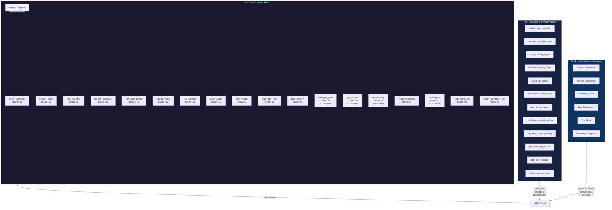
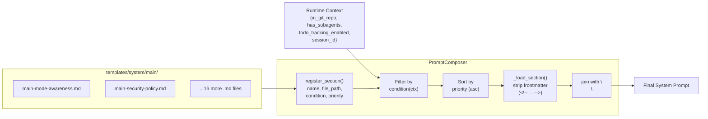
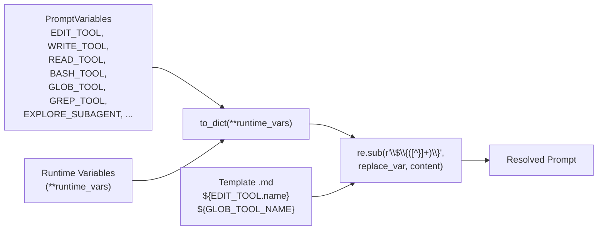
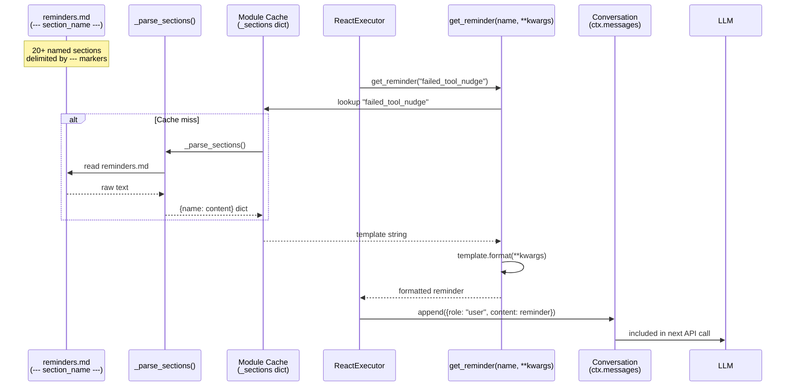
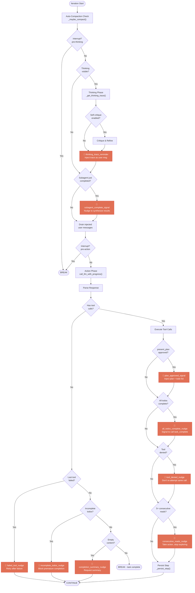
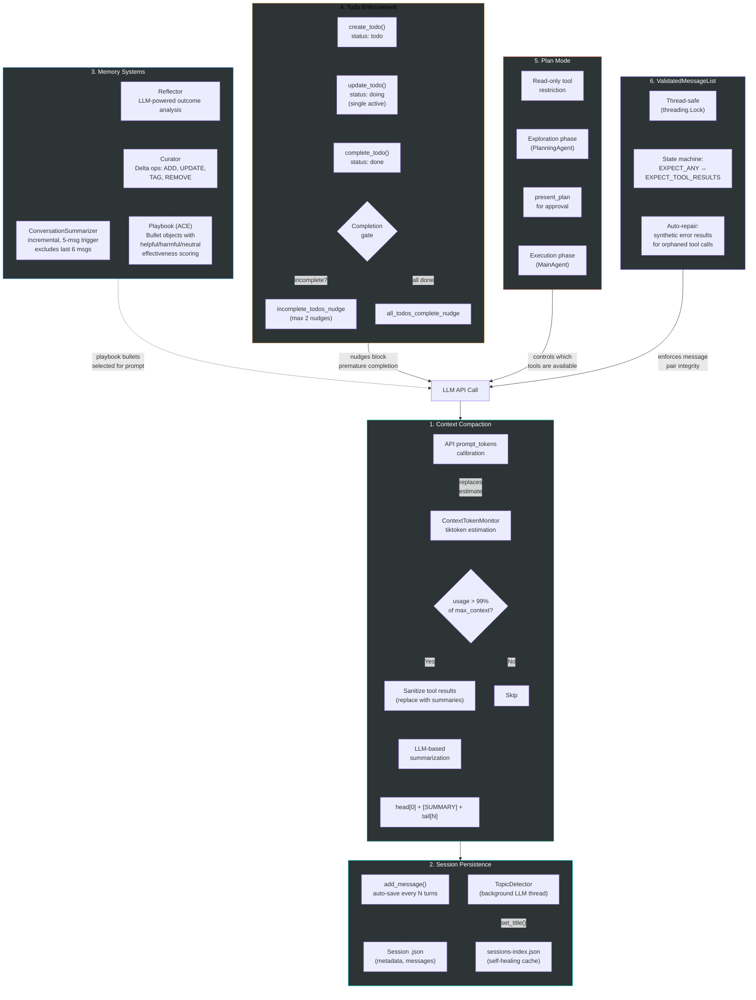
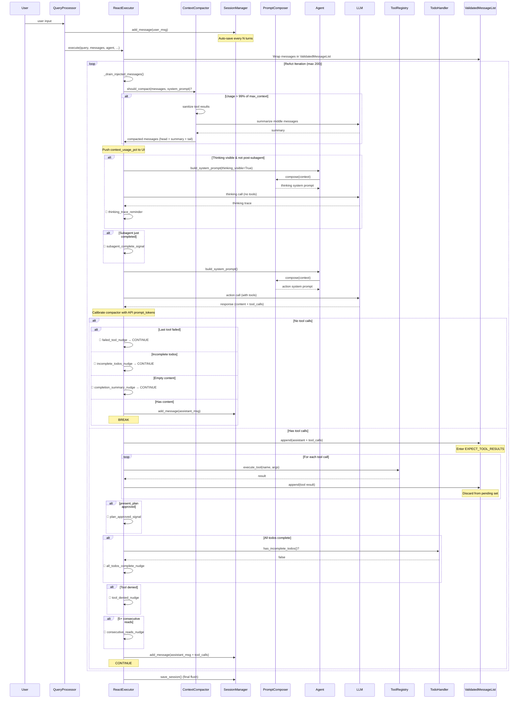
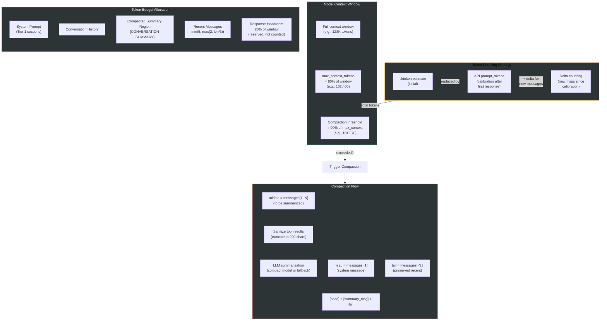

# System Reminders & Long-Horizon Architecture

A diagram-heavy architecture reference covering how OpenDev maintains task quality across long conversations through a 3-tier context architecture: static system prompts, dynamic system reminders, and long-horizon persistence mechanisms.

---

## 1. High-Level Architecture

OpenDev's context architecture is organized into three tiers, each operating at a different timescale and serving a distinct role in maintaining agent coherence.

**Tier 1** is assembled once per turn from 18 modular markdown sections. **Tier 2** injects targeted nudges as `role: user` messages at specific decision points within the ReAct loop. **Tier 3** operates across turns and sessions to preserve context beyond the model's context window.

---

## 2. Prompt Composition Pipeline

The system prompt is assembled at runtime by `PromptComposer` from individual markdown template files. Each section has a priority (lower = earlier in the final prompt) and an optional condition predicate.

### Priority Bands

```mermaid
graph LR
    subgraph Band1["10-30: Core Identity"]
        B1A["12 mode_awareness"]
        B1B["15 security_policy"]
        B1C["20 tone_and_style"]
        B1D["25 no_time_estimates"]
    end
    subgraph Band2["40-50: Tool Guidance"]
        B2A["40 interaction_pattern"]
        B2B["45 available_tools"]
        B2C["50 tool_selection"]
    end
    subgraph Band3["55-65: Code & Safety"]
        B3A["55 code_quality"]
        B3B["56 action_safety"]
        B3C["58 read_before_edit"]
        B3D["60 error_recovery"]
        B3E["65 subagent_guide ⚡"]
    end
    subgraph Band4["70-95: Conditional & Context"]
        B4A["70 git_workflow ⚡"]
        B4B["75 task_tracking ⚡"]
        B4C["85 output_awareness"]
        B4D["87 scratchpad ⚡"]
        B4E["90 code_references"]
        B4F["95 system_reminders_note"]
    end

    Band1 --> Band2 --> Band3 --> Band4

    style Band1 fill:#2d3436,stroke:#00b894,color:#fff
    style Band2 fill:#2d3436,stroke:#00cec9,color:#fff
    style Band3 fill:#2d3436,stroke:#0984e3,color:#fff
    style Band4 fill:#2d3436,stroke:#6c5ce7,color:#fff
```

Sections marked with ⚡ are conditional - they are only included when their predicate evaluates to `True` against the runtime context dict.

### Variable Substitution Flow

Template files use `${VAR}` placeholders resolved by `PromptRenderer` at render time.

---

## 3. System Reminder Lifecycle

System reminders are short, targeted messages injected into the conversation as `role: user` messages. They are stored in `reminders.md` as named sections and retrieved at runtime by `get_reminder()`.

The module-level `_sections` cache ensures `reminders.md` is parsed only once per process lifetime. The `get_reminder()` function also supports fallback to standalone `.txt` template files for longer prompts.

---

## 4. Injection Point Map

Every system reminder injection point within the ReAct loop is annotated below. The loop runs in `ReactExecutor._run_iteration_inner()` (react_executor.py).

Two additional reminders are injected outside the core loop:

- **plan_subagent_request** - injected by `QueryProcessor` when the user toggles plan mode via `/mode` or `Shift+Tab`
- **plan_file_reference** - injected on session resume when a plan file exists from a prior session

---

## 5. Long-Horizon Quality Architecture

Six mechanisms work together to maintain task quality across long conversations that may span hundreds of turns or multiple sessions.

---

## 6. Conversation Lifecycle

A complete end-to-end sequence showing how a single turn flows through all three tiers, with annotations showing where each mechanism activates.

---

## 7. Context Budget Architecture

The context budget determines when compaction fires and how much of the conversation is preserved.

After compaction, the API calibration state is invalidated (`_api_prompt_tokens = 0`) so the next turn falls back to tiktoken estimation until a new API response provides fresh calibration.

---

## 8. Key Files Reference

| Mechanism | Source File | Key Lines/Classes |
|---|---|---|
| **PromptComposer** | `core/agents/prompts/composition.py` | `PromptComposer`, `create_default_composer()` (18 sections registered) |
| **PromptRenderer** | `core/agents/prompts/renderer.py` | `PromptRenderer.render()` - `${VAR}` substitution |
| **PromptVariables** | `core/agents/prompts/variables.py` | `PromptVariables` - tool refs, agent config |
| **Template Loader** | `core/agents/prompts/loader.py` | `load_prompt()`, `load_tool_description()`, frontmatter stripping |
| **System Reminders** | `core/agents/prompts/reminders.py` | `get_reminder()` - section parser + module cache |
| **Reminder Templates** | `core/agents/prompts/templates/reminders.md` | 20+ named sections (nudges, signals, instructions) |
| **ReAct Executor** | `repl/react_executor.py` | `ReactExecutor._run_iteration_inner()` - all injection points |
| **Context Compactor** | `core/context_engineering/compaction.py` | `ContextCompactor` - 99% threshold, sanitize, LLM summarize |
| **Token Monitor** | `core/context_engineering/retrieval/token_monitor.py` | `ContextTokenMonitor` - tiktoken-based estimation |
| **Session Manager** | `core/context_engineering/history/session_manager.py` | `SessionManager` - JSON persistence, self-healing index |
| **Topic Detector** | `core/context_engineering/history/topic_detector.py` | `TopicDetector` - background LLM thread for session titles |
| **Conversation Summarizer** | `core/context_engineering/memory/conversation_summarizer.py` | `ConversationSummarizer` - incremental, 5-msg trigger |
| **Playbook (ACE)** | `core/context_engineering/memory/playbook.py` | `Playbook`, `Bullet` - effectiveness-scored strategy store |
| **Reflector / Curator** | `core/context_engineering/memory/roles.py` | `Reflector`, `Curator` - LLM-powered learning loop |
| **Todo Handler** | `core/context_engineering/tools/handlers/todo_handler.py` | `TodoHandler` - todo/doing/done lifecycle, completion gate |
| **Mode Manager** | `core/runtime/mode_manager.py` | `ModeManager` - NORMAL/PLAN mode, plan storage |
| **ValidatedMessageList** | `core/context_engineering/validated_message_list.py` | State machine, auto-repair orphaned tool calls |
| **Prompt Templates** | `core/agents/prompts/templates/system/main/*.md` | 18 modular sections (see Section 2 priority bands) |
