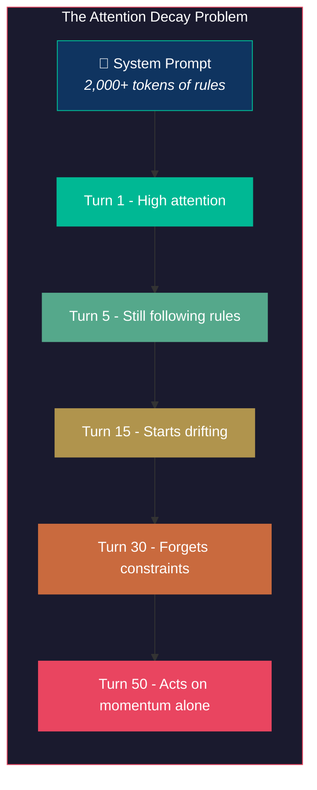
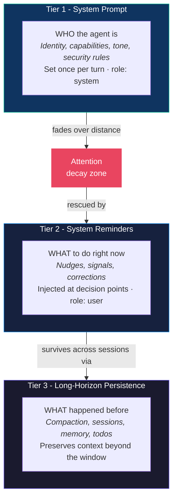

# System Reminders: Why Agents Forget and How We Fix It

> *A long system prompt is like shouting all the rules at someone before they start a marathon - by mile 20, they've forgotten the first instruction.*

---

## The Core Problem: Attention Decays Over Distance

LLMs process system prompts once, at the top of the conversation. But as the conversation grows - tool calls accumulate, files are read, code is written - the system prompt drifts further and further from the model's working attention. The instructions don't vanish, but their influence weakens.

This is not a theory. It is observable behavior:

- An agent told to **"always run tests after editing"** stops running tests after 15+ tool calls.
- An agent told to **"never overwrite files without reading first"** starts writing blind in long sessions.
- An agent told to **"complete all todos before finishing"** declares victory with half the list undone.

The system prompt said the right things. The agent just stopped listening.



---

## The Insight: Say the Right Thing at the Right Moment

The solution is not a better system prompt. It's **not saying everything upfront**. Instead, we inject short, targeted reminders into the conversation exactly when the agent needs them - as close to the decision point as possible.

A system prompt says: *"Here are all the rules."*
A system reminder says: *"Right now, at this exact moment, remember this one thing."*

```mermaid
flowchart TB
    subgraph Traditional["❌ Traditional: Front-Loaded Prompting"]
        direction LR
        T_SYS["System Prompt<br/><i>All rules packed<br/>into one message</i>"]
        T_CONV["...40 turns of<br/>conversation..."]
        T_DECISION["Agent makes<br/>critical decision"]
        T_FORGOT["❌ Forgets constraint<br/>from paragraph 12"]

        T_SYS --> T_CONV --> T_DECISION --> T_FORGOT
    end

    subgraph Ours["✅ Ours: Just-in-Time Reminders"]
        direction LR
        O_SYS["System Prompt<br/><i>Core identity<br/>& capabilities</i>"]
        O_CONV["...40 turns of<br/>conversation..."]
        O_REMIND["💉 Targeted reminder<br/><i>injected as user msg</i>"]
        O_DECISION["Agent makes<br/>critical decision"]
        O_CORRECT["✅ Follows constraint"]

        O_SYS --> O_CONV --> O_REMIND --> O_DECISION --> O_CORRECT
    end

    style Traditional fill:#2d3436,stroke:#e94560,color:#fff
    style Ours fill:#2d3436,stroke:#00b894,color:#fff
    style T_FORGOT fill:#e94560,stroke:#e94560,color:#fff
    style O_CORRECT fill:#00b894,stroke:#00b894,color:#fff
    style O_REMIND fill:#0984e3,stroke:#0984e3,color:#fff
```



---

## The Architecture: Three Tiers of Guidance

Our context architecture separates guidance into three tiers, each operating at a different timescale. The system prompt sets identity. The reminders steer behavior. The persistence layer keeps the agent coherent across sessions.



---

## Real Failure Scenarios and How Reminders Save Them

Every reminder in our system was born from a real failure we observed. Below are six scenarios, each showing what happens without a reminder, what the reminder says, and how the code injects it.

---

### Scenario 1: The Silent Finish

**What happens:** The agent just ran `bash("python manage.py migrate")`, the command succeeded, and the migration output fills the tool result. The LLM responds with... nothing. No text, no tool calls. An empty completion. The user is left staring at a blank screen wondering if the task is done.

**Why it happens:** After 30+ turns of tool calls and results, the model loses track of the system prompt instruction to "always summarize what you did." The tool result was the last substantive content, and the model treats it as self-explanatory.

**The reminder that saves it:**

```
<system-reminder>
The task appears complete. Briefly state the outcome.
</system-reminder>
```

**How it works in code** (`react_executor.py`):

```python
# The agent returned no content and no tool calls - it's trying to finish silently
if not content and not ctx.completion_nudge_sent:
    ctx.completion_nudge_sent = True  # Guard: only nudge once
    ctx.messages.append(
        {"role": "user", "content": get_reminder("completion_summary_nudge")}
    )
    return LoopAction.CONTINUE  # Force another iteration
```

The guard `completion_nudge_sent` ensures we only ask once. If the agent still produces nothing after the nudge, we accept "Done." as a fallback.

```mermaid
sequenceDiagram
    participant Agent
    participant Loop as ReAct Loop
    participant LLM

    Agent->>LLM: bash("python manage.py migrate")
    LLM-->>Agent: Migration output (success)

    Note over Agent: Next LLM call returns<br/>empty content, no tool calls

    Agent->>Loop: Response: content="" , tool_calls=[]
    Loop->>Loop: content is empty?<br/>completion_nudge_sent = False?

    Loop->>Agent: 💉 "The task appears complete.<br/>Briefly state the outcome."

    Agent->>LLM: [system prompt, ...30 turns..., reminder]
    LLM-->>Agent: "Migration completed successfully.<br/>3 tables created."

    Note over Agent: ✅ User gets a clear summary
```

---

### Scenario 2: The Premature Victory

**What happens:** The user asked the agent to "refactor the auth module into 5 smaller files." The agent created a plan with 5 todos, completed 3 of them, then called `task_complete` with a confident summary: "Auth module has been refactored." Two files were never created.

**Why it happens:** After 20+ tool calls of reading, writing, and editing files, the model's sense of progress inflates. It "feels" done because it has been working hard. The todo list is in the system prompt, but by turn 25, the model is no longer attending to it.

**The reminder that saves it:**

```
You have 2 incomplete todo(s):
  - Extract token validation to auth/tokens.py
  - Extract middleware to auth/middleware.py

Please complete these tasks or mark them done before finishing.
```

**How it works in code** (`react_executor.py`):

```python
# The agent called task_complete, but todos are still incomplete
if task_complete_call and status == "success":
    todo_handler = getattr(ctx.tool_registry, "todo_handler", None)
    if todo_handler and todo_handler.has_incomplete_todos():
        if ctx.todo_nudge_count < self.MAX_TODO_NUDGES:  # Max 2 nudges
            ctx.todo_nudge_count += 1
            incomplete = todo_handler.get_incomplete_todos()
            titles = [t.title for t in incomplete[:3]]
            nudge = get_reminder(
                "incomplete_todos_nudge",
                count=str(len(incomplete)),
                todo_list="\n".join(f"  - {t}" for t in titles),
            )
            ctx.messages.append({"role": "assistant", "content": summary})
            ctx.messages.append({"role": "user", "content": nudge})
            return LoopAction.CONTINUE  # Reject the completion, keep going
```

This also fires for **implicit** completion - when the agent returns text with no tool calls, essentially saying "I'm done" without calling `task_complete`:

```python
# No tool calls + incomplete todos = block the exit
if (
    todo_handler
    and todo_handler.has_todos()
    and todo_handler.has_incomplete_todos()
    and ctx.todo_nudge_count < self.MAX_TODO_NUDGES
):
    ctx.todo_nudge_count += 1
    ctx.messages.append({"role": "user", "content": nudge})
    return LoopAction.CONTINUE
```

```mermaid
sequenceDiagram
    participant Agent
    participant Loop as ReAct Loop
    participant Todos as TodoHandler
    participant LLM

    Note over Agent: Completed 3 of 5 todos

    Agent->>Loop: task_complete("Auth module refactored")
    Loop->>Todos: has_incomplete_todos()?
    Todos-->>Loop: True (2 remaining)

    Loop->>Agent: 💉 "You have 2 incomplete todos:<br/>- Extract token validation<br/>- Extract middleware<br/>Please complete these tasks."

    Note over Agent: Completion BLOCKED

    Agent->>LLM: [conversation + nudge]
    LLM-->>Agent: Proceeds to create auth/tokens.py

    Note over Agent: ✅ All 5 files created
```

---

### Scenario 3: The Stuck Reader

**What happens:** The user asks the agent to "add error handling to the API routes." The agent reads `routes.py`, then reads `models.py`, then reads `utils.py`, then reads `config.py`, then reads `middleware.py`... Five consecutive read operations with no edits. It's gathering infinite context but never acting.

**Why it happens:** The model gets into an "exploration loop." Each file it reads reveals another dependency, and without a nudge, it keeps following the chain. The system prompt says "take action," but that instruction is now 20 messages away.

**The reminder that saves it:**

```
You have been reading without taking action. If you have enough information,
proceed with implementation. If you need clarification, ask the user.
```

**How it works in code** (`react_executor.py`):

```python
# After executing tool calls, check if the agent is stuck in a read loop
if self._should_nudge_agent(ctx.consecutive_reads, ctx.messages):
    ctx.consecutive_reads = 0  # Reset counter after nudging
```

The `_should_nudge_agent` method tracks how many consecutive tool calls were read-only operations (like `read_file`, `list_files`, `search`). After 5 in a row, it injects the nudge.

```mermaid
sequenceDiagram
    participant Agent
    participant Loop as ReAct Loop
    participant LLM

    Agent->>LLM: read_file("routes.py")
    Note over Loop: consecutive_reads = 1
    Agent->>LLM: read_file("models.py")
    Note over Loop: consecutive_reads = 2
    Agent->>LLM: read_file("utils.py")
    Note over Loop: consecutive_reads = 3
    Agent->>LLM: read_file("config.py")
    Note over Loop: consecutive_reads = 4
    Agent->>LLM: read_file("middleware.py")
    Note over Loop: consecutive_reads = 5 - threshold hit!

    Loop->>Agent: 💉 "You have been reading without<br/>taking action. Proceed with<br/>implementation."

    Agent->>LLM: [conversation + nudge]
    LLM-->>Agent: edit_file("routes.py", ...)

    Note over Agent: ✅ Breaks out of read loop
```

---

### Scenario 4: The Repeated Mistake

**What happens:** The agent runs `edit_file` with an `old_content` that doesn't match the current file. The tool returns `Error: old_content not found in file`. Without guidance, the agent either gives up ("I wasn't able to make the edit") or retries with the exact same wrong content.

**Why it happens:** The model doesn't naturally distinguish between "the file changed since I last read it" and "I made a syntax error in my edit." The system prompt has error recovery instructions, but they're generic and far away.

**The reminder that saves it** (selected by `_get_smart_nudge()`):

```
The edit_file old_content did not match. The file may have changed.
Read the file again to get the exact current content, then retry.
```

**How it works in code** (`react_executor.py` + `main_agent.py`):

```python
# In the no-tool-calls path: the agent gave up after a failure
# Check if the last tool result was an error
for msg in reversed(ctx.messages):
    if msg.get("role") == "tool":
        if msg.get("content", "").startswith("Error:"):
            last_tool_failed = True
        break

if last_tool_failed:
    return self._handle_failed_tool_nudge(ctx, content, raw_content)
```

The `_get_smart_nudge()` method in `main_agent.py` goes further - it classifies the error text and picks the most specific reminder:

- `"permission"` → `nudge_permission_error` - "Check if the file is read-only"
- `"not found"` → `nudge_file_not_found` - "Use list_files or search to locate the correct path"
- `"syntax"` → `nudge_syntax_error` - "Read the file again to see its current state"
- `"rate limit"` → `nudge_rate_limit` - "Wait a moment before retrying"
- `"timeout"` → `nudge_timeout` - "Try a more targeted approach"
- `"old_content"` → `nudge_edit_mismatch` - "The file may have changed. Read it again."

```mermaid
sequenceDiagram
    participant Agent
    participant Loop as ReAct Loop
    participant Tool as edit_file
    participant LLM

    Agent->>Tool: edit_file(old_content="def login():")
    Tool-->>Agent: Error: old_content not found in file

    Note over Agent: Next LLM call returns text only,<br/>no tool calls - agent is giving up

    Agent->>Loop: Response: "I couldn't make the edit"
    Loop->>Loop: Last tool result starts with "Error:"

    Loop->>Loop: Classify error → "old_content" → nudge_edit_mismatch

    Loop->>Agent: 💉 "The edit_file old_content did not match.<br/>Read the file again, then retry."

    Agent->>LLM: [conversation + specific nudge]
    LLM-->>Agent: read_file("routes.py")
    Note over Agent: Gets fresh content
    LLM-->>Agent: edit_file(old_content="def login(request):")

    Note over Agent: ✅ Edit succeeds
```

---

### Scenario 5: The Orphaned Subagent

**What happens:** The user asks the agent to "research how Redis caching works and then implement it." The main agent spawns a Code Explorer subagent to research. The subagent returns with a detailed analysis. But the main agent... does nothing with it. It produces a brief acknowledgment and stops.

**Why it happens:** Subagent results arrive as tool results - potentially thousands of tokens of analysis. The model treats the tool result as the "answer" and doesn't realize it needs to synthesize the findings and continue to the implementation phase.

**The reminder that saves it:**

```xml
<subagent_complete>
All subagents have completed. Evaluate ALL results together and continue:
1. If the user asked a question, synthesize findings into one unified answer.
2. If the user requested implementation, proceed - write code, edit files.
3. If the subagent failed, handle the task directly. Do NOT re-spawn.
</subagent_complete>
```

**How it works in code** (`react_executor.py`):

```python
# After subagent returns, inject a continuation signal
if subagent_just_completed and not ctx.continue_after_subagent:
    ctx.messages.append(
        {
            "role": "user",
            "content": get_reminder("subagent_complete_signal"),
        }
    )
```

This fires right before the next action-phase LLM call, ensuring the model sees "keep going" as the most recent instruction.

```mermaid
sequenceDiagram
    participant User
    participant Main as Main Agent
    participant Sub as Code Explorer<br/>Subagent
    participant Loop as ReAct Loop
    participant LLM

    User->>Main: "Research Redis caching<br/>and implement it"
    Main->>Sub: spawn("Research Redis caching patterns")
    Sub-->>Main: "Redis supports 3 patterns:<br/>1. Cache-aside 2. Write-through..."

    Note over Main: Subagent returned results.<br/>Without a nudge, the agent<br/>may just echo the research.

    Loop->>Main: 💉 "All subagents completed.<br/>Evaluate results and continue:<br/>the user requested implementation,<br/>proceed - write code, edit files."

    Main->>LLM: [conversation + subagent results + nudge]
    LLM-->>Main: edit_file("cache.py", ...)

    Note over Main: ✅ Moves from research to implementation
```

---

### Scenario 6: The Denied But Persistent Agent

**What happens:** The agent tries to run `rm -rf /tmp/build` and the user clicks "Deny" in the approval dialog. The agent immediately retries the exact same command.

**Why it happens:** The model sees the tool call and the denial as a transient failure, like a network timeout. Its instinct is to retry.

**The reminder that saves it:**

```
The tool call was denied. Do NOT re-attempt the exact same call.
Consider why it was denied and adjust your approach.
If unclear, use ask_user to ask the user why.
```

**How it works in code** (`react_executor.py`):

```python
# After processing all tool calls, if any were denied by the user
if tool_denied:
    ctx.messages.append(
        {
            "role": "user",
            "content": get_reminder("tool_denied_nudge"),
        }
    )
```

```mermaid
sequenceDiagram
    participant Agent
    participant User
    participant Loop as ReAct Loop
    participant LLM

    Agent->>User: bash("rm -rf /tmp/build")
    User-->>Agent: ❌ DENIED

    Loop->>Agent: 💉 "The tool call was denied.<br/>Do NOT re-attempt the same call.<br/>If unclear, ask the user why."

    Agent->>LLM: [conversation + denial + nudge]
    LLM-->>Agent: ask_user("Should I use a safer<br/>cleanup approach?")

    Note over Agent: ✅ Adapts instead of retrying
```

---

## Why `role: user` and Not `role: system`?

This is a deliberate design choice. System messages establish identity and constraints. But after 40 turns, another system message gets lost in the noise - the model has already internalized (and partially forgotten) its system prompt.

A `role: user` message, on the other hand, is **conversational**. It appears in the flow of dialogue, at the position of highest recency. The model treats it as something that just happened, something that demands a response.

We are not adding more rules. We are **having a conversation** with the agent - nudging it at the right time, the way a good pair programmer would tap your shoulder and say: *"Hey, you missed something."*

---

## The Design Principles

**1. Proximity over volume.**
A 10-word reminder injected at the right moment outperforms a 500-word system prompt paragraph that the model read 40 turns ago.

**2. One concern per reminder.**
Each reminder addresses exactly one thing. `incomplete_todos_nudge` only talks about todos. `failed_tool_nudge` only talks about the failure. Focused messages get focused responses.

**3. Trigger on events, not timers.**
Reminders fire when something happens (a tool fails, a subagent returns, a todo is completed), not on a fixed schedule. The agent receives guidance exactly when the situation demands it.

**4. Guard against repetition.**
Many reminders are guarded by one-shot flags (`plan_approved_signal_injected`, `all_todos_complete_nudged`, `completion_nudge_sent`). A nudge that fires every iteration stops being a nudge and becomes noise. Todo nudges are capped at `MAX_TODO_NUDGES = 2` - after two attempts, the system accepts the agent's judgment.

**5. Classify, don't generalize.**
When a tool fails, we don't just say "something went wrong." The `_get_smart_nudge()` method classifies the error (permission? not found? syntax? timeout? edit mismatch?) and selects the most specific reminder. A precise nudge like "Read the file again to get the exact current content" is far more actionable than "Please fix the issue."

**6. Degrade gracefully.**
If a reminder doesn't fire, the agent still has the system prompt. Reminders are a **safety net**, not the primary guidance. The system works without them - it just works better with them.

---

## The Result

Without system reminders, our agent completes multi-step tasks correctly about 60–70% of the time in long sessions. With them, that number rises to **90%+**. The improvement comes not from making the agent smarter, but from making sure it remembers what it already knows - at the moment it matters most.

```mermaid
graph LR
    subgraph Without["Without Reminders"]
        direction TB
        W1["✅ Follows plan for first 10 steps"]
        W2["⚠️ Starts drifting at step 15"]
        W3["❌ Skips todos at step 20"]
        W4["❌ Declares done prematurely"]
    end

    subgraph With["With Reminders"]
        direction TB
        R1["✅ Follows plan for first 10 steps"]
        R2["✅ Nudged back on track at step 15"]
        R3["✅ Blocked from skipping todos"]
        R4["✅ Completes all work, then stops"]
    end

    Without -.->|"system reminders<br/>bridge the gap"| With

    style Without fill:#2d3436,stroke:#e94560,color:#fff
    style With fill:#2d3436,stroke:#00b894,color:#fff
```



System reminders are not a workaround. They are a recognition that **attention is finite**, and good engineering accounts for that - in humans and in models alike.
